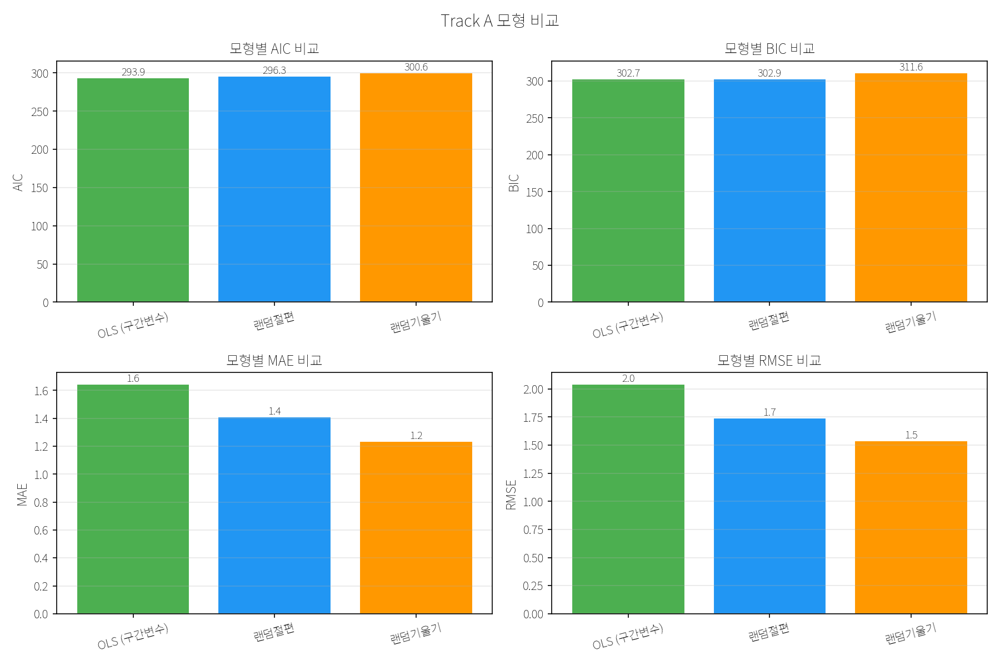
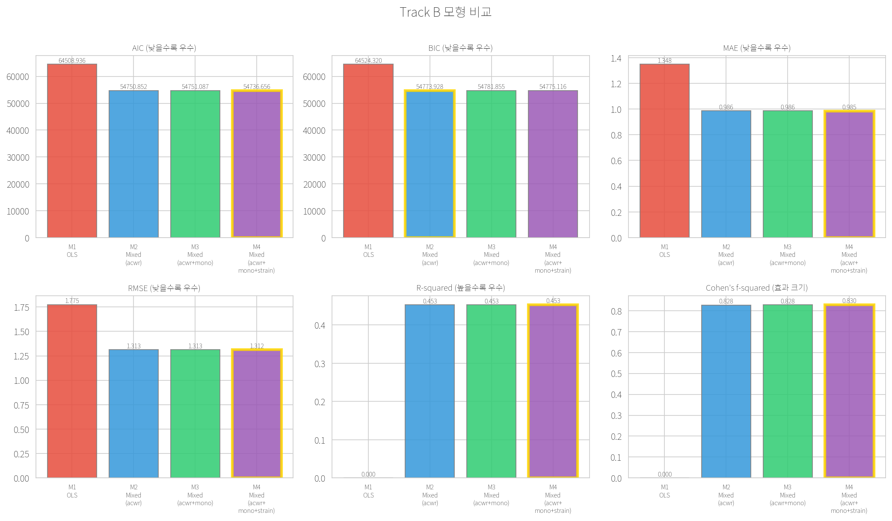
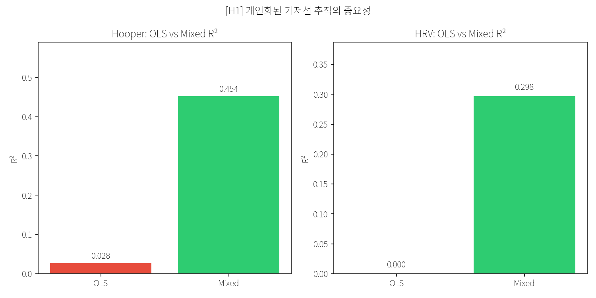

# Fatigue–HRV–Load PoV Repository

> **선수 생체·부하 데이터 기반 피로도 분석 — 통계 우선(statistics-first) PoV 파이프라인**
> 공개 데이터셋(PhysioNet ACTES · SoccerMon)으로 훈련 부하 지표(ATL/CTL/ACWR, Monotony/Strain)와
> 회복/웰니스 반응(HRV, Hooper Index)의 관계를 정량화하고, 사전 정의된 가설을 PASS/FAIL로 검증한다.

  

---

## 1. 개요

두 개의 독립 트랙으로 구성된다.

- **Track A — HRV 중심** (PhysioNet ACTES, 18명): 점증 운동 부하 중 파워 구간별 HRV(rMSSD/SDNN) 용량-반응을 혼합효과모형으로 분석.
- **Track B — 부하+설문 중심** (SoccerMon, 44명): sRPE/Hooper Index를 종속변수로 ACWR/Monotony/Strain의 예측력을 M1~M4 순차 모형으로 비교.
- **Integrated Hypothesis**: 두 트랙의 발견을 합성 데이터(DGP)로 재현하여 H1~H4를 PASS/FAIL로 판정.

분석 파이프라인: **데이터 취득 → 지표 산출 → EDA → 통계 모형 → 가설 검증 → 합성 검증 → 종합 보고**.

---

## 2. 연구 단계 (Research Stages)

| 단계 | 내용 | 핵심 산출물 / 코드 | 상태 |
|---|---|---|---|
| **0. 설계·데이터셋 선정** | 연구질문·프로토콜·지표 정의 확정, 데이터셋 후보 비교 | [`docs/rnd/tracks/track_A/PROTOCOL.md`](docs/rnd/tracks/track_A/PROTOCOL.md) · [`docs/rnd/tracks/track_B/PROTOCOL.md`](docs/rnd/tracks/track_B/PROTOCOL.md) · [`docs/rnd/tracks/track_A/DATASETS.md`](docs/rnd/tracks/track_A/DATASETS.md) · [`docs/standards/REFERENCES.md`](docs/standards/REFERENCES.md) · [`docs/rnd/DECISIONS.md`](docs/rnd/DECISIONS.md) | ✅ 완료 |
| **1. 데이터 취득·전처리** | RR 품질 점검·이상치 필터, Wide→Long 변환, 활성 시즌 필터 | [`src/data/`](src/data/) · [`data/raw/`](data/raw/) · [`data/processed/`](data/processed/) | ✅ 완료 |
| **2. 지표 산출** | ATL/CTL/ACWR(Rolling·EWMA), Monotony/Strain, HRV(rMSSD/SDNN/ln) | [`src/metrics/`](src/metrics/) · [`docs/standards/METRICS_FORMULAS.md`](docs/standards/METRICS_FORMULAS.md) | ✅ 완료 |
| **3. EDA** | 분포·결측·시차 탐색, 실측 기술통계 | [`notebooks/track_A_eda.ipynb`](notebooks/track_A_eda.ipynb) · [`notebooks/track_B_eda.ipynb`](notebooks/track_B_eda.ipynb) · [`src/eda/`](src/eda/) · [`scripts/eda_protocol.py`](scripts/eda_protocol.py) | ✅ 완료 |
| **4. 통계 모형** | OLS→랜덤절편→랜덤기울기 순차 비교, ICC, Cohen's f², VIF, 다중시차, LOSO | [`notebooks/track_A_real.ipynb`](notebooks/track_A_real.ipynb) · [`notebooks/track_B_real.ipynb`](notebooks/track_B_real.ipynb) · [`src/stats/`](src/stats/) · [`reports/track_A_model_comparison.md`](reports/track_A_model_comparison.md) · [`reports/track_B_model_comparison.md`](reports/track_B_model_comparison.md) | ✅ 완료 |
| **5. 통합 가설 검증** | H1~H4를 합성 DGP로 PASS/FAIL 판정 (**9/13 PASS**) | [`notebooks/integrated_hypothesis.ipynb`](notebooks/integrated_hypothesis.ipynb) · [`notebooks/run_integrated_hypothesis.py`](notebooks/run_integrated_hypothesis.py) · [`reports/integrated_hypothesis_report.md`](reports/integrated_hypothesis_report.md) | ✅ 완료 |
| **6. 합성 데이터 검증** | 참값(β, σ) 복원 sanity check, 파이프라인 사전 검증 | [`notebooks/run_synthetic_analysis.py`](notebooks/run_synthetic_analysis.py) · [`reports/track_A_model_comparison_synthetic.md`](reports/track_A_model_comparison_synthetic.md) · [`tests/test_synthetic_integrated.py`](tests/test_synthetic_integrated.py) | ✅ 완료 |
| **7. 종합 보고** | 실데이터 결과·효과크기·해석을 PoV 보고서로 통합 | [`reports/POV_REPORT.md`](reports/POV_REPORT.md) | ✅ 완료 |
| **8. 부상 예측 격상 (P0~P3)** | onset 라벨(gap≥7, 43건) → 기술역학 EDA → Gabbett 기준선 → 삼각검증(이산시간 생존·case-crossover·벌점 로지스틱). 검정력 제약상 **방법론 시연** | [`reports/injury_prediction_report.md`](reports/injury_prediction_report.md) · [`docs/rnd/tracks/track_B/INJURY_PREDICTION.md`](docs/rnd/tracks/track_B/INJURY_PREDICTION.md) · [`src/data/injury_label.py`](src/data/injury_label.py) · [`src/stats/survival_models.py`](src/stats/survival_models.py) · [`docs/rnd/RESEARCH_PROTOCOL.md`](docs/rnd/RESEARCH_PROTOCOL.md) | ✅ P0~P3 완료 (P4~P6 계획) |

> **노트북 미리보기 (nbviewer)** — GitHub 자체 렌더가 느리거나 실패할 경우 아래 nbviewer 링크로 안정적으로 확인할 수 있다.
> [track_A_eda](https://nbviewer.org/github/genelyuu/soccer-demo/blob/main/soccer_rnd/notebooks/track_A_eda.ipynb) ·
> [track_A_real](https://nbviewer.org/github/genelyuu/soccer-demo/blob/main/soccer_rnd/notebooks/track_A_real.ipynb) ·
> [track_A_stats](https://nbviewer.org/github/genelyuu/soccer-demo/blob/main/soccer_rnd/notebooks/track_A_stats.ipynb) ·
> [track_B_eda](https://nbviewer.org/github/genelyuu/soccer-demo/blob/main/soccer_rnd/notebooks/track_B_eda.ipynb) ·
> [track_B_real](https://nbviewer.org/github/genelyuu/soccer-demo/blob/main/soccer_rnd/notebooks/track_B_real.ipynb) ·
> [track_B_stats](https://nbviewer.org/github/genelyuu/soccer-demo/blob/main/soccer_rnd/notebooks/track_B_stats.ipynb) ·
> [integrated_hypothesis](https://nbviewer.org/github/genelyuu/soccer-demo/blob/main/soccer_rnd/notebooks/integrated_hypothesis.ipynb)

---

## 3. 핵심 결과 (Key Findings)

전체 수치·해석은 [`reports/POV_REPORT.md`](reports/POV_REPORT.md) 참조.

### Track A — HRV 용량-반응 (ACTES, 18명)
- **파워-HRV 용량-반응**: 파워 구간 상승 시 rMSSD 단조 감소 (Rest 7.6±2.4ms → High 4.6±1.5ms). 혼합효과 `power_mean` 계수 **−0.016** (p<0.001).
- **개인차의 중요성**: 랜덤절편 모형이 OLS 대비 MAE 개선(1.64→1.41), 피험자 간 분산 0.56.
- **이월 효과**: 직전 파워 부하–현재 rMSSD Pearson r **−0.465** (p=0.001).



### Track B — 부하·웰니스 (SoccerMon, 44명)
- **개인 랜덤효과의 지배**: OLS R²=0.000 → 혼합효과 **R²=0.453** (Hooper 변동의 ~45%가 선수 개인차).
- **ACWR–Hooper**: ACWR 계수 **−0.089** (p<0.001).
- **Monotony 독립 효과**: M4에서 Monotony **+0.142** (p=0.002), Strain −0.00007 (p<0.001).
- **LOSO 교차검증**: 평균 MAE **1.45** (SD 0.57), RMSE 1.76.



### Integrated Hypothesis — 합성 검증 (9/13 PASS)
| 가설 | 결과 | 핵심 측정값 |
|---|---|---|
| **H1** 개인화 기저선 | **4/4 PASS** | ΔAIC=1403.7, R² 0.029→0.454 (Simpson's Paradox 재현) |
| **H2** 다지표 통합 | 2/3 PARTIAL | ΔAIC=54.9, f²=0.0214 / LOSO 개선 3.1%(FAIL) |
| **H3** Monotony 억제변수 | 2/3 PARTIAL | 부호반전 −0.063→+0.103(262%), 참값복원 26.7% / p=0.564(FAIL) |
| **H4** 결측 민감도 | 1/3 PARTIAL | MCAR 편향 3.35%(PASS) / MNAR 순서 미성립 |



### Stage 8 — 부상 예측 (P0~P3, 방법론 시연)
- **onset 라벨**: gap≥7 규칙으로 독립 onset **43건**·발생률 **1.748/1000 athlete-days** 재현(외부 연구 arXiv 2601.19479 일치).
- **삼각검증 방향 일관 3/3**: 이산시간 생존 HR **3.263** (p<0.001) · 벌점 로지스틱 coef **+0.175** · case-crossover OR 1.159(비유의).
- 검정력 제약(독립 onset 43건·EPV≤4)상 임상 배포를 주장하지 않는 **방법론 시연** 단계(reviewer-safe).


> 상세 결과·그림: [`reports/injury_prediction_report.md`](reports/injury_prediction_report.md) · 개념·방법론: [`docs/rnd/tracks/track_B/INJURY_PREDICTION.md`](docs/rnd/tracks/track_B/INJURY_PREDICTION.md)

> 전체 그림: [`reports/figures/`](reports/figures/)

---

## 4. 디렉토리 구조

```
soccer_rnd/
├── docs/                  # R&D 문서 거버넌스 (허브: docs/README.md, 구조 근거: ADR-015)
│   ├── rnd/               # 연구·요구·통제·실행
│   │   ├── RESEARCH_PROTOCOL.md · TRD_v1.0.md · GOVERNANCE.md · PLAYBOOK.md · DECISIONS.md
│   │   ├── INJURY_PREDICTION_REFERENCES.md
│   │   ├── requirements/  # DRD_v1~v3.0 · DATA_SPEC_v3.0
│   │   └── tracks/        # track_A/ · track_B/ (+ INJURY_PREDICTION.md)
│   └── standards/         # METRICS_FORMULAS · DATA_SCHEMA_MAPPING · REFERENCES (SSOT)
├── ops/                   # 운영(비 R&D): migration/ · incidents/
├── src/
│   ├── metrics/           # acwr · monotony_strain · hrv_features · alternative_load
│   ├── data/              # loader · preprocess · synthetic · injury_label
│   ├── eda/ · stats/       # EDA 유틸 · 혼합효과 · 생존모형(survival_models · injury_*)
├── notebooks/             # 재현 가능한 EDA·통계 노트북 + run_*.py 스크립트
├── reports/               # PoV 보고서 + 모형 비교표 + 부상예측 리포트
│   └── figures/           # 산출 그림 (23종)
├── scripts/eda_protocol.py   # 실데이터 EDA 재현 (read-only)
├── tests/                 # pytest 단위 테스트 (12개 파일)
└── data/raw/ · data/processed/
```

---

## 5. 재현 방법 (Reproduction)

```bash
# 1) 가상환경
python -m venv venv
venv\Scripts\activate.bat          # Windows (CMD) / PowerShell: .\venv\Scripts\Activate.ps1
# source venv/bin/activate          # Linux/macOS
pip install -r requirements.txt

# 2) 테스트
python -m pytest tests/ -v

# 3) 분석 실행
python notebooks/run_track_A.py
python notebooks/run_track_B.py
python notebooks/run_integrated_hypothesis.py
python scripts/eda_protocol.py     # 실데이터 EDA 요약

# 4) 노트북 (선택)
python -m ipykernel install --user --name=soccer_rnd --display-name "Python (soccer_rnd)"
jupyter notebook
```

**재현 환경**: Python 3.13, numpy(seed 고정), pandas 2.3, statsmodels 0.14, scipy 1.16, scikit-learn 1.7.

---

## 6. 데이터 출처 및 라이선스

- **Track A**: PhysioNet ACTES — `data/raw/track_A/LICENSE.txt` 참조.
- **Track B**: SoccerMon (Midoglu et al., 2024, *Nature Scientific Data*) — Zenodo, CC BY 4.0.
- 지표·방법론의 학술 근거: [`docs/standards/REFERENCES.md`](docs/standards/REFERENCES.md) (30편) · [`docs/rnd/INJURY_PREDICTION_REFERENCES.md`](docs/rnd/INJURY_PREDICTION_REFERENCES.md).

> 본 분석은 AI 코치 서비스 ML 파이프라인 R&D를 공개 데이터셋으로 재현한 PoV 결과물이다.
> 프로젝트 상세는 [`docs/README.md`](docs/README.md) 참조.
