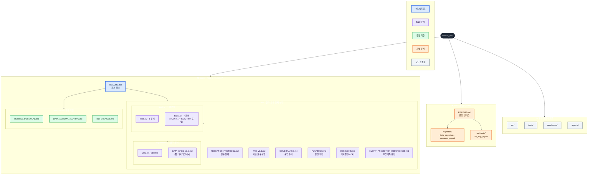
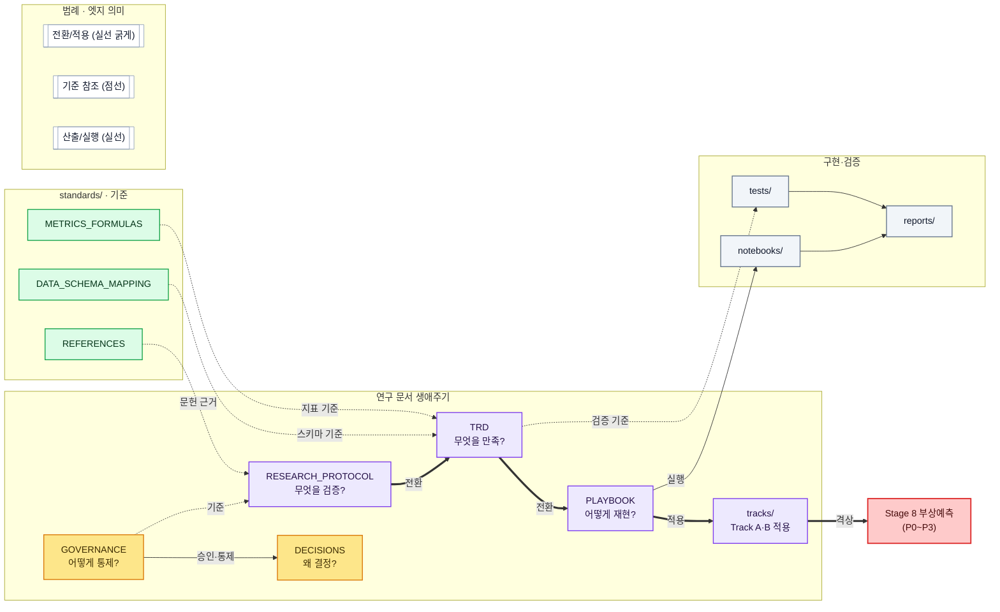

# R&D 문서 거버넌스 — 개선 제안 (Proposal)

> 문서 ID: PROPOSAL-DOCGOV-2026-001 · 버전 v1.1 · 최종수정 2026-05-30 · 상태: **채택·실행 완료**
> 성격: 초안(사용자 제출)에 대한 개선안. **§7 런북이 실행되어 본 권장 구조가 저장소에 반영됨**(파일 이동·링크 재작성·README 신설 완료).
> 거버넌스 기록: [DECISIONS.md](rnd/DECISIONS.md) ADR-015(ADR-013 flat → 3축 nested 개정). 검증: 깨진 링크 0 · pytest 영향 없음.

---

## 1. 설계 원칙

`soccer_rnd` 저장소 문서를 **연구·실험·검증 중심**으로 정리하되, 과도한 세분화를 피하고 한눈에 이해되는 **3축**으로 구성한다.

| 축 | 경로 | 역할 |
|---|---|---|
| **R&D 문서** | `docs/` | 연구 설계·요구사항·거버넌스·실행 재현·표준 |
| **운영(비 R&D)** | `ops/` | 데이터 마이그레이션·DB 이슈·운영 스크립트(임시) |
| **구현·검증** | `src/` · `tests/` · `notebooks/` · `reports/` | 분석 코드·테스트·노트북·결과 보고 |

R&D 분석 문서와 성격이 다른 운영성 문서(마이그레이션·DB 장애)는 `docs/`에 섞지 않고 동일 레벨의 `ops/`로 분리한다.

---

## 2. 초안 대비 개선 사항 (핵심)

초안(번호 프리픽스 개명 + git mv 위주)을 실측 기반으로 검토해 다음 10개를 보완한다.

| # | 개선 | 근거·효과 |
|---:|---|---|
| 1 | **[최우선] 링크 무결성 단계 신설** | 초안 §7은 `git mv`만 있고 **링크 재작성이 누락**. 실측상 이동 시 마크다운 **약 356개 참조(32파일)** + 코드 **약 59개(15파일)** + `soccer_rnd/CLAUDE.md`(3) + 루트 `README.md`(9)를 함께 고쳐야 한다. "깨진 링크 0"을 완료 게이트로 신설. |
| 2 | **파일명 규칙 경량화** | `01_/02_` 번호 프리픽스는 **읽는 순서를 파일명에 결합** → 재정렬 시 개명·링크 재수정 비용 발생. **미채택**. 대신 한글 파일명만 영문화하고 순서는 README 인덱스가 담당. |
| 3 | **누락 파일 2건 배치** | 초안이 빠뜨린 `INJURY_PREDICTION_REFERENCES.md`(루트) → `rnd/`로, 신규 `track_B/INJURY_PREDICTION.md` → `rnd/tracks/track_B/` 유지. |
| 4 | **거버넌스 변경의 ADR 기록** | nested 전환은 **오늘(2026-05-30) 채택된 ADR-013(flat 컨벤션)을 번복**. ADR-015 신설로 개정 사유를 동결(추적성). |
| 5 | **빈 폴더 지양** | `ops/scripts/`는 실제 스크립트가 생길 때 생성(git은 빈 폴더 미추적, `.gitkeep` 남발 방지). |
| 6 | **허브 + per-folder README** | `docs/README`(허브) 외에 `rnd/`·`standards/`·`ops/` 로컬 인덱스를 둬 깊은 트리에서도 길찾기 보장. |
| 7 | **CLAUDE.md 동기화 포함** | `soccer_rnd/CLAUDE.md`(DECISIONS·track_*·METRICS 경로 인용)와 루트 monorepo `CLAUDE.md` 점검을 런북에 포함. |
| 8 | **코드·리포트 참조 갱신 범위 명시** | `src/data/loader.py`("docs/DATA_SCHEMA_MAPPING.md 참조") 등 docstring과 `reports/*.md`의 `../docs/...` 상대링크까지 재작성 대상에 포함. |
| 9 | **DATA_SPEC ↔ DRD 역할 경계** | `데이터명세서`와 `DRD`의 중복 우려 → `requirements/README`에 "DRD=요구사항 이력 / DATA_SPEC=현 명세" 경계 기술. |
| 10 | **mermaid 접근성·가드 계승** | 한글/괄호/콜론 라벨 `["..."]`, 줄바꿈 `<br/>`, **범례 노드 필수**, 대비 높은 팔레트(ADR-013 가드 계승). |

---

## 3. 최종 권장 디렉토리 구조

```text
soccer_rnd/
├─ README.md
├─ requirements.txt
│
├─ docs/                               # R&D 문서 거버넌스
│  ├─ README.md                        # 문서 허브(읽는 순서 인덱스)
│  ├─ DOC_GOVERNANCE_PROPOSAL.md        # (본 문서)
│  │
│  ├─ rnd/                             # 연구·요구·통제·실행
│  │  ├─ README.md
│  │  ├─ RESEARCH_PROTOCOL.md
│  │  ├─ TRD_v1.0.md
│  │  ├─ GOVERNANCE.md
│  │  ├─ PLAYBOOK.md
│  │  ├─ DECISIONS.md
│  │  ├─ INJURY_PREDICTION_REFERENCES.md   # ← 초안 누락, 연구설계로 배치
│  │  ├─ requirements/
│  │  │  ├─ DRD_v1.0.md
│  │  │  ├─ DRD_v2.0.md
│  │  │  ├─ DRD_v3.0.md
│  │  │  └─ DATA_SPEC_v3.0.md              # ← 데이터명세서_v3.0.md 영문화
│  │  └─ tracks/
│  │     ├─ track_A/   (PROTOCOL·DATASETS·METRICS·EDA_PLAN·STATS_PLAN·EXPECTED_OUTPUTS)
│  │     └─ track_B/   (위 6 + INJURY_PREDICTION.md)
│  │
│  └─ standards/                       # 공통 기준(반복 참조)
│     ├─ README.md
│     ├─ METRICS_FORMULAS.md
│     ├─ DATA_SCHEMA_MAPPING.md
│     └─ REFERENCES.md
│
├─ ops/                                # 운영(비 R&D) — 최상위 분리
│  ├─ README.md
│  ├─ migration/
│  │  ├─ data_migration.md
│  │  └─ migration_progress_report.md     # ← 마이그레이션_진행보고서.md 영문화
│  └─ incidents/
│     └─ db_bug_report.md
│     # ops/scripts/ : 실제 스크립트 생길 때 생성(빈 폴더 지양)
│
├─ src/  tests/  notebooks/  reports/  data/
```

**파일명 규칙(확정)**: 기존 영문명 **유지**, 한글 2건만 영문화. 번호 프리픽스 미채택 — 읽는 순서는 `docs/README` 인덱스가 표현.

---

## 4. 한눈에 보는 구조 (Mermaid)

### 4.1 문서 분류 체계 (Taxonomy)



### 4.2 문서 생애주기 · 의존 흐름 (Lifecycle)



---

## 5. 문서 위계 · 관계 규칙

### 5.1 읽는 순서 (번호는 README 인덱스로만 표현, 파일명 불변)

| 순서 | 문서 | 핵심 질문 |
|---:|---|---|
| 1 | `rnd/RESEARCH_PROTOCOL.md` | 무엇을 검증하는가? |
| 2 | `rnd/TRD_v1.0.md` | 무엇을 만족해야 하는가? |
| 3 | `rnd/GOVERNANCE.md` | 어떤 기준으로 통제·승인하는가? |
| 4 | `rnd/PLAYBOOK.md` | 어떻게 실행·재현하는가? |
| 5 | `rnd/DECISIONS.md` | 왜 그렇게 결정했는가? |

### 5.2 관계 규칙

| 관계 | 의미 | 엣지 |
|---|---|---|
| `RESEARCH_PROTOCOL → TRD` | 연구 설계를 기술 요구사항으로 전환 | 실선(전환) |
| `TRD → PLAYBOOK → tracks/` | 요구사항을 실행 절차·트랙 분석으로 전개 | 실선(전환·적용) |
| `GOVERNANCE → DECISIONS` | 통제 기준에 따라 결정 기록 | 실선 |
| `standards/ ⤳ TRD·tracks·protocol` | 지표·스키마·문헌 기준을 소비처가 참조 | 점선(기준) |
| `PLAYBOOK → notebooks → reports` | 실행이 산출물로 | 실선(산출) |
| `TRD ⤳ tests → reports` | 요구사항이 검증 기준으로 | 점선·실선 |
| `tracks/ ⤳ Stage 8` | PoV를 부상예측으로 격상 | 굵은 실선(격상) |

---

## 6. 이동 · 개명 매핑표

| 현재 | 권장 위치 | 링크 영향 |
|---|---|---|
| `docs/README.md` | `docs/README.md` (허브로 개편) | 인덱스 전면 갱신 |
| `docs/RESEARCH_PROTOCOL.md` | `docs/rnd/RESEARCH_PROTOCOL.md` | 깊이 +1 |
| `docs/TRD_v1.0.md` | `docs/rnd/TRD_v1.0.md` | 깊이 +1 (피참조 多) |
| `docs/GOVERNANCE.md` | `docs/rnd/GOVERNANCE.md` | 깊이 +1 |
| `docs/PLAYBOOK.md` | `docs/rnd/PLAYBOOK.md` | 깊이 +1 |
| `docs/DECISIONS.md` | `docs/rnd/DECISIONS.md` | 깊이 +1 (ADR 다수 피참조) |
| `docs/INJURY_PREDICTION_REFERENCES.md` | `docs/rnd/INJURY_PREDICTION_REFERENCES.md` | 깊이 +1 |
| `docs/DRD_v1~3.0.md` | `docs/rnd/requirements/DRD_v*.md` | 깊이 +2 |
| `docs/데이터명세서_v3.0.md` | `docs/rnd/requirements/DATA_SPEC_v3.0.md` | **개명+이동** |
| `docs/track_A/` · `docs/track_B/` | `docs/rnd/tracks/track_A|B/` | 깊이 +2 (내부 상대링크 재계산) |
| `docs/METRICS_FORMULAS.md` | `docs/standards/METRICS_FORMULAS.md` | 깊이 +1 (SSOT, 피참조 多) |
| `docs/DATA_SCHEMA_MAPPING.md` | `docs/standards/DATA_SCHEMA_MAPPING.md` | 깊이 +1 |
| `docs/REFERENCES.md` | `docs/standards/REFERENCES.md` | 깊이 +1 |
| `docs/data_migration.md` | `ops/migration/data_migration.md` | docs→ops 이동 |
| `docs/마이그레이션_진행보고서.md` | `ops/migration/migration_progress_report.md` | **개명+이동** |
| `docs/db_bug_report.md` | `ops/incidents/db_bug_report.md` | docs→ops 이동 |

> 깊이 변화 예: `tracks/track_B/*`에서 `../METRICS_FORMULAS.md` → `../../standards/METRICS_FORMULAS.md`, `../DECISIONS.md` → `../DECISIONS.md`(rnd 내 동일 레벨) 등 **상대경로 재계산 필수**.

---

## 7. 채택 시 실행 런북 (이번 라운드 비실행)

```text
1) 디렉토리 생성: docs/rnd/{requirements,tracks}, docs/standards, ops/{migration,incidents}
2) git mv 로 §6 매핑 적용(이력 보존). 한글 2건 개명 포함.
3) 링크 일괄 재작성(완료 게이트 = 깨진 링크 0):
   - 마크다운 상대링크 ~356건(32파일): 새 경로/깊이로 치환
   - 코드 docstring ~59건(15파일): 예) src/data/loader.py "docs/standards/DATA_SCHEMA_MAPPING.md"
   - reports/*.md 의 ../docs/... → ../docs/rnd|standards/... 재계산
   - soccer_rnd/CLAUDE.md(3건) + 루트 README.md(9건) 경로 갱신
4) per-folder README 신설(rnd/standards/ops) + docs/README 허브 인덱스 개편
5) 빈 폴더(ops/scripts) 미생성
6) 검증: 링크 체커 통과(아래 §9), pytest 영향 없음 확인
7) DECISIONS.md 에 ADR-015 기록(ADR-013 flat → nested 개정 사유·범위·날짜)
```

---

## 8. README 인덱스 초안

```md
## 문서 구조
| 구분 | 경로 | 역할 |
|---|---|---|
| 문서 허브 | `docs/README.md` | 전체 구조·읽는 순서 안내 |
| R&D 핵심 | `docs/rnd/` | 연구 설계·요구·거버넌스·실행·결정 |
| 공통 기준 | `docs/standards/` | 지표·스키마·문헌 |
| 운영 | `ops/` | 마이그레이션·DB 이슈·스크립트 |

## 핵심 R&D 문서 (읽는 순서)
1. `docs/rnd/RESEARCH_PROTOCOL.md` — 무엇을 검증?
2. `docs/rnd/TRD_v1.0.md` — 무엇을 만족?
3. `docs/rnd/GOVERNANCE.md` — 어떻게 통제?
4. `docs/rnd/PLAYBOOK.md` — 어떻게 재현?
5. `docs/rnd/DECISIONS.md` — 왜 결정?
```

per-folder README 골자: `rnd/README`=읽는 순서·관계도, `standards/README`=SSOT 원칙(지표 수식은 여기서만 정의, 타 문서는 교차참조), `ops/README`=운영 문서는 R&D가 아님을 명시.

---

## 9. 리스크 · 검증

- **최대 리스크 = 링크 깨짐**(피참조 多: TRD·DECISIONS·METRICS_FORMULAS). 완료 게이트로 링크 체커 필수.
  ```bash
  # 마크다운 상대링크 존재성 점검(예시)
  python - <<'PY'
  import os, re, glob
  bad=0
  for f in glob.glob('docs/**/*.md', recursive=True)+glob.glob('ops/**/*.md', recursive=True):
      base=os.path.dirname(f)
      for m in re.findall(r'\]\(([^)]+)\)', open(f,encoding='utf-8').read()):
          link=m.split('#')[0]
          if link.startswith('http') or not link: continue
          if not os.path.exists(os.path.normpath(os.path.join(base,link))):
              print('MISSING', f, '->', m); bad+=1
  print('broken links:', bad)
  PY
  ```
- **거버넌스 일관성**: ADR-013 번복 → ADR-015 미기록 시 추적성 훼손. 런북 7단계 필수.
- **빈 폴더**: git 미추적 → 불필요한 `.gitkeep` 지양, 필요 시점에 생성.
- **mermaid**: 한글/특수문자 라벨 `["..."]` 가드, 범례 포함, 펜스 폐합(본 문서 2종 적용).
- **검증 체크리스트(채택 후)**: 깨진 링크 0 · `pytest tests/ -v` 영향 없음 · CLAUDE.md/README 경로 정합 · UTF-8 무결.

---

## 10. 요약

```text
docs/        = R&D 문서 거버넌스
  rnd/       = 연구 설계·요구·통제·실행·결정
  standards/ = 지표·스키마·문헌(반복 참조 기준)
ops/         = 운영성 문서(비 R&D) 분리 공간
src/·tests/·notebooks/·reports/ = 구현·검증 산출물
```

| 질문 | 확인 위치 |
|---|---|
| 무엇을 검증? | `docs/rnd/RESEARCH_PROTOCOL.md` |
| 무엇을 만족? | `docs/rnd/TRD_v1.0.md` |
| 어떻게 통제? | `docs/rnd/GOVERNANCE.md` |
| 어떻게 재현? | `docs/rnd/PLAYBOOK.md` |
| 왜 결정? | `docs/rnd/DECISIONS.md` |
| 어떤 지표·스키마·문헌? | `docs/standards/` |
| 운영성 문서·코드는? | `ops/` |

> **다음 단계**: 본 제안 채택 시 §7 런북대로 재구성을 실행하고 ADR-015로 동결한다. 미채택 시 현행 flat 구조(ADR-013)를 유지한다.
