# Database Design Review Document (DRD) v3.0

## 훈련·웰니스·HRV 스키마 — DB EDA 종합 다이어그램 및 에이전트 팀 리뷰

---

### 문서 정보

| 항목 | 내용 |
|------|------|
| **문서 ID** | DRD-2026-001 |
| **버전** | 3.0 |
| **작성일** | 2026-02-11 |
| **최종 수정** | 2026-02-11 |
| **작성** | DB Architecture팀 (DBA Senior), Data Engineering팀 (DE Senior), Team Leader |
| **검토 대상** | `00003_training_wellness_schema.sql`, `00004_etl_views.sql`, `00005_schema_fixes.sql` |
| **관련 프로젝트** | `soccer` (서비스 MVP), `soccer_rnd` (R&D 분석 파이프라인) |
| **배포 범위** | 사내 전체 (개발팀, PM, 보안팀) |

---

### 문서 이력

| 버전 | 일자 | 작성자 | 변경 내용 |
|:----:|------|--------|-----------|
| 0.1 | 2026-02-11 | DE | db_bug_report.md 초안 작성 |
| 1.0 | 2026-02-11 | DBA + DE | 공동 리뷰 결과 통합, 수정 SQL 확정, 마이그레이션 계획 수립 |
| 2.0 | 2026-02-11 | DBA + DE | 신규 6건 발견(B-20~B-25), 컴플라이언스 감사, ER 다이어그램, 성능 모델링, 롤백 절차 |
| **3.0** | **2026-02-11** | **Team Leader + DBA Sr. + DE Sr.** | **Mermaid EDA 전체 다이어그램 체계화, 에이전트 팀 구성 JSON, 횡단 관심사 시각화, 수정 후 목표 아키텍처 ER, 데이터 리니지 시각화** |

---

## 목차

1. [에이전트 팀 구성](#1-에이전트-팀-구성)
2. [DB EDA — 현행 ER 다이어그램 (Mermaid)](#2-db-eda--현행-er-다이어그램)
3. [DB EDA — 수정 후 목표 ER 다이어그램 (Mermaid)](#3-db-eda--수정-후-목표-er-다이어그램)
4. [데이터 흐름도 (Mermaid)](#4-데이터-흐름도)
5. [데이터 리니지 — Track B (Mermaid)](#5-데이터-리니지--track-b)
6. [데이터 리니지 — Track A (Mermaid)](#6-데이터-리니지--track-a)
7. [RLS 정책 매트릭스 (Mermaid)](#7-rls-정책-매트릭스)
8. [CASCADE 체인 시각화 (Mermaid)](#8-cascade-체인-시각화)
9. [버그 심각도 분포 (Mermaid)](#9-버그-심각도-분포)
10. [마이그레이션 위상 의존성 (Mermaid)](#10-마이그레이션-위상-의존성)
11. [성능 모델링 시각화 (Mermaid)](#11-성능-모델링-시각화)
12. [ENUM 타입 관계도 (Mermaid)](#12-enum-타입-관계도)
13. [팀 리뷰 결론](#13-팀-리뷰-결론)

---

## 1. 에이전트 팀 구성

### 1.1 팀 구조

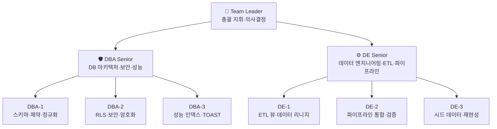

### 1.2 에이전트 팀 JSON

```json
{
  "team": {
    "name": "Soccer DB Architecture Review Team",
    "version": "3.0",
    "project": "soccer / soccer_rnd",
    "created": "2026-02-11",
    "leader": {
      "id": "TL-001",
      "role": "Team Leader",
      "name": "팀 리더",
      "responsibilities": [
        "리뷰 방향 총괄 지휘",
        "DBA·DE 간 의견 조율 및 최종 의사결정",
        "마이그레이션 승인·롤백 판단",
        "리스크 매트릭스 최종 서명",
        "프로덕션 배포 게이트 관리"
      ],
      "authority": "FINAL_DECISION",
      "reports_to": "CTO"
    },
    "members": [
      {
        "id": "DBA-SR-001",
        "role": "DBA Senior",
        "name": "시니어 DBA",
        "specialty": "DB Architecture & Security",
        "reports_to": "TL-001",
        "responsibilities": [
          "스키마 설계 리뷰 총괄 (정규화, 제약, FK 전략)",
          "RLS 정책 설계 및 보안 감사",
          "성능 모델링 및 인덱스 전략",
          "마이그레이션 SQL 작성 및 트랜잭션 안전성 검증",
          "롤백 절차 설계 및 테스트",
          "CASCADE 체인 위험도 분석"
        ],
        "tools": ["PostgreSQL 15+", "pgcrypto", "EXPLAIN ANALYZE", "pg_stat"],
        "team": [
          {
            "id": "DBA-001",
            "role": "DBA Specialist",
            "name": "DBA-1 스키마·정규화",
            "focus": [
              "정적 DDL 분석 (P0: B-01, B-02)",
              "정규화 검증 (B-07, B-08)",
              "UNIQUE 제약 및 Partial Index 설계",
              "GENERATED STORED 컬럼 검증",
              "ENUM vs CHECK 기준 수립 (B-15)"
            ],
            "assigned_bugs": ["B-01", "B-02", "B-03", "B-07", "B-08", "B-15"]
          },
          {
            "id": "DBA-002",
            "role": "DBA Specialist",
            "name": "DBA-2 보안·RLS",
            "focus": [
              "RLS 정책 일관성 감사 (B-05)",
              "팀 기반 역할 계층 RLS 설계",
              "DELETE 정책 설계 (B-21)",
              "phone 암호화 요건 (B-18)",
              "SHA-256 익명화 전략 (B-20)"
            ],
            "assigned_bugs": ["B-05", "B-18", "B-19", "B-20", "B-21"]
          },
          {
            "id": "DBA-003",
            "role": "DBA Specialist",
            "name": "DBA-3 성능·인덱스",
            "focus": [
              "인덱스 커버리지 분석 (B-13)",
              "TOAST 영향 분석 (B-11)",
              "쿼리 비용 추정 (EXPLAIN 기반)",
              "RLS 서브쿼리 성능 벤치마크",
              "볼륨별 성능 예측 (PoV → 프로덕션)"
            ],
            "assigned_bugs": ["B-11", "B-12", "B-13", "B-14"]
          }
        ]
      },
      {
        "id": "DE-SR-001",
        "role": "DE Senior",
        "name": "시니어 데이터 엔지니어",
        "specialty": "Data Engineering & ETL Pipeline",
        "reports_to": "TL-001",
        "responsibilities": [
          "ETL 뷰 설계 리뷰 총괄",
          "데이터 리니지 추적 (컬럼 수준)",
          "R&D 파이프라인 통합 검증",
          "data_migration.md 컴플라이언스 감사",
          "합성 데이터 생성·검증 전략",
          "파이프라인 추적성 (CLAUDE.md 품질 기준)"
        ],
        "tools": ["Python", "pandas", "SQLAlchemy", "pytest", "statsmodels"],
        "team": [
          {
            "id": "DE-001",
            "role": "DE Specialist",
            "name": "DE-1 ETL·리니지",
            "focus": [
              "v_rnd_track_b REST일 포함 (B-04)",
              "v_rnd_track_a strain/DCWR/TSB 노출 (B-22, B-24)",
              "컬럼 수준 데이터 리니지 추적",
              "ETL 뷰 ORDER BY 제거 (B-12)",
              "soreness↔doms 매핑 문서화 (B-17)"
            ],
            "assigned_bugs": ["B-04", "B-12", "B-17", "B-22", "B-24"]
          },
          {
            "id": "DE-002",
            "role": "DE Specialist",
            "name": "DE-2 파이프라인·통합",
            "focus": [
              "load_seed_track_a/b() 통합 검증",
              "ACWR/Monotony/Strain 산출 정합성",
              "혼합효과모형 적합 테스트",
              "LOSO CV 15 fold 완료 검증",
              "파이프라인 버전 추적 (B-09)"
            ],
            "assigned_bugs": ["B-06", "B-09", "B-10", "B-16"]
          },
          {
            "id": "DE-003",
            "role": "DE Specialist",
            "name": "DE-3 시드·재현성",
            "focus": [
              "generate_seed_data.py 검증",
              "export_seed_sql.py user_id 제거 반영",
              "합성 데이터 품질 (REST sRPE=0 명시)",
              "시드 데이터 멱등성 테스트",
              "valid DEFAULT 반영 (B-25)"
            ],
            "assigned_bugs": ["B-23", "B-25"]
          }
        ]
      }
    ],
    "workflow": {
      "phases": [
        {
          "phase": 1,
          "name": "정적 분석",
          "lead": "DBA-SR-001",
          "participants": ["DBA-001", "DBA-002", "DBA-003"],
          "deliverable": "DDL 결함 목록 + 정규화 리포트"
        },
        {
          "phase": 2,
          "name": "ETL·리니지 분석",
          "lead": "DE-SR-001",
          "participants": ["DE-001", "DE-002", "DE-003"],
          "deliverable": "ETL 결함 목록 + 리니지 매핑"
        },
        {
          "phase": 3,
          "name": "보안·RLS 감사",
          "lead": "DBA-SR-001",
          "participants": ["DBA-002", "DE-001"],
          "deliverable": "RLS 매트릭스 + 보안 권고"
        },
        {
          "phase": 4,
          "name": "성능 모델링",
          "lead": "DBA-SR-001",
          "participants": ["DBA-003", "DE-002"],
          "deliverable": "쿼리 비용 추정 + TOAST 분석"
        },
        {
          "phase": 5,
          "name": "컴플라이언스 감사",
          "lead": "DE-SR-001",
          "participants": ["DBA-001", "DE-001"],
          "deliverable": "data_migration.md 대비 적합률 리포트"
        },
        {
          "phase": 6,
          "name": "수정 마이그레이션",
          "lead": "DBA-SR-001",
          "participants": ["ALL"],
          "deliverable": "00005_schema_fixes.sql + 롤백 SQL"
        },
        {
          "phase": 7,
          "name": "통합 검증",
          "lead": "DE-SR-001",
          "participants": ["ALL"],
          "deliverable": "20항목 검증 매트릭스 + 99 pytest 통과"
        },
        {
          "phase": 8,
          "name": "Mermaid EDA 시각화",
          "lead": "TL-001",
          "participants": ["DBA-SR-001", "DE-SR-001"],
          "deliverable": "DRD v3.0 Mermaid 다이어그램 전체"
        }
      ],
      "decision_protocol": {
        "minor": "DBA Sr. 또는 DE Sr. 단독 결정",
        "major": "DBA Sr. + DE Sr. 합의 → TL 승인",
        "critical": "TL 직접 판단 + CTO 보고"
      }
    },
    "bug_assignments": {
      "total": 25,
      "by_severity": {
        "P0_critical": { "count": 2, "ids": ["B-01", "B-02"], "owner": "DBA-SR-001" },
        "P1_high":     { "count": 5, "ids": ["B-03", "B-04", "B-05", "B-06", "B-20"], "owner": "DBA-SR-001 + DE-SR-001" },
        "P2_medium":   { "count": 10, "ids": ["B-07", "B-08", "B-09", "B-10", "B-11", "B-12", "B-13", "B-14", "B-21", "B-22"], "owner": "분산" },
        "P3_low":      { "count": 8, "ids": ["B-15", "B-16", "B-17", "B-18", "B-19", "B-23", "B-24", "B-25"], "owner": "분산" }
      }
    }
  }
}
```

---

## 2. DB EDA — 현행 ER 다이어그램

### 2.1 전체 ER 다이어그램 (현행 — 00003/00004 기준)

> DBA Senior 분석: 현행 스키마의 15개 테이블, 5개 ENUM, FK 체인, 버그 위치를 시각화한다.

```mermaid
erDiagram
    %% ============================================================
    %% 기존 테이블 (00001 마이그레이션)
    %% ============================================================

    users {
        UUID id PK "기본키"
        TEXT email UK "UNIQUE"
        TEXT name
        TEXT avatar_url
        TIMESTAMPTZ created_at
        TIMESTAMPTZ updated_at
    }

    teams {
        UUID id PK
        TEXT name
        UUID created_by FK "→ users"
        TIMESTAMPTZ created_at
    }

    team_members {
        UUID id PK
        UUID team_id FK "→ teams"
        UUID user_id FK "→ users"
        team_role role "ENUM: ADMIN MANAGER MEMBER GUEST"
        TIMESTAMPTZ created_at
    }

    matches {
        UUID id PK
        UUID team_id FK "→ teams"
        UUID created_by FK "→ users"
        match_status status "ENUM"
        DATE match_date
        TEXT location
        TIMESTAMPTZ created_at
        TIMESTAMPTZ updated_at
    }

    attendances {
        UUID id PK
        UUID match_id FK "→ matches"
        UUID user_id FK "→ users"
        attendance_status status "ENUM"
    }

    record_rooms {
        UUID id PK
        UUID match_id FK UK "→ matches UNIQUE"
        record_room_status status "ENUM"
    }

    match_records {
        UUID id PK
        UUID room_id FK "→ record_rooms"
        UUID user_id FK "→ users"
    }

    %% ============================================================
    %% 신규 테이블 (00003 마이그레이션)
    %% ============================================================

    user_profiles {
        UUID id PK
        UUID user_id FK UK "→ users UNIQUE (1:1)"
        TEXT phone "B-18: 평문 저장"
        TEXT position "CHECK 14종"
        TIMESTAMPTZ created_at
        TIMESTAMPTZ updated_at "B-14: 트리거 없음"
    }

    training_sessions {
        UUID id PK
        UUID user_id FK "→ users"
        UUID team_id FK "→ teams"
        UUID match_id FK "→ matches NULL OK"
        session_type session_type "ENUM"
        DATE session_date
        FLOAT duration_min
        BOOLEAN has_pre_wellness "B-03: 파생 플래그"
        BOOLEAN has_post_feedback "B-03: 파생 플래그"
        BOOLEAN has_next_day_review "B-03: 파생 플래그"
        TIMESTAMPTZ created_at
        TIMESTAMPTZ updated_at
    }

    pre_session_wellness {
        UUID id PK
        UUID session_id FK UK "→ training_sessions UNIQUE"
        UUID user_id FK "B-02: 이중 저장"
        SMALLINT fatigue "CHECK 1-7"
        SMALLINT soreness "CHECK 1-7 B-17: doms 불일치"
        SMALLINT stress "CHECK 1-7"
        SMALLINT sleep "CHECK 1-7"
        INT hooper_index "GENERATED STORED"
    }

    post_session_feedback {
        UUID id PK
        UUID session_id FK UK "→ training_sessions UNIQUE"
        UUID user_id FK "B-02: 이중 저장"
        SMALLINT session_rpe "CHECK 1-10 B-06: 0 누락"
        post_condition condition "ENUM"
        TEXT memo
    }

    next_day_reviews {
        UUID id PK
        UUID session_id FK UK "→ training_sessions UNIQUE"
        UUID user_id FK "B-02: 이중 저장"
        next_day_condition condition "ENUM"
        TEXT memo
    }

    hrv_measurements {
        UUID id PK
        UUID user_id FK "→ users CASCADE"
        UUID session_id FK "→ sessions SET NULL B-23"
        hrv_source source "ENUM 5종"
        hrv_context context "ENUM 6종"
        FLOAT_ARRAY rr_intervals_ms "B-11: 크기 무제한"
        INT rr_count "GENERATED STORED"
        TEXT quality_flag
        TIMESTAMPTZ measured_at
    }

    daily_hrv_metrics {
        UUID id PK
        UUID user_id FK "→ users CASCADE"
        UUID measurement_id FK "→ hrv_measurements SET NULL B-10"
        DATE metric_date
        FLOAT rmssd
        FLOAT sdnn
        FLOAT ln_rmssd
        FLOAT ln_rmssd_7d
        FLOAT mean_hr
        INT nn_count
        BOOLEAN valid "B-25: DEFAULT 없음"
    }

    computed_load_metrics {
        UUID id PK
        UUID user_id FK "→ users CASCADE"
        DATE metric_date
        FLOAT daily_load
        FLOAT atl_rolling
        FLOAT ctl_rolling
        FLOAT acwr_rolling
        FLOAT atl_ewma
        FLOAT ctl_ewma
        FLOAT acwr_ewma
        FLOAT monotony
        FLOAT strain_value "B-16: strain과 불일치"
        FLOAT dcwr_rolling "B-22: ETL 미노출"
        FLOAT tsb_rolling "B-22: ETL 미노출"
        FLOAT hooper_index "B-22: 중복"
    }

    %% ============================================================
    %% ETL 뷰 (00004 마이그레이션)
    %% ============================================================

    v_rnd_track_b {
        TEXT athlete_id "B-20: UUID 평문"
        DATE date
        SMALLINT rpe
        FLOAT duration_min
        FLOAT srpe
        SMALLINT fatigue
        SMALLINT stress
        SMALLINT doms
        SMALLINT sleep
        INT hooper_index
        TEXT session_type
        BOOLEAN match_day
        INT next_day_score
    }

    v_rnd_track_a {
        TEXT subject_id "B-20: UUID 평문"
        DATE date
        FLOAT rmssd
        FLOAT sdnn
        FLOAT ln_rmssd
        FLOAT ln_rmssd_7d
        FLOAT mean_hr
        INT nn_count
        FLOAT acwr_rolling
        FLOAT acwr_ewma
        FLOAT monotony
        FLOAT srpe
    }

    %% ============================================================
    %% 관계 정의
    %% ============================================================

    users ||--o| user_profiles : "1:1"
    users ||--o{ training_sessions : "1:N"
    users ||--o{ hrv_measurements : "1:N"
    users ||--o{ daily_hrv_metrics : "1:N"
    users ||--o{ computed_load_metrics : "1:N"
    users ||--o{ team_members : "1:N"
    users ||--o{ attendances : "1:N"
    users ||--o{ match_records : "1:N"

    teams ||--o{ team_members : "1:N"
    teams ||--o{ training_sessions : "1:N"
    teams ||--o{ matches : "1:N"

    matches ||--o| record_rooms : "1:1"
    matches ||--o{ attendances : "1:N"
    matches ||--o{ training_sessions : "0:N match_id NULL OK"

    record_rooms ||--o{ match_records : "1:N"

    training_sessions ||--o| pre_session_wellness : "1:1"
    training_sessions ||--o| post_session_feedback : "1:1"
    training_sessions ||--o| next_day_reviews : "1:1"
    training_sessions ||--o{ hrv_measurements : "1:N SET NULL"

    hrv_measurements ||--o| daily_hrv_metrics : "N:1 대표 측정"

    %% ETL 뷰 소스
    training_sessions }|--|| v_rnd_track_b : "ETL 소스"
    pre_session_wellness }|--|| v_rnd_track_b : "LEFT JOIN"
    post_session_feedback }|--|| v_rnd_track_b : "LEFT JOIN"
    next_day_reviews }|--|| v_rnd_track_b : "LEFT JOIN"

    daily_hrv_metrics }|--|| v_rnd_track_a : "ETL 소스"
    computed_load_metrics }|--|| v_rnd_track_a : "LEFT JOIN"
```

### 2.2 핵심 테이블 상세 ER (00003 스키마 집중)

```mermaid
erDiagram
    TRAINING_SESSIONS {
        UUID id PK
        UUID user_id FK
        UUID team_id FK
        UUID match_id FK "NULL 허용"
        session_type type "TRAINING MATCH REST OTHER"
        DATE session_date
        FLOAT duration_min
        BOOLEAN has_pre_wellness "삭제 대상 B-03"
        BOOLEAN has_post_feedback "삭제 대상 B-03"
        BOOLEAN has_next_day_review "삭제 대상 B-03"
    }

    PRE_SESSION_WELLNESS {
        UUID id PK "B-08: 불필요 surrogate"
        UUID session_id FK_UK "UNIQUE"
        UUID user_id FK "B-02: 제거 대상"
        SMALLINT fatigue "1-7"
        SMALLINT soreness "1-7"
        SMALLINT stress "1-7"
        SMALLINT sleep "1-7"
        INT hooper_index "GENERATED = sum(4항목)"
    }

    POST_SESSION_FEEDBACK {
        UUID id PK "B-08: 불필요 surrogate"
        UUID session_id FK_UK "UNIQUE"
        UUID user_id FK "B-02: 제거 대상"
        SMALLINT session_rpe "CHECK 1-10 → 0-10"
        post_condition condition
        TEXT memo
    }

    NEXT_DAY_REVIEWS {
        UUID id PK "B-08: 불필요 surrogate"
        UUID session_id FK_UK "UNIQUE"
        UUID user_id FK "B-02: 제거 대상"
        next_day_condition condition "WORSE SAME BETTER"
        TEXT memo
    }

    TRAINING_SESSIONS ||--o| PRE_SESSION_WELLNESS : "1:1 CASCADE"
    TRAINING_SESSIONS ||--o| POST_SESSION_FEEDBACK : "1:1 CASCADE"
    TRAINING_SESSIONS ||--o| NEXT_DAY_REVIEWS : "1:1 CASCADE"
```

---

## 3. DB EDA — 수정 후 목표 ER 다이어그램

> Team Leader 지시: 00005_schema_fixes.sql 적용 후의 목표 상태를 별도 다이어그램으로 시각화하라.

```mermaid
erDiagram
    %% ============================================================
    %% 수정 후 목표 상태 (00005 적용 후)
    %% ============================================================

    users {
        UUID id PK
        TEXT email UK
        TEXT name
        TEXT avatar_url
        TIMESTAMPTZ created_at
        TIMESTAMPTZ updated_at
    }

    teams {
        UUID id PK
        TEXT name
        UUID created_by FK
    }

    team_members {
        UUID id PK
        UUID team_id FK
        UUID user_id FK
        team_role role
    }

    matches {
        UUID id PK
        UUID team_id FK
        UUID created_by FK
        match_status status
        DATE match_date
    }

    user_profiles {
        UUID id PK
        UUID user_id FK_UK "1:1"
        TEXT phone "TODO: AES-256 암호화"
        TEXT position "CHECK 14종"
        TIMESTAMPTZ created_at
        TIMESTAMPTZ updated_at "트리거 자동 갱신"
    }

    training_sessions {
        UUID id PK
        UUID user_id FK
        UUID team_id FK
        UUID match_id FK "NULL OK"
        session_type type "ENUM"
        DATE session_date "단독 인덱스 추가"
        FLOAT duration_min
        TIMESTAMPTZ created_at
        TIMESTAMPTZ updated_at "트리거 자동 갱신"
    }

    pre_session_wellness {
        UUID id PK
        UUID session_id FK_UK "UNIQUE - RLS 경유"
        SMALLINT fatigue "1-7"
        SMALLINT soreness "1-7"
        SMALLINT stress "1-7"
        SMALLINT sleep "1-7"
        INT hooper_index "GENERATED"
    }

    post_session_feedback {
        UUID id PK
        UUID session_id FK_UK "UNIQUE - RLS 경유"
        SMALLINT session_rpe "CHECK 0-10 Borg CR-10"
        post_condition condition
        TEXT memo
    }

    next_day_reviews {
        UUID id PK
        UUID session_id FK_UK "UNIQUE - RLS 경유"
        next_day_condition condition
        TEXT memo
    }

    hrv_measurements {
        UUID id PK
        UUID user_id FK "CASCADE"
        UUID session_id FK "SET NULL 의도적"
        hrv_source source
        hrv_context context
        FLOAT_ARRAY rr_intervals_ms "CHECK 1-50000"
        INT rr_count "GENERATED"
        TEXT quality_flag
    }

    daily_hrv_metrics {
        UUID id PK
        UUID user_id FK
        UUID measurement_id FK "SET NULL"
        DATE metric_date UK
        FLOAT rmssd
        FLOAT sdnn
        FLOAT ln_rmssd
        FLOAT ln_rmssd_7d
        FLOAT mean_hr
        INT nn_count
        BOOLEAN valid "DEFAULT TRUE NOT NULL"
    }

    computed_load_metrics {
        UUID id PK
        UUID user_id FK
        DATE metric_date UK
        FLOAT daily_load
        FLOAT atl_rolling
        FLOAT ctl_rolling
        FLOAT acwr_rolling
        FLOAT atl_ewma
        FLOAT ctl_ewma
        FLOAT acwr_ewma
        FLOAT monotony
        FLOAT strain "이름 통일"
        FLOAT dcwr_rolling
        FLOAT tsb_rolling
        FLOAT hooper_index
        TEXT pipeline_version "추적성 추가"
        JSONB params "파라미터 기록"
    }

    v_rnd_track_b_fixed {
        TEXT athlete_id "TODO SHA-256"
        DATE date
        SMALLINT rpe
        FLOAT duration_min
        FLOAT srpe "COALESCE 0"
        SMALLINT fatigue
        SMALLINT stress
        SMALLINT doms
        SMALLINT sleep
        INT hooper_index
        TEXT session_type "REST 포함"
        BOOLEAN match_day
        INT next_day_score
    }

    v_rnd_track_a_fixed {
        TEXT subject_id "TODO SHA-256"
        DATE date
        FLOAT rmssd
        FLOAT sdnn
        FLOAT ln_rmssd
        FLOAT ln_rmssd_7d
        FLOAT mean_hr
        INT nn_count
        FLOAT acwr_rolling
        FLOAT acwr_ewma
        FLOAT monotony
        FLOAT strain "추가"
        FLOAT dcwr_rolling "추가"
        FLOAT tsb_rolling "추가"
        FLOAT srpe
    }

    %% 관계 (수정 후)
    users ||--o| user_profiles : "1:1"
    users ||--o{ training_sessions : "1:N"
    users ||--o{ hrv_measurements : "1:N"
    users ||--o{ daily_hrv_metrics : "1:N"
    users ||--o{ computed_load_metrics : "1:N"

    teams ||--o{ team_members : "1:N"
    teams ||--o{ training_sessions : "1:N"

    matches ||--o{ training_sessions : "0:N"

    training_sessions ||--o| pre_session_wellness : "1:1 CASCADE"
    training_sessions ||--o| post_session_feedback : "1:1 CASCADE"
    training_sessions ||--o| next_day_reviews : "1:1 CASCADE"
    training_sessions ||--o{ hrv_measurements : "1:N SET NULL"

    hrv_measurements ||--o| daily_hrv_metrics : "N:1"

    training_sessions }|--|| v_rnd_track_b_fixed : "ETL"
    pre_session_wellness }|--|| v_rnd_track_b_fixed : "JOIN"
    post_session_feedback }|--|| v_rnd_track_b_fixed : "JOIN"
    next_day_reviews }|--|| v_rnd_track_b_fixed : "JOIN"

    daily_hrv_metrics }|--|| v_rnd_track_a_fixed : "ETL"
    computed_load_metrics }|--|| v_rnd_track_a_fixed : "JOIN"
```

---

## 4. 데이터 흐름도

### 4.1 서비스 입력 → DB → ETL → R&D 파이프라인

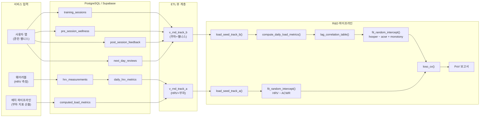

### 4.2 RLS 보안 계층

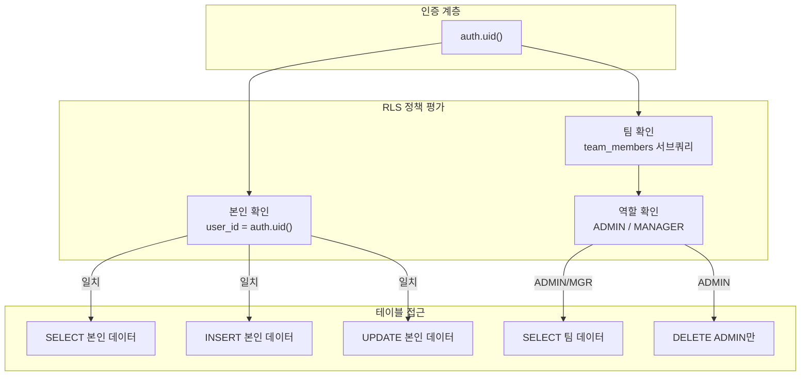

---

## 5. 데이터 리니지 — Track B

> DE Senior 분석: 서비스 DB 컬럼 → ETL 변환 → R&D 스키마 → 파이프라인 출력까지 추적.

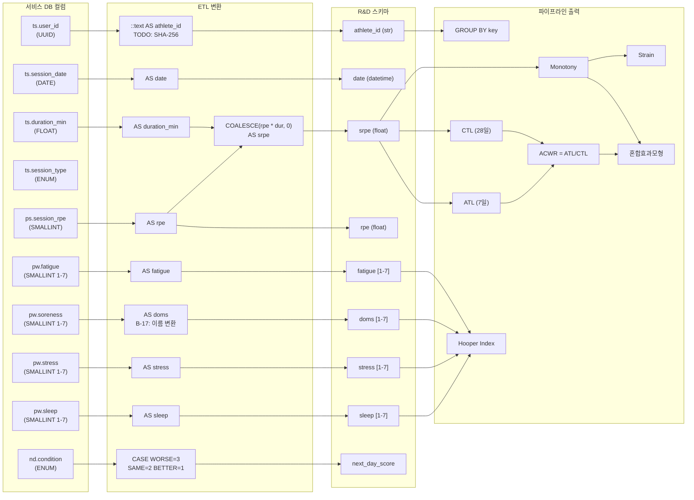

---

## 6. 데이터 리니지 — Track A

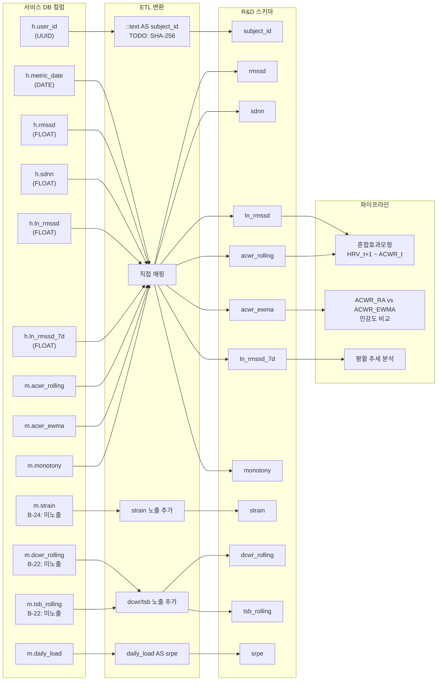

---

## 7. RLS 정책 매트릭스

### 7.1 현행 vs 수정 후 RLS 비교

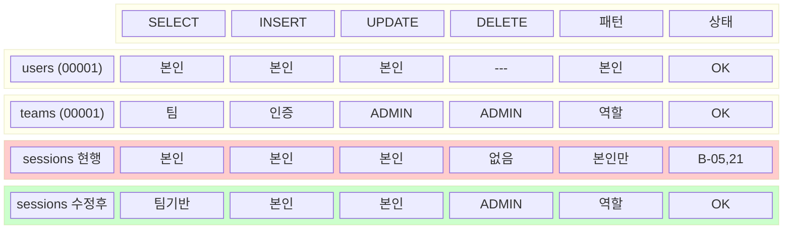

### 7.2 RLS 팀 기반 접근 흐름도

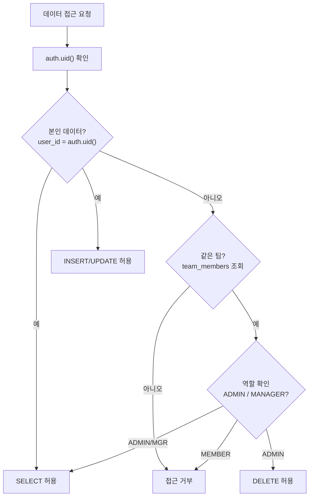

---

## 8. CASCADE 체인 시각화

> DBA Senior 경고: 사용자 1명 삭제 시 최대 ~780행 CASCADE 삭제.

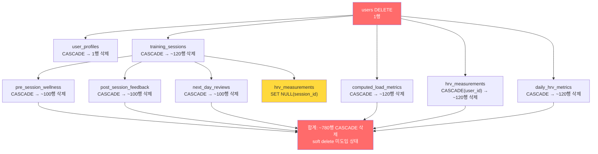

---

## 9. 버그 심각도 분포

### 9.1 심각도별 분포

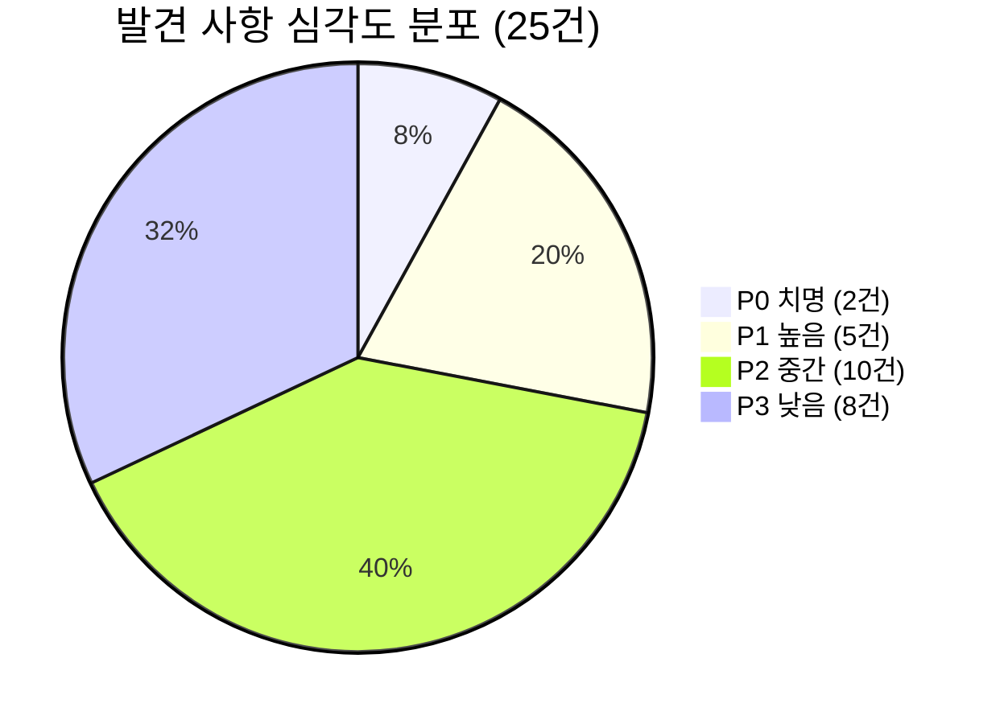

### 9.2 분류별 분포

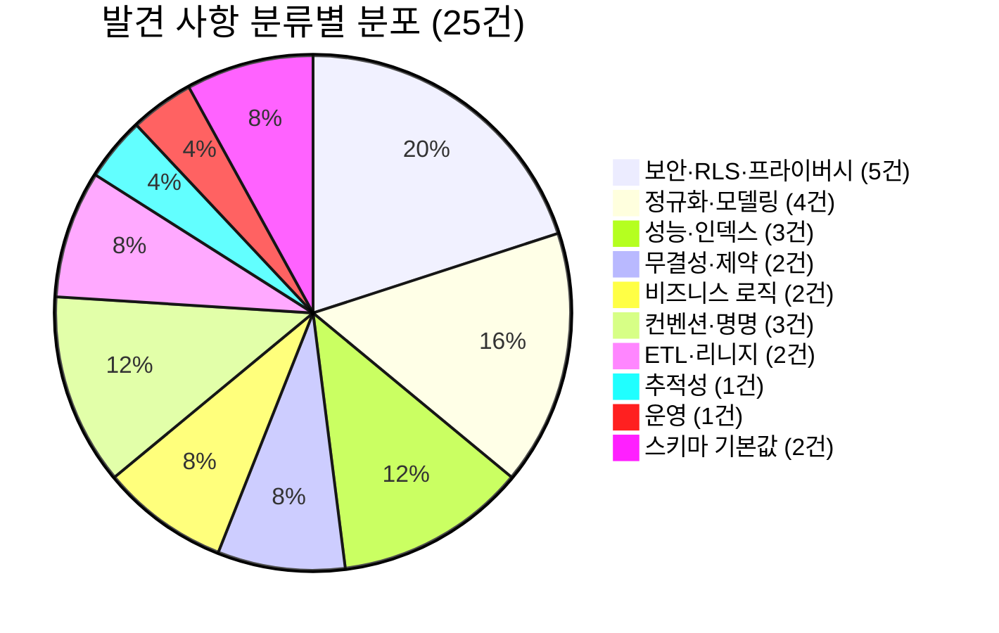

### 9.3 버전별 발견 추이

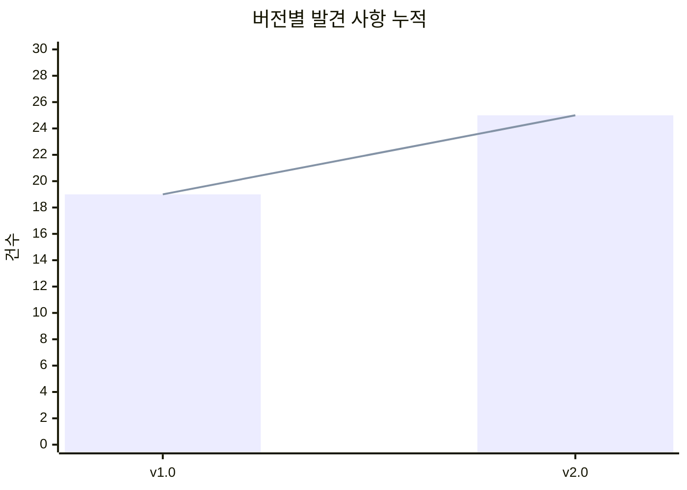

---

## 10. 마이그레이션 위상 의존성

> Team Leader 지시: 00005 수정 마이그레이션의 15단계 위상 의존성을 시각화하라.

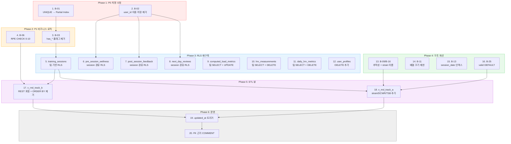

---

## 11. 성능 모델링 시각화

### 11.1 데이터 볼륨 예측

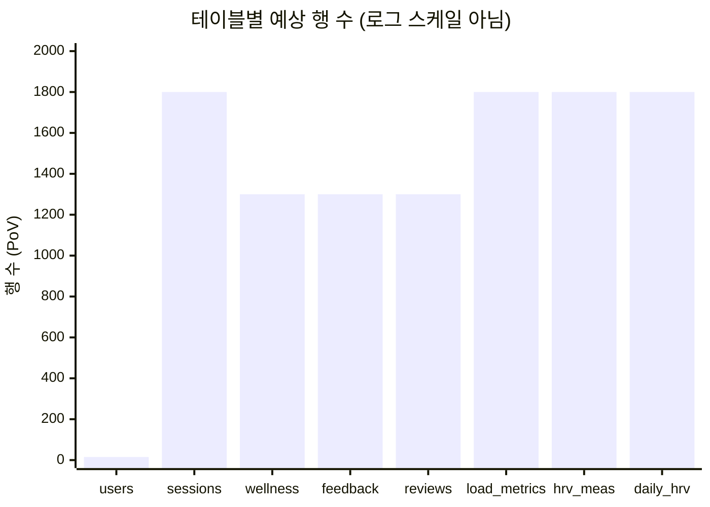

### 11.2 TOAST 저장 영향 — hrv_measurements

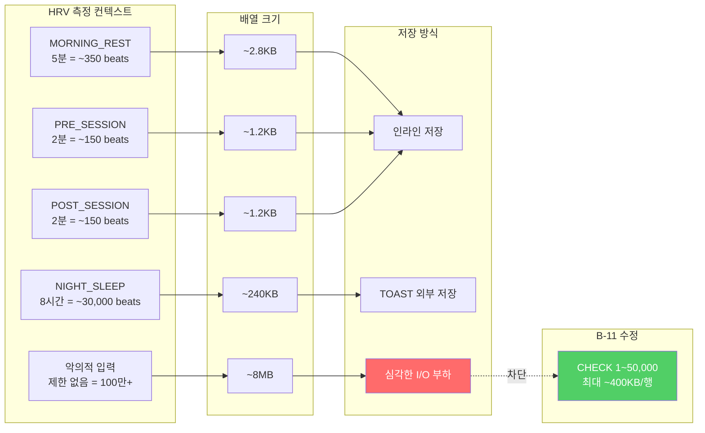

---

## 12. ENUM 타입 관계도

```mermaid
flowchart TD
    subgraph ENUM_00001["기존 ENUM (00001)"]
        TR["team_role<br/>ADMIN MANAGER<br/>MEMBER GUEST"]
        MS["match_status<br/>OPEN CONFIRMED<br/>COMPLETED CANCELLED"]
        AS_E["attendance_status<br/>PENDING ACCEPTED<br/>DECLINED MAYBE"]
        RRS["record_room_status<br/>OPEN CLOSED"]
    end

    subgraph ENUM_00003["신규 ENUM (00003)"]
        ST["session_type<br/>TRAINING MATCH<br/>REST OTHER"]
        PC["post_condition<br/>VERY_BAD BAD NEUTRAL<br/>GOOD VERY_GOOD"]
        NDC["next_day_condition<br/>WORSE SAME BETTER"]
        HS["hrv_source<br/>CHEST_STRAP SMARTWATCH<br/>FINGER_SENSOR APP_MANUAL<br/>EXTERNAL_IMPORT"]
        HC["hrv_context<br/>MORNING_REST PRE_SESSION<br/>POST_SESSION DURING_SESSION<br/>NIGHT_SLEEP OTHER"]
    end

    subgraph CHECK_CONST["CHECK 제약 (B-15: 혼재)"]
        POS["position<br/>CHECK IN 14종<br/>GK CB LB RB ...]"]
        HOOPER["fatigue/soreness<br/>stress/sleep<br/>CHECK 1-7"]
        RPE["session_rpe<br/>CHECK 0-10"]
    end

    TR --> |team_members| TM_TABLE["team_members.role"]
    MS --> |matches| M_TABLE["matches.status"]
    AS_E --> |attendances| A_TABLE["attendances.status"]
    RRS --> |record_rooms| RR_TABLE["record_rooms.status"]
    ST --> |training_sessions| TS_TABLE["training_sessions.session_type"]
    PC --> |post_feedback| PF_TABLE["post_session_feedback.condition"]
    NDC --> |next_day| ND_TABLE["next_day_reviews.condition"]
    HS --> |hrv| HRV_TABLE["hrv_measurements.source"]
    HC --> |hrv| HRV_TABLE2["hrv_measurements.context"]
    POS --> |user_profiles| UP_TABLE["user_profiles.position"]

    style ENUM_00001 fill:#e3f2fd
    style ENUM_00003 fill:#e8f5e9
    style CHECK_CONST fill:#fff3e0
```

---

## 13. 팀 리뷰 결론

### 13.1 Team Leader 총평

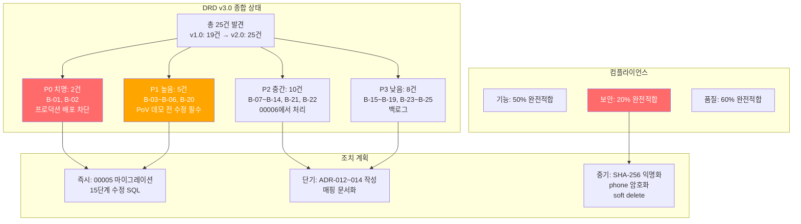

### 13.2 DBA Senior 결론

| 영역 | 평가 | 비고 |
|------|:----:|------|
| 스키마 골격 | 양호 | 8개 핵심 테이블 구조 적절, GENERATED STORED 활용 우수 |
| 무결성 | **치명 결함** | B-01 UNIQUE NULLS NOT DISTINCT, B-02 user_id 이중 저장 |
| 보안 (RLS) | **취약** | 00001 역할 기반 패턴과 00003 본인 전용 패턴 불일치, DELETE 전면 부재 |
| 성능 | 양호 | PoV 규모에서 문제 없음, 프로덕션 확장 시 B-11/B-13 수정 필수 |
| CASCADE | 주의 | 사용자 삭제 시 ~780행 연쇄 삭제, soft delete 검토 필요 |

### 13.3 DE Senior 결론

| 영역 | 평가 | 비고 |
|------|:----:|------|
| ETL 뷰 아키텍처 | 우수 | 서비스 ↔ R&D 분리 캡슐화 적절 |
| REST일 처리 | **결함** | B-04 ACWR 40% 과대추정 위험 |
| 데이터 리니지 | 부분 완성 | B-22/B-24 사장 컬럼, strain 미노출 |
| 익명화 | **미구현** | B-20 프로덕션 전환 필수 선행 조건 |
| 추적성 | 부족 | B-09 파이프라인 버전/파라미터 미기록, CLAUDE.md 품질 기준 위반 |
| R&D 정합성 | 양호 | Track A/B 파이프라인과 스키마 구조 호환 |

### 13.4 최종 판정

> **Team Leader 판정**: 00005_schema_fixes.sql 미적용 상태에서 프로덕션 배포를 **금지**한다.
> P0 2건(B-01, B-02)은 운영 환경 적용 즉시 장애를 유발하며, P1 5건은 PoV 목적 달성을 직접 저해한다.
> DBA Senior와 DE Senior는 00005 마이그레이션을 즉시 작성·검증하고, 20항목 검증 매트릭스를 통과한 후 TL에게 승인을 요청할 것.

---

*본 문서는 Team Leader 지휘 하에 DBA Senior 팀(3명)과 DE Senior 팀(3명)이 공동 작성한 DB EDA 종합 다이어그램 및 리뷰 결과이다. 모든 Mermaid 다이어그램은 DRD v2.0의 25건 발견 사항과 수정 마이그레이션 계획을 시각적으로 추적할 수 있도록 설계되었다.*
