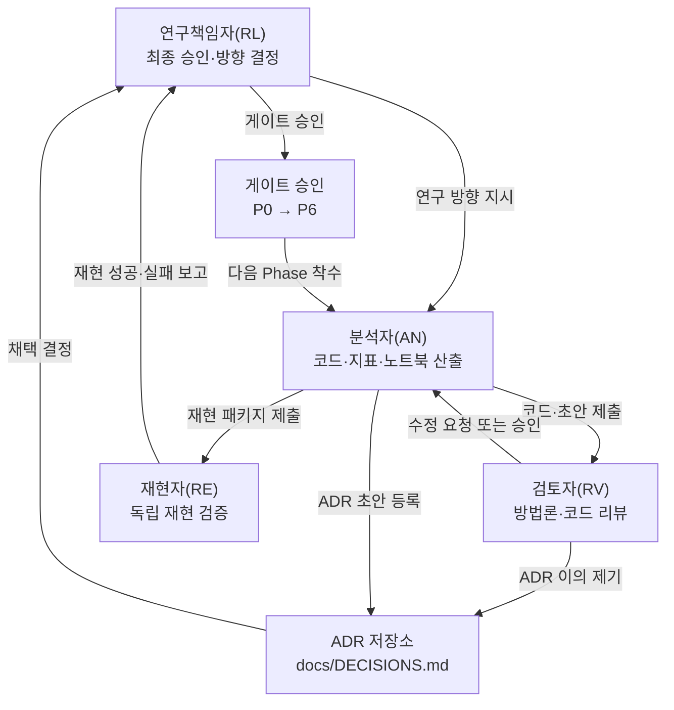
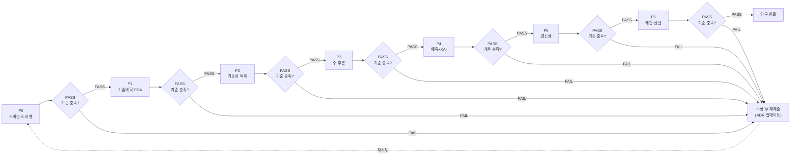
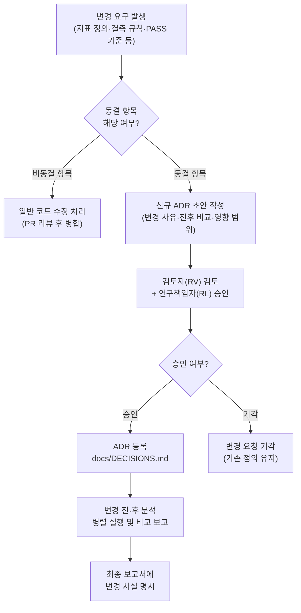

# 실험 운영 거버넌스 문서 — soccer_rnd R&D 저장소

> **버전**: v1.0 | **작성일**: 2026-05-30 | **언어 정책**: 한국어(ko-KR), 코드 식별자·파일명·약어만 영문
> **위치**: `docs/GOVERNANCE.md`
> **연관 문서**: [`docs/RESEARCH_PROTOCOL.md`](RESEARCH_PROTOCOL.md) · [`docs/DECISIONS.md`](DECISIONS.md) · [`docs/REFERENCES.md`](REFERENCES.md) · [`README.md`](../README.md)

---

## 1. 목적 및 적용 범위

### 1.1 목적

본 문서는 `soccer_rnd` R&D 저장소의 실험·분석·보고 전 과정에 걸쳐 **재현 가능성, 사전등록 원칙, 데이터 무결성, 역할 명확화**를 보장하기 위한 거버넌스 규약을 정의한다. 통계적 결론의 신뢰성과 방법론 투명성을 확보함으로써, 연구 결과가 FDS(Fraud Detection System) 도메인 및 스포츠 과학 분야 심사자에게 재현 가능하고 검토 가능한(reviewer-safe) 형태로 전달될 수 있도록 한다.

### 1.2 적용 범위

| 대상 | 포함 여부 |
|---|---|
| Track A(PhysioNet ACTES) 및 Track B(SoccerMon) 분석 전반 | 포함 |
| 단계 P0~P6 게이트 전환 절차 | 포함 |
| 지표 정의·결측 처리·PASS 기준 사전 동결(freeze) | 포함 |
| 데이터 라이선스·인용 의무 | 포함 |
| 합성 DGP 실험(H1~H4) | 포함 |
| 배포형 서비스·운영 환경 | **적용 외** (본 저장소는 PoV/R&D 범위) |

### 1.3 문서 메타

| 항목 | 내용 |
|---|---|
| 버전 | v1.0 |
| 작성일 | 2026-05-30 |
| 다음 검토 예정 | P3 착수 전(부상 예측 인과설계 착수 시) |
| 관할 ADR | ADR-004(결측), ADR-005(Track A), ADR-006(Track B), ADR-007(합성), ADR-012(통합 가설) |
| 보고 표준 | 예측=TRIPOD-AI, 관찰=STROBE |

---

## 2. 역할 및 책임 (RACI)

### 2.1 역할 정의

| 역할 코드 | 명칭 | 주요 책무 |
|---|---|---|
| `RL` | 연구책임자(Research Lead) | 연구 방향·게이트 최종 승인·ADR 채택 권한·외부 인용 책임 |
| `AN` | 분석자(Analyst) | 코드 작성·지표 산출·모형 실행·노트북 산출·결과 해석 초안 |
| `RV` | 검토자(Reviewer) | 코드 리뷰·통계 방법론 검토·ADR 이의 제기·보고서 fact-check |
| `RE` | 재현자(Reproducer) | 독립 환경에서 산출물 재현 확인·seed·버전 일치 검증 |

### 2.2 RACI 매트릭스

| 활동 | 연구책임자(RL) | 분석자(AN) | 검토자(RV) | 재현자(RE) |
|---|:---:|:---:|:---:|:---:|
| 연구질문·RQ 확정 | **R/A** | C | I | — |
| ADR 초안 작성 | I | **R** | C | — |
| ADR 채택 승인 | **A** | I | C | — |
| 지표 산출 코드 작성 | I | **R** | C | I |
| 코드 리뷰 | C | I | **R/A** | — |
| 게이트 PASS 기준 충족 확인 | **A** | **R** | C | C |
| 노트북 산출물 커밋 | C | **R/A** | I | — |
| 재현 독립 실행 검증 | I | I | I | **R/A** |
| 보고서(TRIPOD/STROBE) 초안 | I | **R** | C | — |
| 보고서 최종 승인 | **A** | I | **R** | I |
| 데이터 라이선스 준수 확인 | **A** | **R** | C | — |
| ADR 변경통제(사후 수정) | **A** | C | **R** | — |

> *R=실행, A=최종책임, C=협의, I=통보 (RACI 표준 기호)*

### 2.3 조직 및 의사결정 흐름



---

## 3. 게이트 승인 프로세스 (P0~P6)

### 3.1 단계별 승인 기준 및 권한

| 게이트 | 단계 명칭 | 핵심 산출물 | PASS 기준 | 승인 권한 |
|---|---|---|---|---|
| **P0** | 거버넌스·라벨 정의 | ADR-injury-label.md, 라벨 빌더 + 단위 테스트 | onset 43건·발생률 1.75/1000 재현, seed=42 고정 확인 | RL 단독 |
| **P1** | 기술역학 EDA | STROBE 흐름도, 기술통계표, KM 곡선, 결측 히트맵 | STROBE 흐름도 완비·결측 패턴 MNAR 가설 명시 | RL + RV |
| **P2** | 기준선(Baseline) 박제 | Gabbett sweet-spot 룰 기반 PR-AUC 산출 | 기준선 PR-AUC 수치 확정, 후속 모형 비교 기준 고정 | RL + RV |
| **P3** | 주 추론(인과 설계) | 이산시간 생존+frailty, case-crossover 결과, 효과추정+95% CI | 설계 3종 방향 일관 + 민감도 통과 | RL + RV + RE |
| **P4** | 예측 + XAI | TRIPOD 표, calibration·DCA 그림, SHAP | 시간분리 검정에서 net benefit > Gabbett 룰 | RL + RV + RE |
| **P5** | 강건성 검증 | MNAR 편향 정량, 윈도우 민감도, Leave-Team-Out | 결론의 가정 강건성 수치 보고 | RL + RV |
| **P6** | 재현·전달 패키지 | 재현 패키지, Streamlit 데모, TRIPOD 체크리스트 | 동일 입력 → 동일 결과, RE 독립 재현 성공 | RL + RE |

### 3.2 게이트 통과 흐름



### 3.3 게이트 운영 원칙

- 게이트를 통과하지 않은 단계의 코드·산출물은 `main` 브랜치에 병합하지 않는다.
- FAIL 시 원인을 ADR에 기록한 뒤 수정하고, 동일 게이트를 재통과해야 한다.
- 게이트 통과 사실은 `docs/DECISIONS.md`에 날짜·담당자·산출물 경로를 기록한다.

---

## 4. 사전등록 동결(Freeze) 절차 및 변경통제

### 4.1 동결 대상 및 시점

분석 착수 전에 반드시 ADR로 동결해야 하는 항목은 다음과 같다.

| 동결 대상 | 동결 시점 | 참조 ADR |
|---|---|---|
| 부상 onset 정의(gap 임계값, gap≥7일) | P0 착수 전 | ADR-injury-label(예정) |
| 결측 처리 원칙(원칙 NA 유지, 명시 규칙만 허용) | P0 착수 전 | ADR-004 |
| 주요 지표 정의(ATL 7일/CTL 28일/ACWR 캡핑 4.0) | P0 착수 전 | ADR-002, ADR-011 |
| PASS 기준(PR-AUC 임계, ΔAIC 기준) | 각 단계 착수 전 | ADR 개별 등록 |
| 예측 윈도우 k(k=1·3·7일) | P3 착수 전 | ADR-injury-label(예정) |
| 모형 가설(RQ1~RQ4) | P3 착수 전 | RESEARCH_PROTOCOL.md §D |
| np.random.seed 값(42, 합성=2024) | P0 착수 전 | ADR-007, ADR-012 |

### 4.2 동결 후 변경 금지 원칙

> **동결된 항목은 분석 착수 후 변경할 수 없다.** 변경이 불가피한 경우에는 반드시 다음 절차를 따른다.

1. 기존 ADR를 수정하지 않는다(이력 보존).
2. **신규 ADR를 별도 등록**하고 변경 사유, 변경 전후 정의, 변경의 영향 범위를 명시한다.
3. 변경 후 분석은 변경 전 분석과 **병렬로 보고**하여 결론 안정성을 확인한다.
4. 최종 보고서에 변경 사실과 민감도 분석 결과를 투명하게 기재한다.

### 4.3 변경통제 흐름



---

## 5. 데이터 무결성 및 결측 정책

### 5.1 원칙

본 저장소의 모든 결측 처리는 **ADR-004**를 기준으로 한다.

- **원칙 NA 유지**: 측정이 없는 값은 결측(NA)으로 보존한다. 암묵적 보간, 전진 충전(forward-fill), 후진 충전(backward-fill)은 명시적 근거 없이 허용하지 않는다.
- **명시 규칙만 허용**: 분석 목적상 결측을 처리해야 할 경우, 처리 방법·근거·적용 범위를 ADR에 명시하고 코드에 주석으로 기재한다.

### 5.2 트랙별 결측 현황 및 처리 규약

| 변수 | 결측률 | 결측 메커니즘 가설 | 처리 규약 |
|---|---|---|---|
| fatigue / stress / soreness / sleep_quality | 32.4% | MNAR 가설(부상·컨디션 불량 시 미보고) | NA 유지, MNAR 편향 정량화(RQ4) |
| hooper_index | 32.5% | MNAR(4개 항목 중 하나라도 결측 시) | NA 유지, 분석 시 완전관측 행 사용 명시 |
| daily_load / acwr / atl / monotony / strain | 0% | 원자료 사전 산출·전진충전 가능성 | 전진충전 여부 재확인 후 ADR 기록 |
| RR(Track A) | — | 아티팩트(RR>3000ms 등) | 클리닝 규칙 ADR 명시, 원본 보존 |

### 5.3 MNAR 가설 처리

SoccerMon 웰니스 결측 32%가 MNAR(Missing Not At Random)임을 가정할 때, 완전관측 분석은 웰니스 효과를 **체계적으로 과소추정**할 가능성이 있다. 이를 투명하게 처리하기 위해 다음을 의무화한다.

1. RQ4(MNAR 편향 분석)를 P5 강건성 단계에서 Monte Carlo 시뮬레이션으로 정량화한다.
2. 결측 메커니즘에 대한 민감도 분석(MCAR·MAR·MNAR 시나리오)을 최종 보고서에 포함한다.
3. "결측=컨디션 불량"의 MNAR 가설을 기술역학 EDA(P1) 단계에서 검정 가능한 방식으로 제시한다.

---

## 6. 데이터 출처 및 라이선스

### 6.1 Track A — PhysioNet ACTES

| 항목 | 내용 |
|---|---|
| 정식명 | Autonomic Control of the cardiovascular system during Exercise (ACTES) |
| 출처 | PhysioNet (`physionet.org/content/actes/`) |
| 라이선스 | PhysioNet Credentialed Health Data License (공개 열람 가능, 배포 제한 조건 확인 필수) |
| 인용 의무 | 논문·보고서 사용 시 PhysioNet 표준 인용 방식 준수 |
| 저장 위치 | `data/raw/track_A/` (git 제외, `.gitignore` 적용) |
| 재배포 금지 | 원본 데이터 파일을 git 저장소에 포함하거나 제3자에게 재배포하지 않는다 |

### 6.2 Track B — SoccerMon (Zenodo)

| 항목 | 내용 |
|---|---|
| 정식명 | SoccerMon (Midoglu et al., 2024, *Nature Scientific Data*) |
| 출처 | Zenodo (DOI 확인 후 기재), 노르웨이 엘리트 여자 축구 2개 팀 |
| 라이선스 | **CC BY 4.0** — 출처 표기 의무, 상업적 사용 허용, 라이선스 조건 상속 |
| 인용 의무 | Midoglu et al. (2024) 및 Zenodo DOI를 모든 분석 보고서·노트북 첫머리에 명시 |
| 저장 위치 | `data/raw/track_B/` (git 제외, `.gitignore` 적용) |
| 재배포 | CC BY 4.0 조건 하에 허용, 단 출처·라이선스 명시 의무 준수 |

### 6.3 data/raw 비-git 규칙

- `data/raw/` 전체는 `.gitignore`에 등록되어 있으며, 어떠한 원본 데이터 파일도 git 이력에 포함하지 않는다.
- 데이터 취득 방법은 `docs/DATA_SCHEMA_MAPPING.md`에 URL·절차를 기록하여 재현 가능성을 보장한다.
- `data/processed/`의 전처리 결과물도 원칙적으로 git에 포함하지 않는다. 예외적 포함 시 ADR로 사유를 기록한다.

---

## 7. 재현성 체크리스트

본 저장소의 모든 분석은 **동일 입력 → 동일 결과** 원칙을 준수한다. 커밋 전 다음 체크리스트를 확인한다.

### 7.1 필수 재현 조건

| 항목 | 기준 | 확인 방법 |
|---|---|---|
| 난수 시드 고정 | `np.random.seed(42)` (합성 DGP: `seed=2024`) | 코드 최상단 명시 |
| 의존 패키지 버전 핀 | `requirements.txt`에 버전 고정(`==` 사용) | `pip freeze` 출력과 일치 |
| 가상환경 격리 | `venv/` 사용, 시스템 Python 의존 금지 | `venv\Scripts\activate` 후 실행 |
| 재현 환경 명세 | Python 3.13.7, numpy 1.26.4, pandas 2.3.1, statsmodels 0.14.5, scipy 1.16.1, scikit-learn 1.7.1 | `RESEARCH_PROTOCOL.md` 상단 명세와 일치 |
| 산출물 경로 고정 | 그림 → `reports/figures/`, 보고서 → `reports/`, 전처리 → `data/processed/` | 하드코딩 경로 사용 금지, 설정 파일 또는 상수로 관리 |
| 단위 테스트 통과 | `python -m pytest tests/ -v` 전체 통과 | CI 또는 로컬 실행 |
| 노트북 셀 순서 실행 | `Restart Kernel → Run All` 후 오류 없음 | P6 제출 전 의무 확인 |
| 동일 입력 → 동일 결과 | 독립 환경에서 재현자(RE)가 동일 결과 확인 | P6 게이트 통과 조건 |

### 7.2 재현 실패 시 처리

1. 재현자(RE)가 재현 실패 사실과 오류 내용을 연구책임자(RL)에게 보고한다.
2. 분석자(AN)가 원인을 추적하고 코드 또는 환경 설정을 수정한다.
3. 수정 후 재현 재시도, 성공 시 커밋 및 ADR 업데이트.
4. P6 게이트는 RE 독립 재현 성공 없이 통과 불가.

---

## 8. 보고 표준

### 8.1 예측 모형 — TRIPOD-AI

예측 모형(RQ1~RQ3)을 포함하는 모든 보고서는 **TRIPOD-AI 체크리스트**를 준수한다.

| 영역 | 주요 항목 |
|---|---|
| 제목·초록 | 예측 모형 연구임을 명시, 목표 모집단·결과변수 기술 |
| 배경 | 기존 모형의 한계, 본 연구의 필요성 |
| 방법: 데이터 | 데이터 출처·수집 기간·포함/제외 기준·STROBE 흐름도 |
| 방법: 변수 | 예측변수·결과변수·공변량 정의, 코딩 방법 |
| 방법: 분석 | 표본 크기·결측 처리·모형 개발·검증 방법 |
| 결과: 성능 | 보정(calibration)·판별(discrimination)·임상 효용(DCA) |
| 결과: 불확실성 | 95% CI, 부트스트랩 또는 교차검증 불확실성 |
| 토론 | 한계·일반화 가능성·과적합 위험 명시 |
| 기타 | 코드·데이터 접근 가능성 명시 |

### 8.2 관찰 연구 — STROBE

역학·기술통계 분석(P1·P2)은 **STROBE 체크리스트**를 준수한다.

| 영역 | 주요 항목 |
|---|---|
| 제목·초록 | 연구 설계 유형 명시(코호트, case-crossover 등) |
| 방법: 연구 설계 | 연구 기간·장소·관찰 단위(athlete-day) |
| 방법: 참가자 | 포함/제외 기준, 흐름도(분기·탈락 추적) |
| 방법: 변수 | 결과변수·노출변수·교란변수 정의 |
| 방법: 편향 | 결측 메커니즘(MNAR 가설), 자가보고 편향 |
| 결과: 기술통계 | 참가자 특성표(Table 1), 결측 수 보고 |
| 결과: 추정 | 효과 추정치·95% CI·p값 |
| 토론 | 한계: 단일 데이터셋, 소표본, 라벨 노이즈 |

### 8.3 통계 표기 규칙

- 수치는 소수점 이하 2~3자리로 통일하며, 95% CI는 [하한, 상한] 형식으로 표기한다.
- p값은 p < 0.001, p = 0.023 등 구체적 수치를 기재하며 "p < 0.05"로 뭉뚱그리지 않는다.
- 효과 크기(Cohen's f², η², PR-AUC 등)는 점추정치와 CI를 함께 보고한다.
- "유의하다(significant)"는 단독으로 사용하지 않으며, 항상 효과 크기·임상적 의미와 함께 기술한다.
- 결론은 "시사한다(suggests)", "관찰된다(is observed)", "일관된 경향(consistent pattern)"으로 기술하며, 단정적 표현을 피한다.

---

## 9. 리스크 레지스터

### 9.1 식별된 리스크

| # | 리스크 | 발생 가능성 | 영향도 | 완화 방안 | 소유자 | 참조 |
|---|---|---|---|---|---|---|
| R-01 | **onset 희소성**: 독립 onset 43건 → EPV≤4 제약, 다변수 모형 불가 | 확정(현 데이터) | 높음 | 벌점 회귀(Firth/ridge), case-crossover, 예측변수 ≤4 준수, 결론을 "방법론 시연"으로 한정 | RL | RESEARCH_PROTOCOL.md §E.1 |
| R-02 | **MNAR 결측(32%)**: 컨디션 불량 시 웰니스 미보고 → 효과 과소추정 | 높음 | 중간 | ADR-004 원칙 NA 유지, RQ4 MNAR Monte Carlo 정량화, 민감도 분석 필수 | AN | ADR-004, §E.1 |
| R-03 | **검정력 제약(EPV≤4)**: 부상 예측 모형의 분리(separation) 및 과적합 위험 | 확정(현 데이터) | 높음 | Firth 보정, 벌점화 GLMM, GBM을 보조 탐색으로 한정, PR-AUC > 기저율×2 기준 | AN + RV | RESEARCH_PROTOCOL.md §E.1 |
| R-04 | **단일 데이터셋 외적 타당도**: 여자 축구 2팀 한정 → 종목·성별·수준 일반화 불가 | 확정 | 중간 | Leave-Team-Out(TeamA↔TeamB) 도메인 이동 평가, 보고서에 일반화 한계 명시 | RL + RV | RESEARCH_PROTOCOL.md §I |
| R-05 | **라벨 노이즈**: 자가보고 부상 기록의 onset 정의 민감도(gap 3일 vs 7일) | 중간 | 중간 | onset gap 민감도 분석(75건 vs 43건 비교), ADR로 기준 동결, 주 분석 gap≥7 고정 | AN | RESEARCH_PROTOCOL.md §B.2 |
| R-06 | **과조정(overadjustment) 편향**: 피로(HRV·soreness)가 매개변수인데 조정 시 편향 | 중간 | 중간 | DAG 명시(부하→피로→부상), 총효과 추정 시 매개변수 제외, 매개분석은 별도 모형 | AN + RV | RESEARCH_PROTOCOL.md §E.2 |
| R-07 | **ACWR 아티팩트(수학적 커플링)**: 비율 기반 지표의 허위 상관 가능성 | 중간 | 중간 | DCWR·TSB·ACWR Uncoupled 대안 지표 병행 비교(ADR-011), 보조 민감도 분석 | AN | ADR-011 |
| R-08 | **노트북 재현 실패**: 셀 순서 의존, 상태 누적, 경로 하드코딩 | 중간 | 중간 | Restart → Run All 의무화, 경로 상수 관리, P6 게이트 RE 독립 재현 | RE | §7 재현성 체크리스트 |
| R-09 | **합성 데이터 오용**: Kaggle 합성 데이터를 실데이터로 혼동하거나 주 검증에 사용 | 낮음 | 높음 | Tier D(합성 추정 데이터) 사용 금지, 실데이터·합성데이터 구분을 보고서에 명시 | RL | RESEARCH_PROTOCOL.md §A′.5 |
| R-10 | **데이터 라이선스 위반**: 데이터 파일의 git 포함 또는 무단 재배포 | 낮음 | 높음 | `data/raw/` `.gitignore` 적용, 라이선스 준수 확인을 P0 게이트 조건으로 포함 | RL | §6 데이터 출처·라이선스 |

---

## 10. 용어집 (Glossary — 고정 번역)

본 저장소에서 사용하는 핵심 용어의 고정 번역을 아래에 정의한다. 동일 개념을 다르게 표기하지 않는다.

| 영문 원어 | 한국어 고정 번역 | 정의 |
|---|---|---|
| injury onset (gap≥7) | 부상 발생(onset, gap≥7) | 이전 부상 종료 후 7일 이상 간격이 있는 새로운 부상 발생 이벤트 |
| ATL (Acute Training Load) | 급성 훈련 부하(ATL) | 7일 rolling mean 또는 EWMA(decay=2/8)로 산출한 단기 누적 부하 |
| CTL (Chronic Training Load) | 만성 훈련 부하(CTL) | 28일 rolling mean 또는 EWMA(decay=2/29)로 산출한 장기 누적 부하 |
| ACWR (Acute:Chronic Workload Ratio) | 급성:만성 부하비(ACWR) | ATL/CTL. sweet spot 0.8~1.3, 위험 임계 >1.5 |
| Monotony | 단조성(Monotony) | 7일 평균 부하 / 7일 표준편차. 훈련 변동성 결여 지표 |
| Strain | 훈련 스트레인(Strain) | 주간 총 부하 × Monotony |
| sRPE (Session Rating of Perceived Exertion) | 세션 자각 부하(sRPE) | RPE × 세션 지속시간(분) |
| Hooper Index | 후퍼 지수(Hooper Index) | fatigue + stress + soreness + sleep_quality 합산(1~5 순서형 × 4 = 4~20) |
| HRV (Heart Rate Variability) | 심박변이도(HRV) | 연속 심박 간격(RR interval)의 변동성 |
| rMSSD | rMSSD | 연속 RR 차이 제곱합 평균의 제곱근(단기 HRV 지표, 미주신경 활성) |
| SDNN | SDNN | RR 간격 표준편차(전체 HRV 지표) |
| ln_rMSSD | ln_rMSSD | rMSSD의 자연로그 변환값(정규화 목적) |
| LOSO (Leave-One-Subject-Out) | 피험자 제외 교차검증(LOSO) | 한 명의 피험자를 검정 세트로 남기고 나머지로 학습하는 교차검증 방식 |
| ICC (Intraclass Correlation Coefficient) | 급내상관계수(ICC) | 개인 간 분산이 전체 분산에서 차지하는 비율. 개인차 크기 지표 |
| MCAR (Missing Completely At Random) | 완전 무작위 결측(MCAR) | 결측이 관측·미관측 변수 모두와 무관한 경우 |
| MAR (Missing At Random) | 무작위 결측(MAR) | 결측이 관측된 변수에는 의존하지만 미관측 변수에는 무관한 경우 |
| MNAR (Missing Not At Random) | 비무작위 결측(MNAR) | 결측이 미관측 변수(결측값 자체)에 의존하는 경우. 분석 편향 위험 |
| EPV (Events Per Variable) | 변수당 이벤트 수(EPV) | 모형 과적합 방지 기준. EPV≥10을 권장하며, 본 연구 EPV≤4 제약 |
| PR-AUC | PR-AUC | 정밀도-재현율 곡선 아래 면적. 불균형 라벨 평가 지표 |
| DCA (Decision Curve Analysis) | 의사결정 곡선 분석(DCA) | 임계값별 순이익(net benefit)으로 모형의 임상 효용을 평가 |
| frailty | 취약도 모형(frailty) | 생존 분석에서 개인 수준 이질성을 포착하는 랜덤효과 |
| case-crossover | 케이스 교차연구(case-crossover) | 이벤트 발생 직전 기간과 대조 기간을 동일 개인 내에서 비교하는 설계 |
| SCCS (Self-Controlled Case Series) | 자기대조 케이스 시리즈(SCCS) | 이벤트를 경험한 개인만 사용하여 노출-이벤트 관계를 분석하는 설계 |
| TRIPOD-AI | TRIPOD-AI | 다변수 예측 모형 개발·검증 보고 지침(AI 확장판) |
| STROBE | STROBE | 관찰역학 연구 보고 지침(Strengthening the Reporting of Observational Studies in Epidemiology) |
| DAG (Directed Acyclic Graph) | 방향 비순환 그래프(DAG) | 인과 구조를 변수·화살표로 명시하는 그래프. 과조정 편향 방지에 활용 |
| net benefit | 순이익(net benefit) | DCA에서 임계값 가중 후 진양성 비율에서 위양성 비율을 뺀 임상 효용 지표 |
| EWMA | 지수가중이동평균(EWMA) | 최근 관측값에 더 높은 가중치를 부여하는 이동평균 |

---

## 11. 문서 버전 정책

### 11.1 트랙 문서 버전 규칙

| 버전 유형 | 적용 기준 | 예시 |
|---|---|---|
| v1.x | 초기 설계·프로토콜 확정, ADR 등록, EDA 완료 단계 | v1.0(프로토콜 확정), v1.1(ADR 추가) |
| v2.x | 주 추론(P3) 착수 또는 설계 변경 동반 | v2.0(인과설계 착수), v2.1(대안 지표 추가) |
| v3.x | 최종 보고서 단계 또는 외부 발표용 정제 버전 | v3.0(TRIPOD 완성), v3.1(peer review 반영) |

### 11.2 변경이력 형식

각 문서의 하단 또는 별도 섹션에 다음 형식으로 변경이력을 관리한다.

```
| 버전 | 날짜 | 변경자 | 변경 내용 요약 | 연관 ADR |
|---|---|---|---|---|
| v1.0 | 2026-05-30 | RL | 최초 작성 | — |
| v1.1 | YYYY-MM-DD | AN | onset 정의 수정(gap≥7 확정) | ADR-injury-label |
```

### 11.3 ADR 연동 원칙

- 분석 설계에 영향을 미치는 문서 변경은 반드시 ADR 신규 등록 또는 기존 ADR 참조와 함께 이루어진다.
- GOVERNANCE.md 자체의 버전업이 ADR 변경을 수반할 경우, `docs/DECISIONS.md`에 연동 ADR를 등록한다.
- 문서 간 버전 불일치(예: RESEARCH_PROTOCOL.md v1.0과 GOVERNANCE.md v2.0 간 충돌)가 발생하면 ADR로 우선순위를 명시한다.

---

## 12. 스타일 가이드

### 12.1 Reviewer-safe 표현

| 피해야 할 표현 | 권장 표현 |
|---|---|
| "증명한다(proves)", "확인한다(confirms)" | "시사한다(suggests)", "관찰된다(is observed)" |
| "유의하다(significant)" 단독 사용 | "통계적으로 유의하며(p=0.023), 효과 크기는 …" |
| "예측할 수 있다" | "탐색적 단계에서 예측 가능성을 시사한다" |
| "임상적으로 중요하다" 단독 사용 | "임상 효용(DCA net benefit)은 … 수준으로 관찰된다" |
| "최고 성능" | "비교된 모형 중 가장 높은 PR-AUC(=0.xx)" |

### 12.2 수치 표기 규칙

- 소수점 이하 2~3자리 통일 (p값, 효과 크기, ICC 등).
- 95% 신뢰구간은 [하한, 상한] 형식: 예) ACWR 계수 −0.089 [−0.112, −0.066].
- 비율은 % 단위로 소수점 1자리: 예) 결측률 32.4%.
- 대용량 수치(Strain 최댓값 34,475 등)는 천 단위 구분자 포함.

### 12.3 코드 식별자 표기

- 변수명·함수명·파일명·라이브러리명·경로는 인라인 코드(백틱)로 표기한다: `acwr_rolling()`, `data/processed/`, `np.random.seed(42)`.
- 수식은 수학 표기 또는 인라인 코드로 명확히 구분: ATL = mean(load, 7일), ACWR = ATL/CTL.
- 한국어 문장 내 영문 약어는 처음 등장 시 풀이를 병기: ACWR(Acute:Chronic Workload Ratio, 급성:만성 부하비).

---

## 변경이력

| 버전 | 날짜 | 변경 내용 요약 | 연관 ADR |
|---|---|---|---|
| v1.0 | 2026-05-30 | 최초 작성 — 12개 섹션 전체 포함 | ADR-004, ADR-005, ADR-006, ADR-007, ADR-012 |
