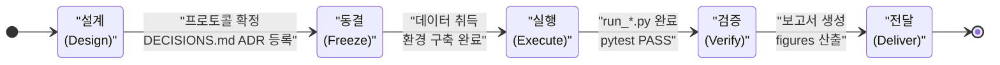
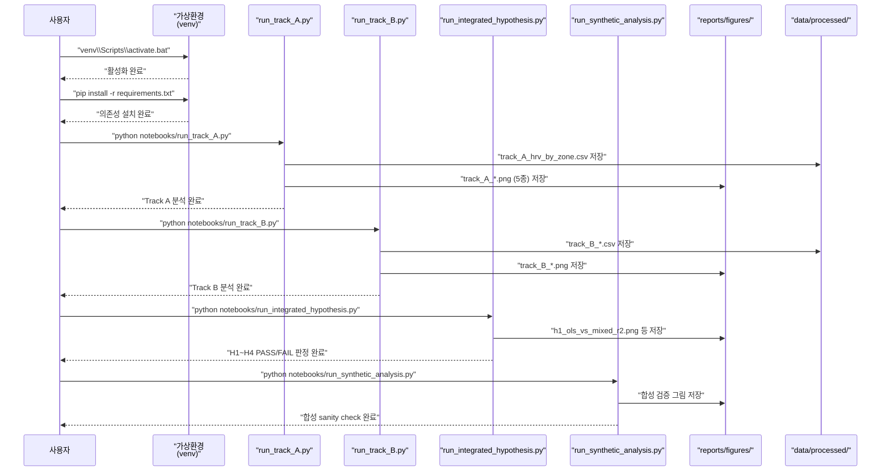

# 실험 실행 플레이북 (Experiment Runbook)

> **문서 메타**
> - 버전: v1.0
> - 작성일: 2026-05-30
> - 대상 저장소: `soccer_rnd/` (Fatigue–HRV–Load PoV 파이프라인)
> - 목적: 실험 재현·신규 트랙 추가·트러블슈팅을 위한 단일 참조 런북

---

## 목적 및 사용법

이 문서는 `soccer_rnd` R&D 저장소에서 **실험을 처음 실행하는 연구자**, **기존 결과를 재현하려는 검토자**, **신규 트랙(track)을 추가하려는 기여자** 모두를 위한 실행 플레이북이다. 각 단계마다 진입 전제조건·실행 명령·완료 정의(DoD)를 명시하여 누락이나 순서 오류를 방지한다.

> **중요 원칙**: 모든 명령은 `soccer_rnd/` 디렉터리를 기준으로 실행한다. 가상환경을 반드시 먼저 활성화한 뒤 명령을 수행한다.

---

## 1. 실험 생애주기



> 각 상태 전환에는 완료 정의(DoD) 체크리스트가 있다. 아래 단계별 런북에서 세부 내용을 확인한다.

---

## 2. 단계별 런북

### 0단계. 환경 구축

#### 진입 전제조건

- [ ] Python 3.13 설치 확인 (`python --version`)
- [ ] `soccer_rnd/` 디렉터리로 이동한 상태
- [ ] `requirements.txt` 파일 존재 확인

#### 실행 명령

```bash
# 가상환경 생성
python -m venv venv

# 활성화 — Windows (CMD)
venv\Scripts\activate.bat

# 활성화 — Windows (PowerShell)
.\venv\Scripts\Activate.ps1

# 활성화 — Linux/macOS
source venv/bin/activate

# 의존성 설치
pip install -r requirements.txt
```

#### 완료 정의 (DoD)

- [ ] `pip install` 오류 없이 완료
- [ ] `python -c "import statsmodels, pandas, numpy, scipy, sklearn; print('OK')"` 출력 확인
- [ ] 재현 환경 버전 충족: Python 3.13, pandas 2.3, statsmodels 0.14, scipy 1.16, scikit-learn 1.7

---

### Stage 1. 데이터 적재 및 전처리

#### 진입 전제조건

- [ ] 가상환경 활성화 완료
- [ ] Track A: `data/raw/track_A/subject-info.csv`, `data/raw/track_A/test_measure.csv` 존재
- [ ] Track B: `data/raw/track_B/subjective/` 디렉터리 존재

#### 실행 명령

```bash
# 실데이터 EDA 요약 및 전처리 확인 (read-only)
python scripts/eda_protocol.py
```

#### 완료 정의 (DoD)

- [ ] `data/processed/` 디렉터리에 전처리 파일 생성
- [ ] RR 이상치 필터링(중앙값 ±20%) 로그 출력 확인
- [ ] 결측 비율 확인 — 과다 결측(>30%) 시 Stage 1 재검토

---

### Stage 2. 지표 산출

#### 진입 전제조건

- [ ] Stage 1 완료, `data/processed/` 파일 존재
- [ ] `src/metrics/` 모듈 임포트 가능 확인

#### 핵심 지표 공식

| 지표 | 공식 |
|---|---|
| ATL | 7일 rolling mean 또는 EWMA (decay=2/8) |
| CTL | 28일 rolling mean 또는 EWMA (decay=2/29) |
| ACWR | ATL / CTL (Rolling 및 EWMA 두 변형 비교 필수) |
| Monotony | mean(7일 daily load) / sd(7일 daily load) |
| Strain | 주간 총 부하 × Monotony |
| sRPE | RPE × session duration |
| Hooper Index | fatigue + stress + DOMS + sleep |

#### 실행 명령

```bash
# 단위 테스트로 지표 산출 검증
python -m pytest tests/test_metrics_acwr.py -v
python -m pytest tests/test_metrics_monotony_strain.py -v
```

#### 완료 정의 (DoD)

- [ ] `test_metrics_acwr.py` PASS
- [ ] `test_metrics_monotony_strain.py` PASS
- [ ] Rolling/EWMA 두 변형 모두 산출 확인

---

### Stage 3. EDA

#### 진입 전제조건

- [ ] Stage 2 완료
- [ ] `src/eda/` 모듈 임포트 가능

#### 실행 명령

```bash
# 실데이터 EDA 요약
python scripts/eda_protocol.py

# 노트북 인터랙티브 실행 (선택)
python -m ipykernel install --user --name=soccer_rnd --display-name "Python (soccer_rnd)"
jupyter notebook
```

#### 완료 정의 (DoD)

- [ ] Track A EDA: 분포·결측·시차 탐색 완료 (`notebooks/track_A_eda.ipynb`)
- [ ] Track B EDA: 주간 부하 패턴·ACWR 급등 vs Hooper 변화 확인 (`notebooks/track_B_eda.ipynb`)
- [ ] 이상값 및 결측 패턴 문서화 (`docs/DECISIONS.md` ADR 업데이트)

---

### Stage 4. 통계 모형

#### 진입 전제조건

- [ ] Stage 3 완료, EDA 결과 검토
- [ ] `src/stats/mixed_effects.py` 임포트 가능
- [ ] 모형 공식 및 그룹 변수 확정 (DECISIONS.md 기록)

#### 실행 명령

```bash
# Track A — HRV 용량-반응 혼합효과모형
python notebooks/run_track_A.py

# Track B — 부하+설문 혼합효과모형 (M1~M4 순차 비교)
python notebooks/run_track_B.py
```

**Track A 모형 순서**: OLS → 랜덤절편 (`rmssd ~ power_mean + (1|subject)`) → 랜덤기울기 (`rmssd ~ power_mean + (1+power_mean|subject)`)

**Track B 모형 순서**: M1 OLS → M2 랜덤절편 → M3 ACWR 추가 → M4 Monotony/Strain 추가

#### 완료 정의 (DoD)

- [ ] `reports/figures/track_A_model_comparison.png` 생성
- [ ] `reports/figures/track_B_model_comparison.png` 생성
- [ ] `reports/track_A_model_comparison.md` 업데이트
- [ ] `reports/track_B_model_comparison.md` 업데이트
- [ ] AIC·BIC·MAE·RMSE·Cohen's f² 수치 기록
- [ ] 랜덤기울기 수렴 실패 시 → None 반환 확인 후 랜덤절편 모형으로 최종 채택 (트러블슈팅 섹션 7 참조)

---

### Stage 5. 통합 가설 검증

#### 진입 전제조건

- [ ] Stage 4 완료, 두 트랙 모형 결과 확정
- [ ] H1~H4 가설 명세 확인 (`docs/DECISIONS.md`)

#### 실행 명령

```bash
python notebooks/run_integrated_hypothesis.py
```

**검증 가설 개요**

| 가설 | 내용 |
|---|---|
| H1 | 개인화된 기저선 추적의 중요성 (OLS vs Mixed Simpson's Paradox) |
| H2 | 다중 지표 통합 모니터링 우위 (부하 단독 vs 부하+HRV) |
| H3 | Monotony 독립 효과 및 억제변수 재현 |
| H4 | 결측 민감도 분석 (100회 Monte Carlo, MCAR/MNAR) |

#### 완료 정의 (DoD)

- [ ] `reports/integrated_hypothesis_report.md` 생성
- [ ] H1~H4 PASS/FAIL 판정 기록
- [ ] `reports/figures/h1_ols_vs_mixed_r2.png` 등 가설별 그림 생성

---

### Stage 6. 합성 데이터 검증

#### 진입 전제조건

- [ ] Stage 5 완료
- [ ] DGP(Data Generating Process) 파라미터 (β, σ) 확정

#### 실행 명령

```bash
python notebooks/run_synthetic_analysis.py
```

```bash
# 합성 데이터 통합 테스트
python -m pytest tests/test_synthetic_integrated.py -v
```

#### 완료 정의 (DoD)

- [ ] 참값(β, σ) 복원 sanity check PASS
- [ ] `reports/track_A_model_comparison_synthetic.md` 생성
- [ ] `np.random.seed(42)` 고정으로 재현성 확인

---

### Stage 7. 종합 보고

#### 진입 전제조건

- [ ] Stage 6 완료, 모든 그림 및 모형 비교표 준비
- [ ] `reports/figures/` 디렉터리 내 필요 그림 존재 확인

#### 실행 명령

```bash
# 전체 테스트 최종 실행 (보고 전 최종 검증)
python -m pytest tests/ -v
```

#### 완료 정의 (DoD)

- [ ] `reports/POV_REPORT.md` 최신 수치 반영
- [ ] 모든 주요 효과크기(Cohen's f²), p-value, MAE, LOSO RMSE 기재
- [ ] 결론이 "시사한다/관찰된다/일관된 경향" 톤으로 작성 (과도한 단정 금지)
- [ ] `pytest tests/ -v` 전체 PASS

---

## 3. 실험 1회 실행 시퀀스



---

## 4. 테스트 및 검증

### 전체 테스트 실행

```bash
python -m pytest tests/ -v
```

### 단일 파일 실행 예시

```bash
# ACWR 지표 단위 테스트
python -m pytest tests/test_metrics_acwr.py -v

# 혼합효과모형 단위 테스트
python -m pytest tests/test_mixed_effects.py -v

# 합성 데이터 통합 테스트
python -m pytest tests/test_synthetic_integrated.py -v

# 교차검증(LOSO) 테스트
python -m pytest tests/test_cross_validation.py -v
```

### 현재 테스트 파일 목록

| 파일 | 검증 대상 |
|---|---|
| `tests/test_metrics_acwr.py` | ACWR Rolling/EWMA 산출 |
| `tests/test_metrics_monotony_strain.py` | Monotony/Strain 산출 |
| `tests/test_data_pipeline.py` | 데이터 로딩·전처리 파이프라인 |
| `tests/test_lag_analysis.py` | 시차 분석 |
| `tests/test_alternative_load.py` | 대안 부하 지표 |
| `tests/test_mixed_effects.py` | 혼합효과모형 적합 및 수렴 |
| `tests/test_cross_validation.py` | LOSO 교차검증 |
| `tests/test_seed_generation.py` | seed 데이터 생성 재현성 |
| `tests/test_synthetic_integrated.py` | 합성 DGP 통합 검증 |

---

## 5. 트러블슈팅

| 증상 | 원인 | 조치 |
|---|---|---|
| `fit_random_slope()` 반환값이 `None` | 랜덤기울기 수렴 실패 — 표본 수 부족 또는 변수 스케일 문제 | `src/stats/mixed_effects.py` `fit_random_slope()` 는 수렴 실패 시 경고 출력 후 `None` 반환. `extract_model_metrics()` 에 `None` 전달 시 `np.nan` 딕셔너리 반환. 랜덤절편 모형(`fit_random_intercept()`)을 최종 채택 모형으로 사용 |
| 데이터 결측 과다 (>30%) | 원본 데이터 품질 또는 시즌 기간 필터 이슈 | 결측 패턴을 MCAR/MAR/MNAR 구분 (`H4` 분석 참조). 결측은 원칙적으로 NA 유지. 분석 목적상 필요 시 `docs/DECISIONS.md`에 명시적 규칙 ADR로 등록 |
| 재현 불일치 — 동일 입력에서 다른 수치 | `np.random.seed()` 미고정 또는 버전 불일치 | `run_track_A.py`, `run_track_B.py`, `run_integrated_hypothesis.py`, `run_synthetic_analysis.py` 모두 `np.random.seed(42)` 고정 확인. 재현 환경(Python 3.13, numpy, pandas 2.3, statsmodels 0.14, scipy 1.16, scikit-learn 1.7) 일치 여부 `pip list` 로 검증 |
| 한글 폰트 깨짐 (그림에 □□□ 출력) | matplotlib 기본 폰트가 한글 미지원 | `src/viz/fonts.py`의 `apply_korean_font()` 함수 호출 여부 확인. `run_track_A.py`, `run_integrated_hypothesis.py` 에서 `from src.viz.fonts import apply_korean_font` 후 `apply_korean_font()` 실행. Noto Sans KR 설치 여부 확인 |
| 노트북 GitHub 렌더 실패 | `.ipynb` 대형 셀 출력 또는 nbformat 스키마 위반 | `nbviewer` 링크 사용: `https://nbviewer.org/github/genelyuu/soccer-demo/blob/main/soccer_rnd/notebooks/<파일명>.ipynb`. nbformat 스키마 위반 시 노트북 재저장(`jupyter nbconvert --to notebook --inplace`) |

---

## 6. 신규 실험(Track) 추가 절차

신규 트랙(예: `track_X`)을 추가할 때 아래 체크리스트를 순서대로 완료한다.

### 문서 (6종)

- [ ] `docs/track_X/PROTOCOL.md` — 연구질문·가설·지표 정의 작성
- [ ] `docs/track_X/DATASETS.md` — 데이터셋 출처·라이선스·취득 방법 기재
- [ ] `docs/track_X/EDA_PLAN.md` — EDA 흐름도 및 탐색 항목 정의
- [ ] `docs/track_X/STATS_PLAN.md` — 통계 모형 공식·비교 전략 명세
- [ ] `docs/DECISIONS.md` — 신규 ADR 등록 (지표 윈도우, 결과변수, 결측 처리 규칙)
- [ ] `reports/track_X_model_comparison.md` — 모형 비교표 템플릿 생성

### 코드 (src)

- [ ] `src/metrics/` — 신규 지표 모듈 추가 (필요 시)
- [ ] `src/data/` — 신규 데이터 로더/전처리 추가
- [ ] `src/stats/` — 신규 통계 전략 추가 (필요 시)

### 실행 스크립트

- [ ] `notebooks/run_track_X.py` 생성 — `np.random.seed(42)` 고정, `reports/figures/` 저장 경로 설정

### 테스트

- [ ] `tests/test_metrics_<track_X>.py` — 신규 지표 단위 테스트 작성
- [ ] `python -m pytest tests/ -v` 전체 PASS 확인

### ADR 동반

- [ ] `docs/DECISIONS.md` 에 결정 근거 ADR 형식으로 기록 (Author, Year 인용 포함)
- [ ] 기존 트랙과의 지표 정의 충돌 여부 검토

---

## 7. 산출물 경로 맵

```
soccer_rnd/
├── data/
│   ├── raw/                      # 원본 데이터 (git 비포함)
│   │   ├── track_A/              # PhysioNet ACTES (subject-info.csv, test_measure.csv)
│   │   └── track_B/              # SoccerMon (subjective/ 디렉터리)
│   └── processed/                # 전처리 산출물
│       ├── track_A_hrv_by_zone.csv
│       └── track_B_*.csv
└── reports/
    ├── POV_REPORT.md             # 종합 PoV 보고서
    ├── track_A_model_comparison.md
    ├── track_B_model_comparison.md
    ├── integrated_hypothesis_report.md
    ├── track_A_model_comparison_synthetic.md
    └── figures/                  # 산출 그림 (18종)
        ├── track_A_hrv_by_power_zone.png
        ├── track_A_rmssd_vs_power_scatter.png
        ├── track_A_rr_timeseries_sample.png
        ├── track_A_sport_comparison.png
        ├── track_A_model_comparison.png
        ├── track_B_model_comparison.png
        └── h1_ols_vs_mixed_r2.png  (및 기타 가설별 그림)
```

---

## 8. 참고 문서

- 지표 정의 상세: `docs/METRICS_FORMULAS.md`
- 결정 기록(ADR): `docs/DECISIONS.md`
- 연구 프로토콜: `docs/RESEARCH_PROTOCOL.md`
- 부상 예측 문헌: `docs/INJURY_PREDICTION_REFERENCES.md`
- 학술 참고문헌: `docs/REFERENCES.md`
- Track A 데이터셋: `docs/track_A/DATASETS.md`
- Track B 데이터셋: `docs/track_B/`
