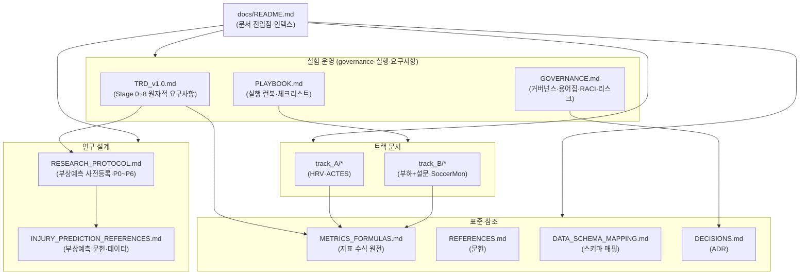

# 스포츠 피로도 R&D: HRV + RPE + Hooper + (ATL/CTL/ACWR) 통계 PoV

## 목표

공개 데이터셋 기반으로 EDA 및 통계 PoV를 재현 가능한 형태로 완성하고, 부하 지표(ATL/CTL/ACWR, Monotony/Strain)와 회복/웰니스(HRV, 설문)의 시차 관계를 정량적으로 제시한다.

## 범위

### In-Scope
- 트랙 A: HRV/RR 원자료 기반 공개 데이터셋(예: PhysioNet ACTES)로 HRV 반응 PoV
- 트랙 B: sRPE/Hooper 구조를 갖는 시즌형 데이터(공개 또는 내부)로 웰니스 PoV
- 지표 산출: ATL/CTL/ACWR(rolling, EWMA), Monotony/Strain, sRPE, Hooper Index
- EDA: 품질/결측/개인차 분해/시차(lag) 탐색/지표 민감도 비교
- 통계: 시차 회귀, 혼합효과모형, 모델 비교(AIC/BIC/MAE/RMSE), 효과크기 보고

### Out-of-Scope
- 의학적 진단 또는 치료 권고
- 부상 위험 예측을 단정적으로 '입증'하는 주장
- 개인정보/민감정보(선수 실명·식별정보) 수집/공유

## 산출물

| 디렉토리 | 내용 |
|-----------|------|
| `docs/` | 지표 정의서, 프로토콜, 결정 기록(ADR) |
| `notebooks/` | 트랙 A·B EDA·통계 노트북 |
| `reports/` | PoV 결과 보고서 (그림/표 포함) |
| `src/` | 지표 산출 모듈, EDA 유틸리티, 통계 모형 |
| `tests/` | 지표 산출 검증 테스트 |

## 마일스톤

| ID | 제목 | 종료 기준 |
|----|------|-----------|
| M1 | 지표 정의 및 코드 스켈레톤 고정 | METRICS_FORMULAS.md 완성, src/metrics/ 구현 + 테스트 통과 |
| M2 | 트랙 A EDA + 통계 PoV 1차 완성 | 노트북 재현 가능, 민감도 비교 그림, 혼합효과 결과표 |
| M3 | 트랙 B 데이터 매핑 + EDA/통계 템플릿 | 스키마 매핑, 파이프라인 구축 |
| M4 | 최종 보고서 패키징 | POV_REPORT.md, 핵심 그림/표, ADR 정리 |

## 품질 기준

- **재현성**: seed, 버전, 파라미터 문서화
- **추적성**: 모든 지표/그림/표에서 산출 코드·파라미터 역추적 가능
- **reviewer-safe 톤**: '시사한다/관찰된다/일관된 경향'으로 기술

## 문서 지도

## 문서 인덱스

### 실험 운영
| 문서 | 설명 |
|---|---|
| [TRD_v1.0.md](TRD_v1.0.md) | Stage 0~8 전체를 우선순위·중요도순 **원자적 요구사항**(REQ-ID)으로 정의 |
| [GOVERNANCE.md](GOVERNANCE.md) | 역할·RACI, 게이트 승인, 사전등록 동결, 재현성, 보고표준, 리스크 레지스터, 용어집 |
| [PLAYBOOK.md](PLAYBOOK.md) | 환경구축→데이터→지표→EDA→모형→가설→리포트 단계별 실행 런북·체크리스트·트러블슈팅 |

### 연구 설계
| 문서 | 설명 |
|---|---|
| [RESEARCH_PROTOCOL.md](RESEARCH_PROTOCOL.md) | 부상예측 격상 사전등록 프로토콜(H1~H4, P0~P6) |
| [INJURY_PREDICTION_REFERENCES.md](INJURY_PREDICTION_REFERENCES.md) | 부상예측 공개 데이터셋·핵심 문헌 |

### 표준·참조
| 문서 | 설명 |
|---|---|
| [METRICS_FORMULAS.md](METRICS_FORMULAS.md) | 지표 수식 원전(원자적 요구사항 포맷) |
| [REFERENCES.md](REFERENCES.md) | 참고 문헌 |
| [DATA_SCHEMA_MAPPING.md](DATA_SCHEMA_MAPPING.md) | 데이터 스키마 매핑 |
| [DECISIONS.md](DECISIONS.md) | 결정 기록(ADR-001~) |

### 트랙 문서
| Track A (HRV·ACTES) | Track B (부하+설문·SoccerMon) |
|---|---|
| [PROTOCOL](track_A/PROTOCOL.md) · [DATASETS](track_A/DATASETS.md) · [METRICS](track_A/METRICS.md) | [PROTOCOL](track_B/PROTOCOL.md) · [DATASETS](track_B/DATASETS.md) · [METRICS](track_B/METRICS.md) |
| [EDA_PLAN](track_A/EDA_PLAN.md) · [STATS_PLAN](track_A/STATS_PLAN.md) · [EXPECTED_OUTPUTS](track_A/EXPECTED_OUTPUTS.md) | [EDA_PLAN](track_B/EDA_PLAN.md) · [STATS_PLAN](track_B/STATS_PLAN.md) · [EXPECTED_OUTPUTS](track_B/EXPECTED_OUTPUTS.md) |
