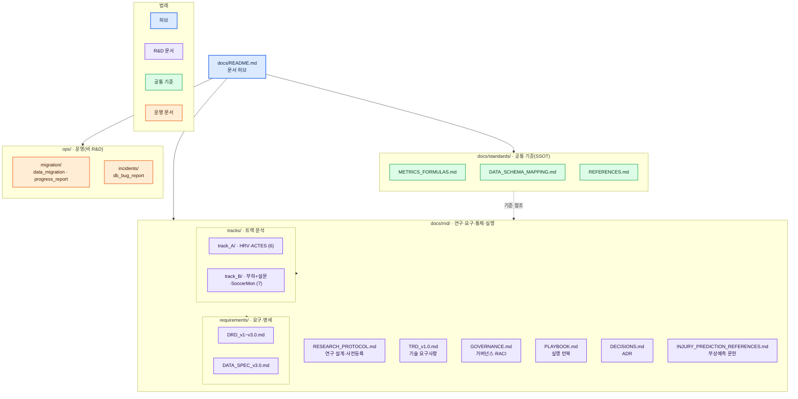

# 스포츠 피로도 R&D: HRV + RPE + Hooper + (ATL/CTL/ACWR) 통계 PoV

> 본 파일은 **문서 허브**다. 전체 디렉토리 구조·읽는 순서·문서 인덱스를 안내한다.
> 거버넌스 재구성 근거: [rnd/DECISIONS.md](rnd/DECISIONS.md) ADR-015 · 제안 원문: [DOC_GOVERNANCE_PROPOSAL.md](DOC_GOVERNANCE_PROPOSAL.md)

## 목표

공개 데이터셋 기반으로 EDA 및 통계 PoV를 재현 가능한 형태로 완성하고, 부하 지표(ATL/CTL/ACWR, Monotony/Strain)와 회복/웰니스(HRV, 설문)의 시차 관계를 정량적으로 제시한다.

## 범위

### In-Scope
- 트랙 A: HRV/RR 원자료 기반 공개 데이터셋(예: PhysioNet ACTES)로 HRV 반응 PoV
- 트랙 B: sRPE/Hooper 구조를 갖는 시즌형 데이터(공개 또는 내부)로 웰니스 PoV
- 지표 산출: ATL/CTL/ACWR(rolling, EWMA), Monotony/Strain, sRPE, Hooper Index
- EDA: 품질/결측/개인차 분해/시차(lag) 탐색/지표 민감도 비교
- 통계: 시차 회귀, 혼합효과모형, 모델 비교(AIC/BIC/MAE/RMSE), 효과크기 보고

### Out-of-Scope
- 의학적 진단 또는 치료 권고
- 부상 위험 예측을 단정적으로 '입증'하는 주장
- 개인정보/민감정보(선수 실명·식별정보) 수집/공유

## 문서 구조 (3축)

| 구분 | 경로 | 역할 |
|---|---|---|
| 문서 허브 | `docs/README.md` | 전체 구조·읽는 순서 안내(본 파일) |
| R&D 핵심 | `docs/rnd/` | 연구 설계·요구·거버넌스·실행·결정 |
| 공통 기준 | `docs/standards/` | 지표 수식·스키마·문헌(반복 참조 SSOT) |
| 운영(비 R&D) | `ops/` | 데이터 마이그레이션·DB 이슈 |
| 구현·검증 | `src/` · `tests/` · `notebooks/` · `reports/` | 분석 코드·테스트·노트북·결과 보고 |

각 폴더 로컬 인덱스: [rnd/README.md](rnd/README.md) · [standards/README.md](standards/README.md) · [../ops/README.md](../ops/README.md)

## 핵심 R&D 문서 (읽는 순서)

| 순서 | 문서 | 핵심 질문 |
|---:|---|---|
| 1 | [rnd/RESEARCH_PROTOCOL.md](rnd/RESEARCH_PROTOCOL.md) | 무엇을 검증하는가? |
| 2 | [rnd/TRD_v1.0.md](rnd/TRD_v1.0.md) | 무엇을 만족해야 하는가? |
| 3 | [rnd/GOVERNANCE.md](rnd/GOVERNANCE.md) | 어떤 기준으로 통제·승인하는가? |
| 4 | [rnd/PLAYBOOK.md](rnd/PLAYBOOK.md) | 어떻게 실행·재현하는가? |
| 5 | [rnd/DECISIONS.md](rnd/DECISIONS.md) | 왜 그렇게 결정했는가? |

## 문서 지도

## 문서 인덱스

### R&D 핵심 (`docs/rnd/`)
| 문서 | 설명 |
|---|---|
| [rnd/RESEARCH_PROTOCOL.md](rnd/RESEARCH_PROTOCOL.md) | 부상예측 격상 사전등록 프로토콜(H1~H4, P0~P6) |
| [rnd/TRD_v1.0.md](rnd/TRD_v1.0.md) | Stage 0~8 전체를 우선순위·중요도순 원자적 요구사항(REQ-ID)으로 정의 |
| [rnd/GOVERNANCE.md](rnd/GOVERNANCE.md) | 역할·RACI, 게이트 승인, 사전등록 동결, 재현성, 보고표준, 리스크, 용어집 |
| [rnd/PLAYBOOK.md](rnd/PLAYBOOK.md) | 환경구축→데이터→지표→EDA→모형→가설→리포트 단계별 실행 런북·체크리스트 |
| [rnd/DECISIONS.md](rnd/DECISIONS.md) | 결정 기록(ADR-001~) |
| [rnd/INJURY_PREDICTION_REFERENCES.md](rnd/INJURY_PREDICTION_REFERENCES.md) | 부상예측 공개 데이터셋·핵심 문헌 |

#### 요구·명세 (`docs/rnd/requirements/`)
| 문서 | 설명 |
|---|---|
| [rnd/requirements/DRD_v1.0.md](rnd/requirements/DRD_v1.0.md) · [v2.0](rnd/requirements/DRD_v2.0.md) · [v3.0](rnd/requirements/DRD_v3.0.md) | 데이터 요구사항 정의(이력) |
| [rnd/requirements/DATA_SPEC_v3.0.md](rnd/requirements/DATA_SPEC_v3.0.md) | 데이터 명세(현 명세, 舊 `데이터명세서_v3.0.md`) |

### 공통 기준 (`docs/standards/`)
| 문서 | 설명 |
|---|---|
| [standards/METRICS_FORMULAS.md](standards/METRICS_FORMULAS.md) | 지표 수식 원전(SSOT, 원자적 요구사항 포맷) |
| [standards/DATA_SCHEMA_MAPPING.md](standards/DATA_SCHEMA_MAPPING.md) | 데이터 스키마 매핑 |
| [standards/REFERENCES.md](standards/REFERENCES.md) | 참고 문헌 |

### 트랙 문서 (`docs/rnd/tracks/`)
| Track A (HRV·ACTES) | Track B (부하+설문·SoccerMon) |
|---|---|
| [PROTOCOL](rnd/tracks/track_A/PROTOCOL.md) · [DATASETS](rnd/tracks/track_A/DATASETS.md) · [METRICS](rnd/tracks/track_A/METRICS.md) | [PROTOCOL](rnd/tracks/track_B/PROTOCOL.md) · [DATASETS](rnd/tracks/track_B/DATASETS.md) · [METRICS](rnd/tracks/track_B/METRICS.md) |
| [EDA_PLAN](rnd/tracks/track_A/EDA_PLAN.md) · [STATS_PLAN](rnd/tracks/track_A/STATS_PLAN.md) · [EXPECTED_OUTPUTS](rnd/tracks/track_A/EXPECTED_OUTPUTS.md) | [EDA_PLAN](rnd/tracks/track_B/EDA_PLAN.md) · [STATS_PLAN](rnd/tracks/track_B/STATS_PLAN.md) · [EXPECTED_OUTPUTS](rnd/tracks/track_B/EXPECTED_OUTPUTS.md) |
| | [INJURY_PREDICTION](rnd/tracks/track_B/INJURY_PREDICTION.md) — Stage 8 부상예측(P0~P3) 개념·방법론 가이드 |

### 운영 (`ops/`)
| 문서 | 설명 |
|---|---|
| [../ops/migration/data_migration.md](../ops/migration/data_migration.md) | 데이터 마이그레이션 |
| [../ops/migration/migration_progress_report.md](../ops/migration/migration_progress_report.md) | 마이그레이션 진행 보고(舊 `마이그레이션_진행보고서.md`) |
| [../ops/incidents/db_bug_report.md](../ops/incidents/db_bug_report.md) | DB 이슈 보고 |

## 마일스톤

| ID | 제목 | 종료 기준 |
|----|------|-----------|
| M1 | 지표 정의 및 코드 스켈레톤 고정 | METRICS_FORMULAS.md 완성, src/metrics/ 구현 + 테스트 통과 |
| M2 | 트랙 A EDA + 통계 PoV 1차 완성 | 노트북 재현 가능, 민감도 비교 그림, 혼합효과 결과표 |
| M3 | 트랙 B 데이터 매핑 + EDA/통계 템플릿 | 스키마 매핑, 파이프라인 구축 |
| M4 | 최종 보고서 패키징 | POV_REPORT.md, 핵심 그림/표, ADR 정리 |

## 품질 기준

- **재현성**: seed, 버전, 파라미터 문서화
- **추적성**: 모든 지표/그림/표에서 산출 코드·파라미터 역추적 가능
- **reviewer-safe 톤**: '시사한다/관찰된다/일관된 경향'으로 기술
