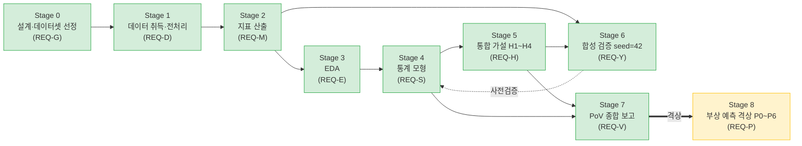
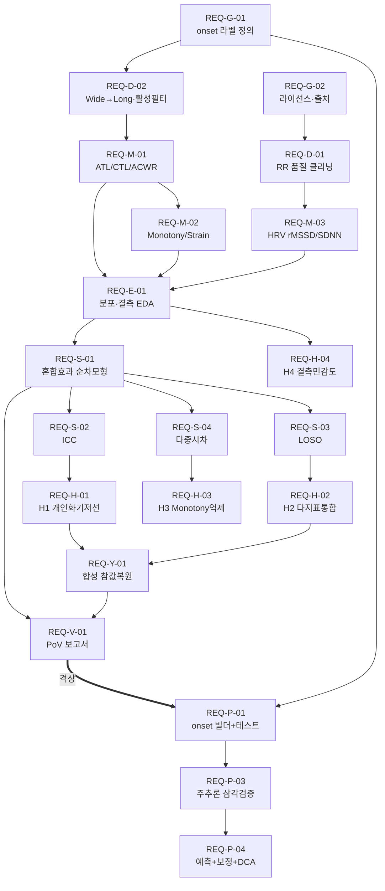
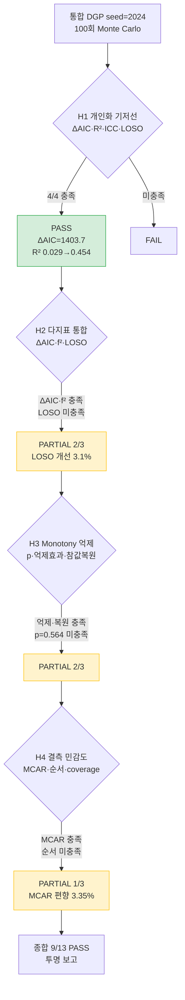
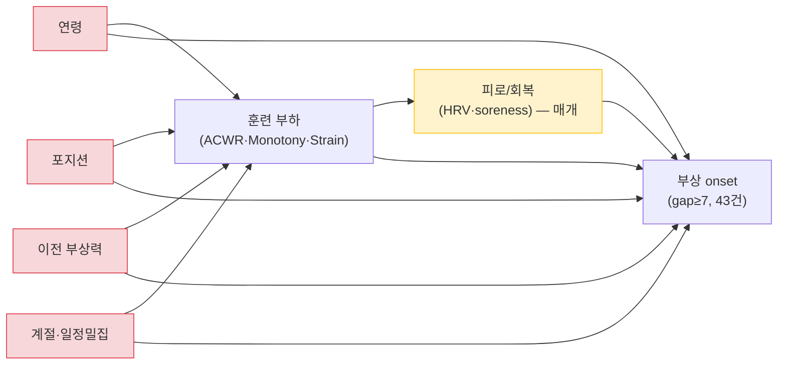
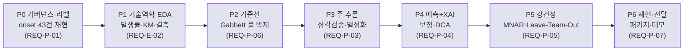

# Technical Requirements Document (TRD) v1.0

## Fatigue–HRV–Load PoV 파이프라인 — Stage 0~8 원자적 기술 요구사항 명세

---

### 문서 정보

| 항목 | 내용 |
|------|------|
| **문서 ID** | TRD-2026-001 |
| **버전** | 1.0 |
| **작성일** | 2026-05-30 |
| **최종 수정** | 2026-05-30 |
| **작성** | R&D 파이프라인팀 (Research Lead, Data Engineer, Statistician) |
| **검토 대상** | `soccer_rnd/` 전체 파이프라인 (Stage 0~8) |
| **관련 프로젝트** | `soccer_rnd` (스포츠 피로도 R&D), `soccer` (서비스 MVP) |
| **배포 범위** | 사내 전체 (R&D팀, PM, 리뷰어, 면접 패널) |
| **선행 문서** | `README.md`, `docs/RESEARCH_PROTOCOL.md`, `docs/DECISIONS.md`, `docs/METRICS_FORMULAS.md`, `reports/POV_REPORT.md` |

---

### 문서 이력

| 버전 | 일자 | 작성자 | 변경 내용 |
|:----:|------|--------|-----------|
| 0.1 | 2026-05-29 | Research Lead | Stage 0~7 요구사항 초안, 영역 접두어(G/D/M/E/S/H/Y/V) 정의 |
| 0.2 | 2026-05-29 | Statistician | Stage 8(REQ-P) 부상 예측 요구사항 추가, 검정력 제약(onset 43건·EPV≤4) 반영 |
| 0.3 | 2026-05-30 | Data Engineer | 추적성 매트릭스 실파일 검증, 검증경로 정합화 |
| **1.0** | **2026-05-30** | **R&D 파이프라인팀** | **우선순위·중요도 매트릭스 확정, mermaid 다이어그램 8종 정비, RESEARCH_PROTOCOL 게이트(P0~P6)·RQ1~RQ4 PASS 기준과 정합 완료** |

---

### 목적

본 TRD는 `soccer_rnd` 저장소의 전체 분석 파이프라인(Stage 0~8)을 **검증 가능한 원자적 요구사항(atomic requirement)** 단위로 분해하여, 우선순위·중요도·상태를 명시하고 각 요구사항을 실존하는 검증경로(`tests/`·`reports/`·`notebooks/`)와 근거(ADR·문헌)에 추적 연결한다. Stage 0~7은 연관성/설명 단계로서 대체로 완료(✅) 상태이며, Stage 8(부상 예측 격상)은 `docs/RESEARCH_PROTOCOL.md`로 프로토콜 확정된 계획/진행(📋/🔄) 상태다.

> **원자성 규약**: 각 REQ는 단일 책임(single responsibility)을 가지며 1개의 검증 가능한 단언만 담는다. 복합 요구("A 및 B")는 분할한다. 모든 REQ-ID는 고유하며 의존성 참조는 본 문서에 실재하는 REQ-ID만 가리킨다.

### 용어집 (고정)

| 약어/용어 | 정의 |
|---|---|
| ACWR | ATL/CTL (급성:만성 부하 비율) |
| ATL / CTL | 급성(7일)·만성(28일) 훈련 부하 — Rolling 또는 EWMA(decay 2/8, 2/29) |
| Monotony | mean(7일 부하) / sd(7일 부하) |
| Strain | 주간 총 부하 × Monotony |
| sRPE | RPE × 세션 시간(min) — 내적 부하 |
| Hooper Index | fatigue + stress + DOMS(soreness) + sleep_quality |
| HRV | 심박변이도 — rMSSD / SDNN / ln_rMSSD |
| LOSO | Leave-One-Subject-Out 교차검증 |
| ICC | 급내상관계수 (개인 간 분산 비중) |
| MCAR / MAR / MNAR | 완전무작위 / 무작위 / 비무작위 결측 |
| EPV | events per variable (사건수/변수수, ≤4 제약) |
| onset | 부상 발생 시점 — 연속 부상-일에서 gap≥7일 기준 독립 이벤트 |

---

## 2. 우선순위 · 중요도 요약 매트릭스

우선순위는 파이프라인 진행상 선·후행 의존(P0=기반·필수 → P2=보조·탐색)을, 중요도는 PoV 설득력·리뷰어 가치(★★★=핵심)를 나타낸다.

### 2.1 2D 매트릭스 (우선순위 × 중요도)

| | ★★★ (핵심) | ★★ (중요) | ★ (보조) |
|---|---|---|---|
| **P0** (기반·필수) | REQ-G-01, REQ-D-01, REQ-D-02, REQ-M-01, REQ-S-01, REQ-S-02, REQ-H-01, REQ-P-01, REQ-P-02 | REQ-G-02, REQ-D-03, REQ-M-02, REQ-E-01 | REQ-G-03 |
| **P1** (주요) | REQ-M-03, REQ-S-03, REQ-S-04, REQ-H-02, REQ-V-01, REQ-P-03, REQ-P-04 | REQ-D-04, REQ-E-02, REQ-S-05, REQ-H-03, REQ-Y-01, REQ-P-05 | REQ-E-03, REQ-Y-02 |
| **P2** (보조·탐색) | REQ-H-04, REQ-P-06 | REQ-M-04, REQ-S-06, REQ-P-07 | REQ-M-05, REQ-V-02 |

### 2.2 영역별 REQ 분포

| 영역 | 접두어 | Stage | REQ 수 | 주 상태 |
|---|---|---|---|---|
| 거버넌스·라벨 | REQ-G | 0 | 3 | ✅ |
| 데이터·스키마 | REQ-D | 1 | 4 | ✅ |
| 지표 | REQ-M | 2 | 5 | ✅ |
| EDA | REQ-E | 3 | 3 | ✅ |
| 통계 | REQ-S | 4 | 6 | ✅ |
| 통합 가설 | REQ-H | 5 | 4 | ✅ |
| 합성 검증 | REQ-Y | 6 | 2 | ✅ |
| PoV 리포트 | REQ-V | 7 | 2 | ✅ |
| 부상 예측 | REQ-P | 8 | 7 | 📋/🔄 |
| **합계** | | | **36** | |

---

## 3. Stage 0~8 파이프라인

---

## 4. TRD 요구사항 의존성 그래프

---

## 5. 원자적 요구사항 본문

### 영역 G — 거버넌스·라벨 (Stage 0)

#### REQ-G-01  부상 onset 라벨 조작적 정의
- **우선순위**: P0  **중요도**: ★★★  **상태**: ✅완료
- **설명**: 연속 부상-일 시퀀스에서 직전 부상과 gap≥7일이면 신규 독립 onset 1건으로 라벨링한다.
- **수용기준**: onset(gap≥7) = **43건**, 발생률 **1.75 onset/1000 athlete-days**가 seed 고정 하에 재현된다.
- **의존성**: 없음
- **검증경로**: `docs/RESEARCH_PROTOCOL.md` §B.2 · `scripts/eda_protocol.py`
- **근거**: RESEARCH_PROTOCOL §P0, [Ref] Gabbett (2016)

#### REQ-G-02  데이터 출처·라이선스 명시
- **우선순위**: P0  **중요도**: ★★  **상태**: ✅완료
- **설명**: 두 트랙의 원천 데이터 출처와 라이선스를 문서에 고정 기록한다.
- **수용기준**: Track A=PhysioNet ACTES, Track B=SoccerMon(Zenodo, CC BY 4.0)이 README §6과 LICENSE에 명시된다.
- **의존성**: 없음
- **검증경로**: `README.md` §6 · `data/raw/track_A/LICENSE.txt`
- **근거**: ADR-005, ADR-006

#### REQ-G-03  핵심 결정의 ADR 기록 규약
- **우선순위**: P0  **중요도**: ★  **상태**: ✅완료
- **설명**: 지표 윈도우·결과변수·결측·이상치 등 핵심 결정을 ADR 형식으로 단일 문서에 기록한다.
- **수용기준**: ADR-001~012가 `docs/DECISIONS.md`에 일자·상태·근거 필드를 갖춰 존재한다.
- **의존성**: 없음
- **검증경로**: `docs/DECISIONS.md`
- **근거**: ADR-003 (config.json teamPolicy)

---

### 영역 D — 데이터·스키마 (Stage 1)

#### REQ-D-01  RR 간격 아티팩트 클리닝
- **우선순위**: P0  **중요도**: ★★★  **상태**: ✅완료
- **설명**: 생리적으로 불가능한 RR 값(상한 30,500ms 등)을 이상치로 필터링한다.
- **수용기준**: 클리닝 후 RR이 생리적 범위로 제한되어 zone별 rMSSD 산출이 가능하다.
- **의존성**: REQ-G-02
- **검증경로**: `tests/test_data_pipeline.py` · `docs/RESEARCH_PROTOCOL.md` §B.3
- **근거**: ADR-004 (결측 NA 유지)

#### REQ-D-02  Wide→Long 변환 및 활성 시즌 필터
- **우선순위**: P0  **중요도**: ★★★  **상태**: ✅완료
- **설명**: SoccerMon 원자료를 athlete-day Long 패널로 변환하고 활성 시즌만 필터링한다.
- **수용기준**: 활성 필터 후 선수 **44명**, **24,596 athlete-days** 패널이 산출된다.
- **의존성**: REQ-G-01
- **검증경로**: `tests/test_data_pipeline.py` · `docs/RESEARCH_PROTOCOL.md` §B.1
- **근거**: ADR-004

#### REQ-D-03  Data Dictionary 실측 기술통계 고정
- **우선순위**: P0  **중요도**: ★★  **상태**: ✅완료
- **설명**: 분석 패널 각 변수의 평균·SD·범위·결측률을 실측 기준으로 명세한다.
- **수용기준**: daily_load 284.9±323.3, acwr 상한 4.0 캡핑, 웰니스 결측 32.4%가 명세표에 일치한다.
- **의존성**: REQ-D-02
- **검증경로**: `docs/RESEARCH_PROTOCOL.md` §B.1 · `scripts/eda_protocol.py`
- **근거**: ADR-004

#### REQ-D-04  부하 지표 사전산출 결측 메커니즘 기록
- **우선순위**: P1  **중요도**: ★★  **상태**: ✅완료
- **설명**: 부하 지표 결측 0%(전진충전)와 웰니스 결측 32%의 상이한 메커니즘을 ADR로 기록한다.
- **수용기준**: 부하·웰니스 결측 메커니즘 차이가 RESEARCH_PROTOCOL §B.1 노트에 명시된다.
- **의존성**: REQ-D-03
- **검증경로**: `docs/RESEARCH_PROTOCOL.md` §B.1
- **근거**: ADR-004

---

### 영역 M — 지표 (Stage 2)

#### REQ-M-01  ATL/CTL/ACWR Rolling·EWMA 병행 산출
- **우선순위**: P0  **중요도**: ★★★  **상태**: ✅완료
- **설명**: ACWR을 Rolling과 EWMA 두 변형으로 모두 산출한다.
- **수용기준**: `acwr_rolling()`·`acwr_ewma()`가 EWMA decay 2/8·2/29로 산출되고 단위테스트를 통과한다.
- **의존성**: REQ-D-02
- **검증경로**: `tests/test_metrics_acwr.py` · `docs/METRICS_FORMULAS.md` §4
- **근거**: ADR-002, [Ref] Williams et al. (2017)

#### REQ-M-02  Monotony/Strain 산출
- **우선순위**: P0  **중요도**: ★★  **상태**: ✅완료
- **설명**: 7일 윈도우 Monotony와 주간부하×Monotony Strain을 산출한다.
- **수용기준**: sd=0 시 cap=10.0 처리 포함, Monotony·Strain이 Foster 정의대로 산출되어 테스트를 통과한다.
- **의존성**: REQ-M-01
- **검증경로**: `tests/test_metrics_monotony_strain.py` · `docs/METRICS_FORMULAS.md` §5-6
- **근거**: ADR-008, [Ref] Foster (1998)

#### REQ-M-03  HRV 시간영역 지표 산출
- **우선순위**: P1  **중요도**: ★★★  **상태**: ✅완료
- **설명**: 클리닝된 RR로부터 rMSSD·SDNN·ln_rMSSD를 산출한다.
- **수용기준**: zone별 rMSSD가 Rest 7.60±2.39 → High 4.59±1.55의 단조 감소를 재현한다.
- **의존성**: REQ-D-01
- **검증경로**: `docs/RESEARCH_PROTOCOL.md` §C.3 · `docs/METRICS_FORMULAS.md` §8
- **근거**: [Ref] Plews et al. (2013), Task Force (1996)

#### REQ-M-04  대안 부하 지표 병행 산출
- **우선순위**: P2  **중요도**: ★★  **상태**: ✅완료
- **설명**: DCWR·TSB·ACWR Uncoupled 대안 지표를 레지스트리 패턴으로 산출한다.
- **수용기준**: 7개 함수+레지스트리가 13개 테스트를 통과한다.
- **의존성**: REQ-M-01
- **검증경로**: `tests/test_alternative_load.py`
- **근거**: ADR-011, [Ref] Lolli et al. (2019)

#### REQ-M-05  ACWR 4.0 캡핑 규칙 적용
- **우선순위**: P2  **중요도**: ★  **상태**: ✅완료
- **설명**: coupling 보정으로 ACWR 산출값에 상한 4.0 캡을 적용한다.
- **수용기준**: 산출 패널의 acwr 최대값이 4.00을 넘지 않는다.
- **의존성**: REQ-M-01
- **검증경로**: `docs/RESEARCH_PROTOCOL.md` §B.1 · `tests/test_metrics_acwr.py`
- **근거**: ADR-004, ADR-011

---

### 영역 E — EDA (Stage 3)

#### REQ-E-01  부하·웰니스 분포·결측 탐색
- **우선순위**: P0  **중요도**: ★★  **상태**: ✅완료
- **설명**: 분포·결측·위험구간을 기술통계로 탐색한다.
- **수용기준**: ACWR sweet spot 48.4%·위험구간(>1.5) 11.5%, Strain 우편향이 EDA 산출물에 일치한다.
- **의존성**: REQ-M-01, REQ-M-02
- **검증경로**: `notebooks/track_B_eda.ipynb` · `docs/RESEARCH_PROTOCOL.md` §C.1
- **근거**: ADR-004

#### REQ-E-02  부상 onset 시간 구조·불균형 EDA
- **우선순위**: P1  **중요도**: ★★  **상태**: ✅완료
- **설명**: 예측 윈도우 k(1/3/7)별 양성률과 불균형비를 산출한다.
- **수용기준**: k=1 1:664, k=3 1:223, k=7 1:96의 불균형비가 재현된다.
- **의존성**: REQ-E-01, REQ-G-01
- **검증경로**: `docs/RESEARCH_PROTOCOL.md` §C.2 · `scripts/eda_protocol.py`
- **근거**: RESEARCH_PROTOCOL §C.2

#### REQ-E-03  HRV 용량-반응 EDA
- **우선순위**: P1  **중요도**: ★  **상태**: ✅완료
- **설명**: Track A에서 파워구간별 HRV의 단조 감소 경향을 탐색한다.
- **수용기준**: track_A_eda 노트북이 zone별 rMSSD 하강 추세를 시각화한다.
- **의존성**: REQ-M-03
- **검증경로**: `notebooks/track_A_eda.ipynb`
- **근거**: RESEARCH_PROTOCOL §C.3

---

### 영역 S — 통계 (Stage 4)

#### REQ-S-01  혼합효과 순차 모형 비교
- **우선순위**: P0  **중요도**: ★★★  **상태**: ✅완료
- **설명**: OLS→랜덤절편→랜덤기울기 순차 모형을 적합·비교한다.
- **수용기준**: Track B에서 OLS R²=0.000 → 혼합효과 R²=0.453으로 개선이 관찰된다.
- **의존성**: REQ-E-01
- **검증경로**: `tests/test_mixed_effects.py` · `reports/track_B_model_comparison.md`
- **근거**: ADR-008

#### REQ-S-02  ICC 산출
- **우선순위**: P0  **중요도**: ★★★  **상태**: ✅완료
- **설명**: 개인 간 분산 비중(ICC)을 산출한다.
- **수용기준**: Track B Hooper ICC≈0.45가 모형 비교 보고서에 산출된다.
- **의존성**: REQ-S-01
- **검증경로**: `tests/test_mixed_effects.py` · `reports/track_B_model_comparison.md`
- **근거**: ADR-008

#### REQ-S-03  LOSO 교차검증
- **우선순위**: P1  **중요도**: ★★★  **상태**: ✅완료
- **설명**: 고정효과 기반 Leave-One-Subject-Out으로 새 선수 일반화 성능을 평가한다.
- **수용기준**: Track B LOSO 평균 MAE **1.45**(SD 0.57)·RMSE 1.76이 재현된다.
- **의존성**: REQ-S-01
- **검증경로**: `tests/test_cross_validation.py` · `reports/track_B_model_comparison.md`
- **근거**: ADR-010

#### REQ-S-04  다중 시차(lag-0~7) 분석
- **우선순위**: P1  **중요도**: ★★★  **상태**: ✅완료
- **설명**: lag-0부터 lag-7까지 상관·혼합효과를 AIC/BIC로 비교하여 최적 시차를 결정한다.
- **수용기준**: 4개 공개 함수가 9개 테스트를 통과하고 lag별 비교표를 산출한다.
- **의존성**: REQ-S-01
- **검증경로**: `tests/test_lag_analysis.py`
- **근거**: ADR-009

#### REQ-S-05  ACWR·Monotony 효과 추정
- **우선순위**: P1  **중요도**: ★★  **상태**: ✅완료
- **설명**: Hooper를 종속변수로 ACWR과 Monotony 계수를 추정한다.
- **수용기준**: ACWR 계수 −0.089(p<0.001), M4 Monotony +0.142(p=0.002)가 보고서에 일치한다.
- **의존성**: REQ-S-01
- **검증경로**: `reports/track_B_model_comparison.md`
- **근거**: ADR-008, [Ref] Foster (1998)

#### REQ-S-06  Track A 파워-HRV 용량-반응 추정
- **우선순위**: P2  **중요도**: ★★  **상태**: ✅완료
- **설명**: rMSSD를 종속변수로 power_mean 계수와 이월효과를 추정한다.
- **수용기준**: power_mean 계수 −0.016(p<0.001), 직전부하-rMSSD r=−0.465(p=0.001)가 재현된다.
- **의존성**: REQ-M-03
- **검증경로**: `notebooks/track_A_real.ipynb` · `reports/track_A_model_comparison.md`
- **근거**: ADR-009

---

### 영역 H — 통합 가설 H1~H4 (Stage 5)

> H1~H4는 통합 DGP(seed=2024)에서 100회 Monte Carlo로 PASS/FAIL 판정한다. 종합 **9/13 세부기준 PASS**.

#### REQ-H-01  H1 개인화 기저선 검증
- **우선순위**: P0  **중요도**: ★★★  **상태**: ✅완료
- **설명**: OLS 대비 혼합효과의 개인화 기저선 우위(Simpson's Paradox)를 검증한다.
- **수용기준**: ΔAIC=1403.7, R² 0.029→0.454, ICC_hooper>ICC_hrv로 **4/4 PASS**.
- **의존성**: REQ-S-02
- **검증경로**: `reports/integrated_hypothesis_report.md` · `tests/test_synthetic_integrated.py`
- **근거**: ADR-012

#### REQ-H-02  H2 다지표 통합 증분가치 검증
- **우선순위**: P1  **중요도**: ★★★  **상태**: ✅완료
- **설명**: 부하 단독 대비 HRV 추가의 증분 예측력을 검증한다.
- **수용기준**: ΔAIC=54.9·f²=0.0214 PASS, LOSO 개선 3.1% FAIL → **2/3 PASS**가 보고서에 기록된다.
- **의존성**: REQ-S-03
- **검증경로**: `reports/integrated_hypothesis_report.md` · `tests/test_synthetic_integrated.py`
- **근거**: ADR-012

#### REQ-H-03  H3 Monotony 억제변수 효과 검증
- **우선순위**: P1  **중요도**: ★★  **상태**: ✅완료
- **설명**: Strain 순차 투입 시 Monotony 계수 부호반전(억제변수)을 검증한다.
- **수용기준**: 억제효과 262.1%·참값복원 26.7% PASS, Monotony p=0.564 FAIL → **2/3 PASS**.
- **의존성**: REQ-S-04
- **검증경로**: `reports/integrated_hypothesis_report.md` · `tests/test_synthetic_integrated.py`
- **근거**: ADR-012

#### REQ-H-04  H4 결측 민감도 검증
- **우선순위**: P2  **중요도**: ★★★  **상태**: ✅완료
- **설명**: MCAR/MAR/MNAR 결측 시나리오의 추정 편향을 정량화한다.
- **수용기준**: MCAR 편향 3.35% PASS, 편향·coverage 순서 FAIL → **1/3 PASS**가 투명 보고된다.
- **의존성**: REQ-E-01
- **검증경로**: `reports/integrated_hypothesis_report.md` · `tests/test_synthetic_integrated.py`
- **근거**: ADR-012

---

### 영역 Y — 합성 검증 seed=42 (Stage 6)

#### REQ-Y-01  합성 DGP 참값 복원 sanity check
- **우선순위**: P1  **중요도**: ★★  **상태**: ✅완료
- **설명**: 합성 데이터로 참값(β, σ)을 복원하여 파이프라인을 사전 검증한다.
- **수용기준**: 합성 분석이 입력 참값을 허용오차 내로 복원하고 18개 테스트를 통과한다.
- **의존성**: REQ-H-01, REQ-H-02
- **검증경로**: `tests/test_synthetic_integrated.py` · `reports/track_A_model_comparison_synthetic.md`
- **근거**: ADR-007, ADR-012

#### REQ-Y-02  seed 고정 재현성 보장
- **우선순위**: P1  **중요도**: ★  **상태**: ✅완료
- **설명**: 합성 생성에 seed=42를 고정하여 동일 입력→동일 결과를 보장한다.
- **수용기준**: seed 고정 하에 합성 산출이 결정론적으로 재현되는 테스트가 통과한다.
- **의존성**: REQ-Y-01
- **검증경로**: `tests/test_seed_generation.py`
- **근거**: ADR-007

---

### 영역 V — PoV 리포트 (Stage 7)

#### REQ-V-01  PoV 종합 보고서 통합
- **우선순위**: P1  **중요도**: ★★★  **상태**: ✅완료
- **설명**: 두 트랙의 실데이터 결과·효과크기·해석을 단일 PoV 보고서로 통합한다.
- **수용기준**: Track A/B 핵심 결과와 H1~H4 판정이 `reports/POV_REPORT.md`에 reviewer-safe 톤으로 통합된다.
- **의존성**: REQ-S-01, REQ-Y-01
- **검증경로**: `reports/POV_REPORT.md`
- **근거**: ADR-008, ADR-010

#### REQ-V-02  산출 그림 재현
- **우선순위**: P2  **중요도**: ★  **상태**: ✅완료
- **설명**: 모형 비교·H1 비교 등 보고서 그림을 코드로 재현 산출한다.
- **수용기준**: `reports/figures/`에 한글 폰트 정상 렌더된 그림이 산출된다.
- **의존성**: REQ-V-01
- **검증경로**: `reports/figures/` · `reports/track_B_model_comparison.md`
- **근거**: ADR-002

---

### 영역 P — 부상 예측 격상 P0~P6 (Stage 8)

> Stage 8은 연관성 → 예측·인과·임상효용으로 격상하는 단계로, `docs/RESEARCH_PROTOCOL.md`에서 프로토콜 확정. 검정력 제약(독립 onset **43건**, **EPV≤4**) 하에서 *방법론 시연*이 1차 가치다.

#### REQ-P-01  P0 onset 라벨 빌더 + 단위테스트
- **우선순위**: P0  **중요도**: ★★★  **상태**: 🔄진행
- **설명**: onset(gap≥7)·중증도·위험집합을 산출하는 라벨 빌더와 재현 테스트를 구현한다.
- **수용기준**: 라벨 빌더가 onset 43건·발생률 1.75/1000을 seed 고정으로 재현한다.
- **의존성**: REQ-G-01, REQ-V-01
- **검증경로**: `docs/RESEARCH_PROTOCOL.md` §P0 (계획: `tests/test_injury_label.py`)
- **근거**: RESEARCH_PROTOCOL §H-P0, ADR(예정) injury-label

#### REQ-P-02  검정력 제약 EPV≤4 변수 예산 강제
- **우선순위**: P0  **중요도**: ★★★  **상태**: 📋계획
- **설명**: 동시 투입 예측변수 수를 EPV 10 규칙상 4개 이하로 제한한다.
- **수용기준**: 주 추론 모형의 동시 투입 변수가 ≤4개임이 모형 명세에 강제된다.
- **의존성**: REQ-P-01
- **검증경로**: `docs/RESEARCH_PROTOCOL.md` §E.1
- **근거**: RESEARCH_PROTOCOL §E.1 (EPV)

#### REQ-P-03  P3 주 추론 설계 삼각검증
- **우선순위**: P1  **중요도**: ★★★  **상태**: 📋계획
- **설명**: 이산시간 생존(frailty)·case-crossover·벌점 GLMM 3종으로 방향 일관성을 검증한다.
- **수용기준**: 설계 3종의 효과 방향이 일관되고 민감도 분석을 통과한다.
- **의존성**: REQ-P-02
- **검증경로**: `docs/RESEARCH_PROTOCOL.md` §E.3, §H-P3
- **근거**: RESEARCH_PROTOCOL §E.3

#### REQ-P-04  P4 예측·확률보정·decision-curve
- **우선순위**: P1  **중요도**: ★★★  **상태**: 📋계획
- **설명**: 벌점 회귀 주모형의 시간분리 net benefit이 Gabbett 룰 기준선을 초과함을 검증한다.
- **수용기준**: TRIPOD 표·calibration·DCA에서 시간분리 net benefit > 룰 baseline.
- **의존성**: REQ-P-03
- **검증경로**: `docs/RESEARCH_PROTOCOL.md` §F, §H-P4
- **근거**: RESEARCH_PROTOCOL §F (TRIPOD), RQ1

#### REQ-P-05  P5 MNAR 결측 강건성
- **우선순위**: P1  **중요도**: ★★  **상태**: 📋계획
- **설명**: 웰니스 32% MNAR 결측의 추정 편향을 Monte Carlo로 정량화한다(H4 재사용).
- **수용기준**: MNAR 편향률·coverage가 정량 보고되어 결론의 가정 강건성이 입증된다.
- **의존성**: REQ-P-04, REQ-H-04
- **검증경로**: `docs/RESEARCH_PROTOCOL.md` §H-P5
- **근거**: RESEARCH_PROTOCOL §A′.6-5, RQ4

#### REQ-P-06  PR-AUC·recall 기반 불균형 평가
- **우선순위**: P2  **중요도**: ★★★  **상태**: 📋계획
- **설명**: 극단 불균형(0.15~1%) 하에서 ROC-AUC가 아닌 PR-AUC·recall@고정정밀도로 성능을 평가한다.
- **수용기준**: PR-AUC > 기저율×2, 시간분리 검증에서 유지된다(RQ1 PASS 기준).
- **의존성**: REQ-P-04
- **검증경로**: `docs/RESEARCH_PROTOCOL.md` §C.2, §D
- **근거**: RESEARCH_PROTOCOL §C.2, RQ1

#### REQ-P-07  P6 재현 패키지·데모 전달
- **우선순위**: P2  **중요도**: ★★  **상태**: 📋계획
- **설명**: 동일입력→동일결과 재현 패키지와 선수별 위험 데모를 전달한다.
- **수용기준**: 데모 URL과 TRIPOD 체크리스트가 동일입력 재현성을 만족한다.
- **의존성**: REQ-P-04
- **검증경로**: `docs/RESEARCH_PROTOCOL.md` §H-P6
- **근거**: RESEARCH_PROTOCOL §H-P6

---

## 6. H1~H4 가설 검증 의사결정트리

---

## 7. 인과 DAG (부상 예측, REQ-P)

> **과조정 회피**: 피로는 매개변수이므로 load→injury 총효과 추정 시 조정하면 과조정 편향. 교란(연령·포지션·이전부상력·계절)만 통제하고 매개분석은 별도 모형으로 분리한다(RESEARCH_PROTOCOL §E.2).

---

## 8. P0~P6 로드맵

| Phase | 합격 게이트 | 대응 REQ |
|---|---|---|
| P0 | onset 수·발생률 재현(=43, 1.75/1000), seed 고정 | REQ-P-01 |
| P1 | STROBE 흐름도 완비 | REQ-E-02 |
| P2 | 룰 baseline PR-AUC 박제 (후속 초과 의무) | REQ-P-06 |
| P3 | 설계 3종 방향 일관 + 민감도 통과 | REQ-P-03 |
| P4 | 시간분리 검정서 net benefit > 룰 | REQ-P-04 |
| P5 | 결론의 가정 강건성 입증 | REQ-P-05 |
| P6 | 동일입력 → 동일결과 | REQ-P-07 |

---

## 9. 추적성 매트릭스 (REQ-ID ↔ 검증경로 ↔ 근거)

| REQ-ID | 검증경로 (실존) | 근거 |
|---|---|---|
| REQ-G-01 | `docs/RESEARCH_PROTOCOL.md` · `scripts/eda_protocol.py` | RP §P0 |
| REQ-G-02 | `README.md` · `data/raw/track_A/LICENSE.txt` | ADR-005/006 |
| REQ-G-03 | `docs/DECISIONS.md` | ADR-003 |
| REQ-D-01 | `tests/test_data_pipeline.py` | ADR-004 |
| REQ-D-02 | `tests/test_data_pipeline.py` | ADR-004 |
| REQ-D-03 | `docs/RESEARCH_PROTOCOL.md` · `scripts/eda_protocol.py` | ADR-004 |
| REQ-D-04 | `docs/RESEARCH_PROTOCOL.md` | ADR-004 |
| REQ-M-01 | `tests/test_metrics_acwr.py` | ADR-002 |
| REQ-M-02 | `tests/test_metrics_monotony_strain.py` | ADR-008 |
| REQ-M-03 | `docs/METRICS_FORMULAS.md` · `docs/RESEARCH_PROTOCOL.md` | [Ref] Plews (2013) |
| REQ-M-04 | `tests/test_alternative_load.py` | ADR-011 |
| REQ-M-05 | `tests/test_metrics_acwr.py` | ADR-004/011 |
| REQ-E-01 | `notebooks/track_B_eda.ipynb` | ADR-004 |
| REQ-E-02 | `docs/RESEARCH_PROTOCOL.md` · `scripts/eda_protocol.py` | RP §C.2 |
| REQ-E-03 | `notebooks/track_A_eda.ipynb` | RP §C.3 |
| REQ-S-01 | `tests/test_mixed_effects.py` · `reports/track_B_model_comparison.md` | ADR-008 |
| REQ-S-02 | `tests/test_mixed_effects.py` · `reports/track_B_model_comparison.md` | ADR-008 |
| REQ-S-03 | `tests/test_cross_validation.py` · `reports/track_B_model_comparison.md` | ADR-010 |
| REQ-S-04 | `tests/test_lag_analysis.py` | ADR-009 |
| REQ-S-05 | `reports/track_B_model_comparison.md` | ADR-008 |
| REQ-S-06 | `notebooks/track_A_real.ipynb` · `reports/track_A_model_comparison.md` | ADR-009 |
| REQ-H-01 | `reports/integrated_hypothesis_report.md` · `tests/test_synthetic_integrated.py` | ADR-012 |
| REQ-H-02 | `reports/integrated_hypothesis_report.md` · `tests/test_synthetic_integrated.py` | ADR-012 |
| REQ-H-03 | `reports/integrated_hypothesis_report.md` · `tests/test_synthetic_integrated.py` | ADR-012 |
| REQ-H-04 | `reports/integrated_hypothesis_report.md` · `tests/test_synthetic_integrated.py` | ADR-012 |
| REQ-Y-01 | `tests/test_synthetic_integrated.py` · `reports/track_A_model_comparison_synthetic.md` | ADR-007/012 |
| REQ-Y-02 | `tests/test_seed_generation.py` | ADR-007 |
| REQ-V-01 | `reports/POV_REPORT.md` | ADR-008/010 |
| REQ-V-02 | `reports/figures/` · `reports/track_B_model_comparison.md` | ADR-002 |
| REQ-P-01 | `docs/RESEARCH_PROTOCOL.md` §P0 | RP §H-P0 |
| REQ-P-02 | `docs/RESEARCH_PROTOCOL.md` §E.1 | RP §E.1 |
| REQ-P-03 | `docs/RESEARCH_PROTOCOL.md` §E.3 | RP §E.3 |
| REQ-P-04 | `docs/RESEARCH_PROTOCOL.md` §F | RP §F |
| REQ-P-05 | `docs/RESEARCH_PROTOCOL.md` §H-P5 | RP §A′.6 |
| REQ-P-06 | `docs/RESEARCH_PROTOCOL.md` §C.2, §D | RP §C.2 |
| REQ-P-07 | `docs/RESEARCH_PROTOCOL.md` §H-P6 | RP §H-P6 |

---

*본 TRD는 RESEARCH_PROTOCOL의 검정력 제약(독립 onset 43건·EPV≤4)과 정합하며, Stage 8 착수 전 P0(라벨 정의 ADR) 확정을 전제로 한다.*
*작성: R&D 파이프라인팀 · 근거 문헌 전체: `docs/REFERENCES.md`, `docs/INJURY_PREDICTION_REFERENCES.md`*
