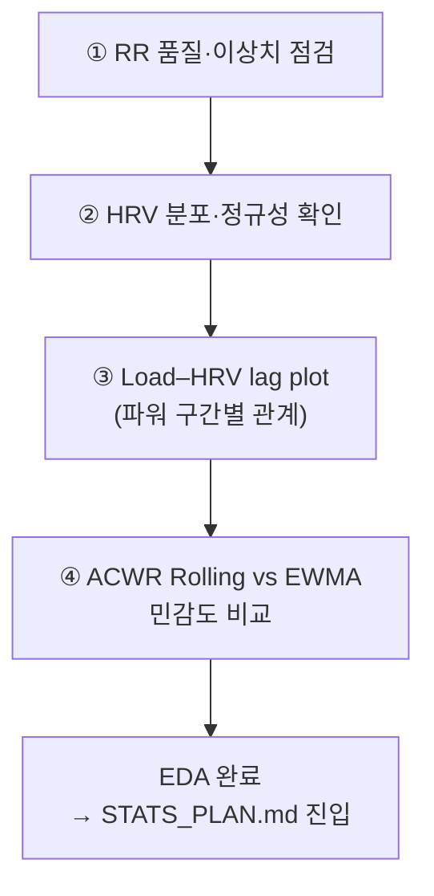
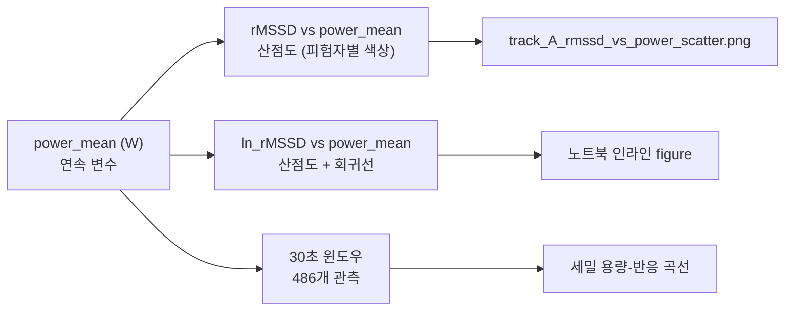
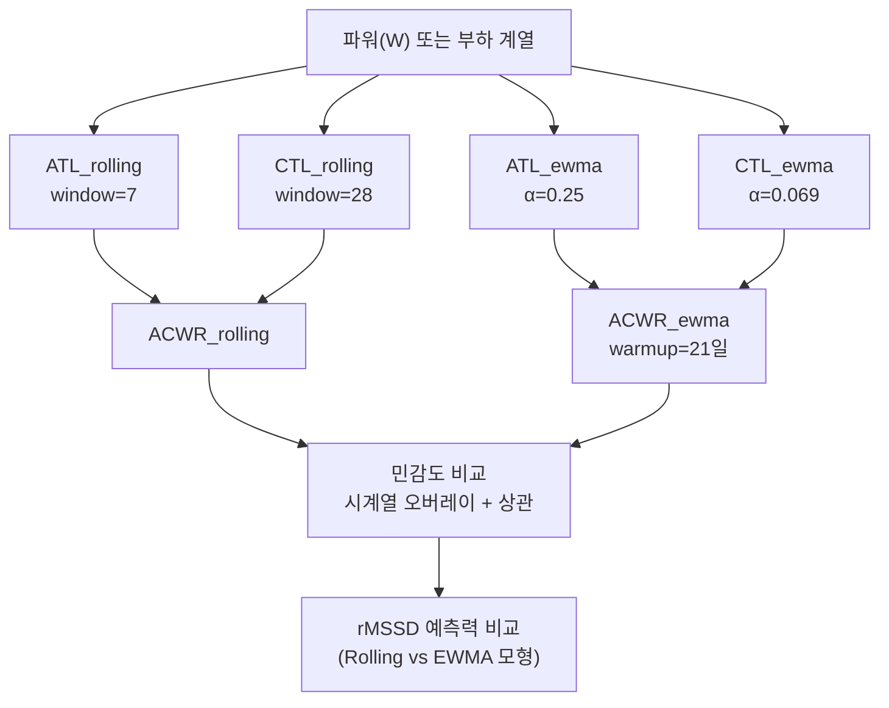

> **문서 ID**: TRK-A-EDA · **버전**: v1.0 · **최종수정**: 2026-05-30 · **상위문서**: [RESEARCH_PROTOCOL.md](../../RESEARCH_PROTOCOL.md) · **담당영역**: Track A (HRV 중심, PhysioNet ACTES)

# Track A EDA 계획 (탐색적 데이터 분석)

> **목적**: PhysioNet ACTES(n=18) RR 원자료의 품질 점검부터 파워–HRV 관계 탐색까지 4단계 구조화 분석을 수행한다.

---

## EDA 전체 흐름



---

## 1단계: RR 품질 점검 및 이상치 분석

### 목표

- 원본 RR 데이터의 전반적 품질을 정량적으로 파악한다.
- `filter_rr_outliers()` 적용 전후 비교를 통해 이상치 분포를 확인한다.

### 분석 항목

| 분석 | 방법 | 산출 figure / 결과 |
|------|------|-------------------|
| 피험자별 RR 분포 | 박스플롯 | 18명 각각의 RR 중앙값·사분위 범위 |
| 이상치 비율 분석 | 필터링 전후 카운트 비교 | 전체 30.1% (15,324건/50,914건) 제거 확인 |
| 필터링 후 RR 시계열 | 대표 피험자(1명) 시계열 플롯 | `reports/figures/track_A_rr_timeseries_sample.png` |
| 파워 구간별 RR 관측 수 | 집계표 | Rest 6,918 / Low 11,375 / Moderate 12,198 / High 5,099 |

### 점검 질문

- 피험자별 이상치 비율 편차가 크지 않은가? (특정 피험자에 집중되어 있으면 데이터 품질 문제 의심)
- 고강도 구간(High)에서 이상치 비율이 다른 구간에 비해 유의하게 높은가?
- 필터링 후 RR 시계열이 생리학적으로 타당한 범위(400~1000 ms)에 분포하는가?

### 사용 함수

```python
# src/data/preprocess.py
filter_rr_outliers(rr_series, threshold=0.20)
```

---

## 2단계: HRV 분포 및 정규성 확인

### 목표

- 파워 구간별 rMSSD·SDNN·ln_rMSSD의 분포 형태와 정규성을 평가한다.
- ln 변환의 정규화 효과를 시각적으로 확인한다.

### 분석 항목

| 분석 | 방법 | 산출 figure / 결과 |
|------|------|-------------------|
| 파워 구간별 rMSSD 분포 | 박스플롯 (4개 구간 나란히) | `reports/figures/track_A_hrv_by_power_zone.png` |
| rMSSD vs ln_rMSSD 정규성 비교 | Q-Q plot 또는 히스토그램 쌍 비교 | 노트북 셀 내 인라인 figure |
| 종목별(fencing/kayak/triathlon) HRV 비교 | 그룹별 박스플롯 | `reports/figures/track_A_sport_comparison.png` |
| 기술통계 요약표 | 평균±SD (구간별, n 포함) | 실측치 (아래 표) |

**실측 기술통계 (출처: `reports/track_A_model_comparison.md` §5.1)**

| 구간 | n | rMSSD (ms) | SD | SDNN (ms) | SD | ln_rMSSD | SD |
|------|:---:|:----------:|:---:|:---------:|:---:|:--------:|:---:|
| Rest | 18 | 7.60 | 2.39 | 48.91 | 6.84 | 1.976 | 0.345 |
| Low | 18 | 6.73 | 2.27 | 22.42 | 8.70 | 1.852 | 0.343 |
| Moderate | 18 | 5.22 | 1.97 | 21.39 | 8.90 | 1.601 | 0.316 |
| High | 13 | 4.59 | 1.55 | 6.70 | 4.28 | 1.482 | 0.292 |

### 점검 질문

- rMSSD의 원분포가 오른쪽 꼬리 분포(right-skewed)를 보이는가? ln 변환 후 개선되는가?
- High 구간에서 n=13 (5명 NA)인 원인은 min_count=30 미만에 기인하는가?
- 종목별(fencing vs kayak vs triathlon) 기저 rMSSD 수준 차이가 유의미한가?

### 사용 함수

```python
# src/metrics/hrv_features.py
rmssd(nn_intervals, min_count=150)
sdnn(nn_intervals, min_count=150)
ln_rmssd(nn_intervals, min_count=150)
ln_rmssd_rolling(daily_ln_rmssd, window=7)
```

---

## 3단계: Load–HRV Lag Plot (파워–HRV 관계 탐색)

### 목표

- 파워(부하 연속변수)와 rMSSD·ln_rMSSD 간 용량-반응 관계를 시각화한다.
- 30초 윈도우 방식으로 세밀한 lag 구조를 탐색한다.

### 분석 항목



| 분석 | 방법 | 산출 figure / 결과 |
|------|------|-------------------|
| rMSSD vs 평균 파워 산점도 | 피험자별 색상 구분, 선형 회귀선 오버레이 | `reports/figures/track_A_rmssd_vs_power_scatter.png` |
| 파워 구간별 rMSSD 박스플롯 | 4개 구간 비교, ANOVA 결과 표시 | `reports/figures/track_A_hrv_by_power_zone.png` |
| 30초 윈도우 ln_rMSSD ~ power_mean | 산점도 + 혼합효과 회귀선 | 노트북 셀 인라인 |
| 이월 효과 (Carryover) 탐색 | 이전 구간 파워 → 현재 rMSSD 상관 | r=−0.465, p=0.0008 (단변량) |

**핵심 실측 수치:**

- 혼합효과모형(랜덤 절편) power_mean 계수: **β=−0.016**, p<0.001
- 30초 윈도우 모형 power_mean 계수: **β=−0.002**, p<0.001 (ln_rMSSD 기준)
- ANOVA F(3, 63)=**6.81**, p=0.000474
- OLS 구간변수 모형 Moderate vs Rest: β=−2.37, SE=0.70, p=0.001
- OLS 구간변수 모형 High vs Rest: β=−3.01, SE=0.77, p<0.001

### 점검 질문

- 파워-rMSSD 관계가 선형인가, 아니면 고강도 구간에서 포화(plateau) 현상이 관찰되는가?
- 피험자별 회귀 기울기의 이질성(heterogeneity)이 존재하는가? (랜덤 기울기 필요성 판단)
- 이월 효과가 현재 파워 통제 후에도 독립적으로 유의한가? (단변량 r=−0.465, 다변량 p=0.796)

### 사용 함수

```python
# src/data/preprocess.py
compute_daily_hrv(df, subject_col, rr_col, min_nn)
build_lagged_dataset(df, outcome_col, predictor_cols, group_col, lag=1)
```

---

## 4단계: ACWR Rolling vs EWMA 민감도 비교

### 목표

- 동일 부하 계열에서 ACWR_rolling과 ACWR_ewma가 얼마나 다른 값을 산출하는지 비교한다.
- 방법론 선택(Rolling vs EWMA)이 분석 결론에 미치는 영향을 정량화한다.

### 분석 항목



| 분석 | 방법 | 산출 figure / 결과 |
|------|------|-------------------|
| ACWR_rolling vs ACWR_ewma 시계열 | 이중 축 시계열 플롯 | 노트북 셀 인라인 |
| 두 ACWR 방식 간 Pearson 상관 | 전체 및 구간별 | 수치 테이블 |
| ACWR 방식별 rMSSD 예측력 | 혼합효과모형 AIC/MAE 비교 | 노트북 셀 수치 |
| 급격한 부하 변화 구간 민감도 | 부하 급증 시점 전후 ACWR 반응 시각화 | 노트북 셀 인라인 |

### 비교 기준 (ACWR 방식)

| 항목 | Rolling Average | EWMA |
|------|----------------|------|
| 가중치 | 균등 (윈도우 내) | 지수 감쇠 (최근 높음) |
| 급변 민감도 | 낮음 | 높음 |
| 수학적 커플링 | Coupled 방식에서 발생 | 구조적으로 발생 안 함 |
| 워밍업 | 28일 (rolling) | 21일 (ewma) |
| 권장 | 탐색용 | 본 프로젝트 기본 (config.json) |

자세한 비교 기준: [../METRICS_FORMULAS.md §4 ACWR Rolling vs EWMA 비교표](../../../standards/METRICS_FORMULAS.md#rolling-average-vs-ewma-비교)

### 점검 질문

- 두 ACWR 방식의 Pearson 상관계수는 어느 수준인가? (r > 0.9이면 방법론 선택이 결론에 미치는 영향 제한적)
- 부하 급변 구간에서 EWMA가 rolling보다 빠르게 반응하는가?
- 모형 AIC/MAE 기준으로 두 방식 중 어느 것이 rMSSD 예측에 더 유리한가?

### 사용 함수

```python
# src/metrics/acwr.py
acwr_rolling(loads, atl_window=7, ctl_window=28)
acwr_ewma(loads, atl_span=7, ctl_span=28, warmup=21)
atl_rolling(loads, window=7)
atl_ewma(loads, span=7)
ctl_rolling(loads, window=28)
ctl_ewma(loads, span=28)
```

---

## EDA 산출물 요약

| 단계 | 산출 figure | 저장 경로 |
|------|------------|-----------|
| 1단계 | RR 시계열 (대표 피험자) | `reports/figures/track_A_rr_timeseries_sample.png` |
| 2단계 | HRV 파워 구간별 박스플롯 | `reports/figures/track_A_hrv_by_power_zone.png` |
| 2단계 | 종목별 HRV 비교 | `reports/figures/track_A_sport_comparison.png` |
| 3단계 | rMSSD vs 파워 산점도 | `reports/figures/track_A_rmssd_vs_power_scatter.png` |
| 4단계 | ACWR Rolling vs EWMA 시계열 | 노트북 인라인 (별도 저장 필요) |

> EDA 완료 후 → [STATS_PLAN.md](STATS_PLAN.md) 진입하여 혼합효과모형 적합 진행.

---

## 참고문헌

- Muniz-Pardos, B., et al. (2023). ACTES Dataset. *PhysioNet*.
- Buchheit, M. (2014). Monitoring training status with HR measures. *IJSPP*, 9(5), 883-895.
- Williams, S., et al. (2017). EWMA vs Rolling ACWR. *IJSPP*, 12(Suppl 2), S2-235.
- Impellizzeri, F. M., et al. (2020). ACWR: Is it a good way to quantify training loads? *BJSM*, 54, 959-960.
