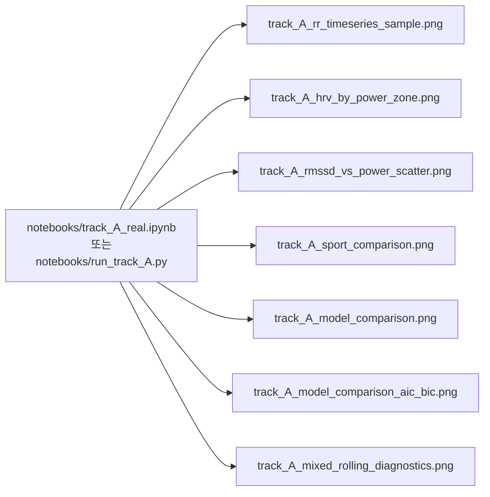
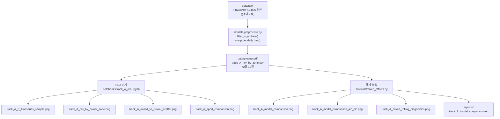

> **문서 ID**: TRK-A-OUTPUTS · **버전**: v1.0 · **최종수정**: 2026-05-30 · **상위문서**: [RESEARCH_PROTOCOL.md](../../RESEARCH_PROTOCOL.md) · **담당영역**: Track A (HRV 중심, PhysioNet ACTES)

# Track A 기대 산출물 (Expected Outputs)

> 본 문서는 Track A 분석 파이프라인이 생성해야 하는 **모든 figures, tables, reports**를 목록화하고, 각 산출물의 내용·경로·재현 명령을 명시한다.

---

## 1. Figure 목록 (시각화 산출물)

모든 figure는 `reports/figures/` 디렉토리에 저장된다.



### 1.1 Figure 상세 목록

| # | 파일명 | 내용 설명 | 파일 크기 | 관련 분석 단계 |
|---|--------|-----------|-----------|----------------|
| 1 | `track_A_rr_timeseries_sample.png` | 대표 피험자(1명) RR 간격·파워 동시 시계열 — 이상치 필터링 전후 비교 포함 | 284.4 KB | EDA 1단계 |
| 2 | `track_A_hrv_by_power_zone.png` | 파워 구간별(Rest/Low/Moderate/High) rMSSD 박스플롯 (n=18, High n=13) | 50.7 KB | EDA 2·3단계 |
| 3 | `track_A_rmssd_vs_power_scatter.png` | rMSSD vs 평균 파워(W) 산점도 — 피험자별 색상 구분, 회귀선 오버레이 | 81.2 KB | EDA 3단계 |
| 4 | `track_A_sport_comparison.png` | 종목별(fencing/kayak/triathlon) HRV 비교 박스플롯 | 138.1 KB | EDA 2단계 |
| 5 | `track_A_model_comparison.png` | 모형 비교 차트 (AIC·BIC·MAE·RMSE 4개 지표 막대 차트) | 86.8 KB | 통계 분석 |
| 6 | `track_A_model_comparison_aic_bic.png` | AIC·BIC 전용 상세 비교 차트 | — | 통계 분석 |
| 7 | `track_A_mixed_rolling_diagnostics.png` | 혼합효과모형(랜덤 절편) 진단 플롯 — 잔차 분포·Q-Q plot | — | 모형 진단 |

### 1.2 Figure 재현성 확인 체크리스트

- [ ] `track_A_rr_timeseries_sample.png` — 필터링 전후 RR 비교가 명확히 표시되는가?
- [ ] `track_A_hrv_by_power_zone.png` — 4개 구간(Rest/Low/Moderate/High) 모두 표시, n 표기 포함
- [ ] `track_A_rmssd_vs_power_scatter.png` — 피험자별 색상 범례, 선형 회귀선 포함
- [ ] `track_A_sport_comparison.png` — 3개 종목 구분, 관측수 표기
- [ ] `track_A_model_comparison.png` — M1/M2/M3 세 모형, 4개 지표 표시

---

## 2. Table 및 Reports 목록

### 2.1 Reports

| 파일 경로 | 내용 | 상태 |
|-----------|------|------|
| `reports/track_A_model_comparison.md` | M1~M3 모형 비교 보고서 — 실측 수치, 해석, 한계 포함 | 완료 (37셀 노트북 기반) |

**`reports/track_A_model_comparison.md` 주요 포함 내용:**

| 섹션 | 핵심 수치 |
|------|-----------|
| §2.1 피험자 개요 | n=18, 종목 구성, 총 RR 52,062건 |
| §2.2 필터링 결과 | 35,590건 유효 (이상치 30.1% 제거) |
| §2.3 파워 구간별 관측 | Rest 6,918 / Low 11,375 / Moderate 12,198 / High 5,099 |
| §4 모형 비교표 | M1 AIC=293.9 / M2 AIC=296.3 / M3 AIC=300.6 |
| §5.1 HRV 기술통계 | rMSSD Rest 7.60±2.39 → High 4.59±1.55 |
| §6.1 30초 윈도우 | 486 윈도우, β=−0.002, p<0.001 |
| §6.2 이월 효과 | r=−0.465 (단변량) → 다변량 p=0.796 (비유의) |

### 2.2 처리 데이터

| 파일 경로 | 내용 | 규모 |
|-----------|------|------|
| `data/processed/track_A_hrv_by_zone.csv` | 피험자×구간별 HRV 집계 | 72행, 10열 |

**`track_A_hrv_by_zone.csv` 컬럼 구성:**

| 컬럼 | 설명 |
|------|------|
| `subject` | 피험자 식별자 |
| `power_zone` | 파워 구간 (Rest/Low/Moderate/High) |
| `n_beats` | 구간 내 유효 RR 수 |
| `power_mean` | 구간 평균 파워 (W) |
| `power_sd` | 구간 파워 표준편차 |
| `rmssd` | rMSSD (ms) |
| `sdnn` | SDNN (ms) |
| `ln_rmssd` | ln(rMSSD) |
| `sport` | 종목 (fencing/kayak/triathlon) |
| `rr_mean` | 구간 평균 RR 간격 (ms) |

---

## 3. 재현 명령

### 3.1 Jupyter Notebook 방식 (권장)

```bash
# 가상환경 활성화 후 실행
cd soccer_rnd
# Windows
venv\Scripts\activate.bat
# Linux/macOS
source venv/bin/activate

# 노트북 실행
jupyter notebook notebooks/track_A_real.ipynb
# 또는 전체 셀 실행
jupyter nbconvert --to notebook --execute notebooks/track_A_real.ipynb \
    --output notebooks/track_A_real_executed.ipynb
```

### 3.2 스크립트 방식

```bash
# 전체 Track A 분석 파이프라인 실행
python notebooks/run_track_A.py

# 섹션별 실행
python -c "
import subprocess
# 섹션 5: 통계 분석 (모형 비교)
exec(open('notebooks/run_track_A.py').read())
"
```

### 3.3 개별 모듈 단위 테스트

```bash
# HRV 지표 단위 테스트
python -m pytest tests/test_metrics_acwr.py -v
python -m pytest tests/ -v -k "hrv"
```

### 3.4 재현 환경 확인

```python
import numpy as np
import statsmodels
print(f"numpy: {np.__version__}")
print(f"statsmodels: {statsmodels.__version__}")
np.random.seed(42)  # 재현성 시드
```

| 환경 항목 | 설정값 |
|-----------|--------|
| Python | 3.x |
| 난수 시드 | `numpy.random.seed(42)` |
| 주요 라이브러리 | statsmodels (mixedlm), pandas, numpy, matplotlib |
| 실행 완료 노트북 | `notebooks/track_A_real.ipynb` (37셀, 전체 셀 출력 포함) |

---

## 4. 산출물 의존 관계 다이어그램



---

## 5. 산출물 품질 기준

| 기준 항목 | 요구사항 |
|-----------|----------|
| **수치 일관성** | reports/track_A_model_comparison.md 수치와 notebooks 출력이 일치해야 함 |
| **Figure 한글 폰트** | 한글 깨짐 없이 표시 (NanumGothic 또는 시스템 폰트 설정 필요) |
| **재현성** | `numpy.random.seed(42)` 설정 후 동일 입력 → 동일 수치 보장 |
| **UTF-8 무결** | 모든 출력 파일 UTF-8 인코딩 (BOM 없음 권장) |
| **Figure 해상도** | 최소 150 DPI (논문 제출용 300 DPI 권장) |
| **NA 처리 투명성** | 5건 NA (High 구간 일부) 처리 사유 노트북에 명시 |

---

## 6. 향후 추가 예정 산출물

아래 산출물은 현재 분석 범위에 포함되지 않으며, 향후 과제로 계획된다.

| 산출물 | 설명 | 우선순위 |
|--------|------|----------|
| `track_A_loso_cv_results.csv` | LOSO 교차검증 18회 반복 MAE·RMSE | 높음 |
| `track_A_gam_power_hrv.png` | GAM(비선형) 파워–rMSSD 용량-반응 곡선 | 중간 |
| `track_A_frequency_domain.png` | LF/HF ratio, HF power 주파수 영역 분석 | 중간 |
| `track_A_vo2_hrv.png` | VO2 vs HRV 관계 (ACTES VO2 데이터 활용) | 낮음 |
| `track_A_sport_subgroup.md` | 종목별(fencing/kayak/triathlon) 하위분석 보고서 | 낮음 |

---

## 참고문헌

- Muniz-Pardos, B., et al. (2023). ACTES Dataset. *PhysioNet*. https://physionet.org/content/actes-cycloergometer-exercise/1.0.0/
- Buchheit, M. (2014). Monitoring training status with HR measures. *IJSPP*, 9(5), 883-895.
- Akaike, H. (1974). Statistical model identification. *IEEE TAC*, 19(6), 716-723.
