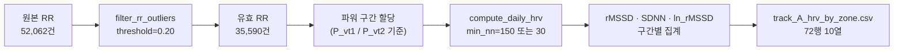
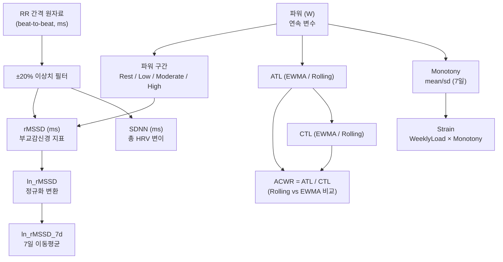

> **문서 ID**: TRK-A-METRICS · **버전**: v1.0 · **최종수정**: 2026-05-30 · **상위문서**: [RESEARCH_PROTOCOL.md](../../RESEARCH_PROTOCOL.md) · **담당영역**: Track A (HRV 중심, PhysioNet ACTES)

# Track A 지표 정의 (Metrics Specification)

> 수식 원문은 [../METRICS_FORMULAS.md](../../../standards/METRICS_FORMULAS.md)에서 정의한다.
> 본 문서는 Track A 특이 적용 규칙, 함수 매핑, 품질 기준만 기술한다.

---

## 1. 지표 목록 및 함수 매핑

### 1.1 부하 지표 (Load Metrics)

| 지표 | 약어 | 산출 함수 | 수식 문서 참조 | Track A 적용 비고 |
|------|------|-----------|----------------|-------------------|
| 급성훈련부하 (Rolling) | ATL_rolling | `src/metrics/acwr.py::atl_rolling(loads, window=7)` | [§2.1 ATL Rolling](../../../standards/METRICS_FORMULAS.md#21-rolling-average-방식) | ACTES는 단일 세션이므로 파워 구간별 평균 파워(W)를 부하 대리지표로 사용 |
| 급성훈련부하 (EWMA) | ATL_ewma | `src/metrics/acwr.py::atl_ewma(loads, span=7)` | [§2.2 ATL EWMA](../../../standards/METRICS_FORMULAS.md#22-ewma-방식) | α = 2/(7+1) = 0.25 |
| 만성훈련부하 (Rolling) | CTL_rolling | `src/metrics/acwr.py::ctl_rolling(loads, window=28)` | [§3.1 CTL Rolling](../../../standards/METRICS_FORMULAS.md#31-rolling-average-방식) | 28일 Warm-up 필요 (단일 세션 적용 시 제한) |
| 만성훈련부하 (EWMA) | CTL_ewma | `src/metrics/acwr.py::ctl_ewma(loads, span=28)` | [§3.2 CTL EWMA](../../../standards/METRICS_FORMULAS.md#32-ewma-방식) | α = 2/(28+1) ≈ 0.069 |
| 급성:만성 부하비 (Rolling) | ACWR_rolling | `src/metrics/acwr.py::acwr_rolling(loads)` | [§4.1 ACWR Rolling](../../../standards/METRICS_FORMULAS.md#41-rolling-average-방식-coupled) | CTL=0 시 NaN 처리 |
| 급성:만성 부하비 (EWMA) | ACWR_ewma | `src/metrics/acwr.py::acwr_ewma(loads, warmup=21)` | [§4.3 ACWR EWMA](../../../standards/METRICS_FORMULAS.md#43-ewma-방식) | 워밍업 21일 내 NaN |
| 훈련 단조성 | Monotony | `src/metrics/monotony_strain.py::monotony(loads, window=7, cap=10.0)` | [§5 Monotony](../../../standards/METRICS_FORMULAS.md#5-monotony) | sd=0 시 cap=10.0 적용 |
| 훈련 부담 | Strain | `src/metrics/monotony_strain.py::strain(loads, window=7)` | [§6 Strain](../../../standards/METRICS_FORMULAS.md#6-strain) | Monotony=NaN 시 Strain=NaN |

> **Track A 설계 주의**: ACTES 데이터셋은 단일 세션 점증 부하 검사이므로, ATL/CTL/ACWR를 종단 시계열 방식으로 산출하는 것은 구조적으로 제한된다. 30초 윈도우 분석에서는 윈도우별 평균 파워(power_mean, W)를 부하 연속변수로 직접 사용한다.

---

### 1.2 HRV 지표 (Heart Rate Variability Metrics)

| 지표 | 약어 | 산출 함수 | 수식 문서 참조 | 스포츠 현장 의미 |
|------|------|-----------|----------------|-----------------|
| 인접 NN 간격 차 제곱 평균 제곱근 | rMSSD | `src/metrics/hrv_features.py::rmssd(nn_intervals, min_count=150)` | [§8.2 rMSSD](../../../standards/METRICS_FORMULAS.md#82-rmssd-root-mean-square-of-successive-differences) | 부교감(vagal) 신경 활동 반영 — 스포츠 모니터링 권장 지표 |
| NN 간격 표준편차 | SDNN | `src/metrics/hrv_features.py::sdnn(nn_intervals, min_count=150)` | [§8.1 SDNN](../../../standards/METRICS_FORMULAS.md#81-sdnn-standard-deviation-of-nn-intervals) | 총 HRV 변이 — 교감+부교감 통합 반영 |
| rMSSD 자연 로그 | ln_rMSSD | `src/metrics/hrv_features.py::ln_rmssd(nn_intervals, min_count=150)` | [§8.3 ln rMSSD](../../../standards/METRICS_FORMULAS.md#83-lnrmssd--자연-로그-변환) | 분포 정규화·변이 계수 감소 목적 |
| ln_rMSSD 7일 이동평균 | ln_rMSSD_7d | `src/metrics/hrv_features.py::ln_rmssd_rolling(daily_ln_rmssd, window=7)` | [§8.3 ln rMSSD](../../../standards/METRICS_FORMULAS.md#83-lnrmssd--자연-로그-변환) | 일상적 변동 완화·추세 파악용 |

---

## 2. 파워 구간별 실측 HRV 요약

> 출처: `reports/track_A_model_comparison.md` — PhysioNet ACTES 실제 데이터 (n=18)

| 파워 구간 | n (피험자) | rMSSD (ms) 평균±SD | SDNN (ms) 평균±SD | ln_rMSSD 평균±SD |
|-----------|:----------:|:------------------:|:-----------------:|:----------------:|
| Rest | 18 | **7.60±2.39** | **48.91±6.84** | **1.976±0.345** |
| Low | 18 | 6.73±2.27 | 22.42±8.70 | 1.852±0.343 |
| Moderate | 18 | 5.22±1.97 | 21.39±8.90 | 1.601±0.316 |
| High | 13 | **4.59±1.55** | **6.70±4.28** | **1.482±0.292** |

파워 증가에 따라 rMSSD와 SDNN이 단조 감소하는 경향이 관찰된다. 특히 SDNN의 감소폭(Rest 48.9ms → High 6.7ms)이 rMSSD(7.6ms → 4.6ms)보다 크며, 이는 고강도 운동 시 교감·부교감 모두의 활동 변화가 반영된 것으로 해석된다.

---

## 3. Track A 특이 결측·품질 규칙

### 3.1 RR 이상치 필터링

| 규칙 | 값 | 구현 위치 |
|------|-----|-----------|
| 판정 기준 | 피험자별 RR 중앙값 ±20% 범위 외 → NaN 대체 | `src/data/preprocess.py::filter_rr_outliers(threshold=0.20)` |
| 필터링 전 RR 수 | 50,914건 | `reports/track_A_model_comparison.md §2.2` |
| 필터링 후 RR 수 | 35,590건 | 이상치 15,324건 (30.1%) 제거 |

### 3.2 HRV 산출 최소 기준

| 조건 | 처리 | 적용 함수 |
|------|------|-----------|
| 유효 NN 간격 < 150개 (기본값) | 해당 세션 HRV = `None` | `rmssd(), sdnn(), ln_rmssd()` |
| 구간 집계 시 완화: min_count=30 | 구간별 집계에서 적용 | `compute_daily_hrv()` 파라미터 조정 |
| 구간별 집계 후 결측 | 67/72건 유효, 5건 NA | `data/processed/track_A_hrv_by_zone.csv` |

### 3.3 전처리 파이프라인 흐름

### 3.4 ACWR 관련 결측 규칙 (Track A 맥락)

| 상황 | 처리 |
|------|------|
| CTL = 0 | ACWR = `NaN` (0 나눗셈 방지) |
| EWMA 워밍업 21일 이내 | ACWR_ewma = `NaN` |
| Rolling CTL 28일 미만 | ACWR_rolling = `NaN` |

> 단일 세션 설계 한계로, Track A에서는 ACWR보다 파워(power_mean, W)를 주된 부하 지표로 사용한다. ACWR 산출 규칙은 향후 다중 세션 데이터 확보 시 적용한다.

---

## 4. 지표 간 관계 다이어그램

---

## 5. 파라미터 설정 요약

| 파라미터 | 기본값 | 설정 위치 |
|----------|--------|-----------|
| ATL 윈도우 | 7일 | `config.json` |
| CTL 윈도우 | 28일 | `config.json` |
| EWMA α (acute) | 0.25 (= 2/8) | `acwr.py::atl_ewma(span=7)` |
| EWMA α (chronic) | ≈0.069 (= 2/29) | `acwr.py::ctl_ewma(span=28)` |
| ACWR warm-up | 21일 | `acwr.py::acwr_ewma(warmup=21)` |
| RR 이상치 임계값 | ±20% | `preprocess.py::filter_rr_outliers(threshold=0.20)` |
| HRV 최소 NN 수 | 150개 (기본), 30개 (구간 집계 완화) | `hrv_features.py` `min_count` |
| Monotony cap | 10.0 | `monotony_strain.py::monotony(cap=10.0)` |

---

## 참고문헌

- Task Force of the European Society of Cardiology. (1996). HRV Standards of Measurement. *Circulation*, 93(5), 1043-1065.
- Plews, D. J., et al. (2013). Training adaptation and HRV in elite endurance athletes. *IJSPP*, 8(6), 688-694.
- Buchheit, M. (2014). Monitoring training status with HR measures. *IJSPP*, 9(5), 883-895.
- Foster, C. (1998). Monitoring training in athletes with reference to overtraining syndrome. *Medicine & Science in Sports & Exercise*, 30(7), 1164-1168.
- Williams, S., et al. (2017). EWMA coupling: a new method for analysing training load. *IJSPP*, 12(Suppl 2), S2-235.
