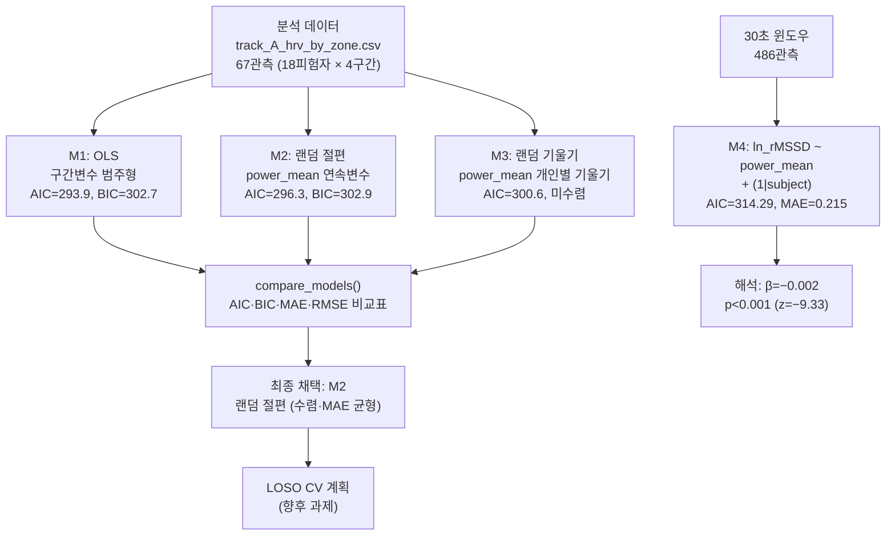
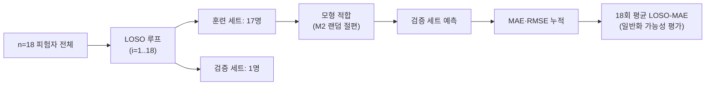

> **문서 ID**: TRK-A-STATS · **버전**: v1.0 · **최종수정**: 2026-05-30 · **상위문서**: [RESEARCH_PROTOCOL.md](../../RESEARCH_PROTOCOL.md) · **담당영역**: Track A (HRV 중심, PhysioNet ACTES)

# Track A 통계 계획 (Statistical Analysis Plan)

> **목적**: 파워 구간(운동 강도)이 rMSSD(HRV)에 미치는 용량-반응 관계를 세 가지 회귀모형으로 비교·검증한다.

---

## 1. 핵심 연구 질문

1. 파워 구간(Rest → High)에 따라 rMSSD가 통계적으로 유의미하게 감소하는가?
2. 피험자 간 개인차(랜덤효과)를 포함하면 예측 정확도가 향상되는가?
3. 랜덤 기울기(피험자별 파워–HRV 민감도 이질성)가 추가 설명력을 제공하는가?

---

## 2. 핵심 모형식

### 2.1 구간별 분석 (67개 관측: 피험자 × 구간)

```
# M1: OLS 베이스라인
rMSSD ~ C(power_zone, Treatment(reference='Rest'))

# M2: 랜덤 절편 혼합효과모형 (채택 모형)
rMSSD ~ power_mean + (1 | subject)

# M3: 랜덤 기울기 혼합효과모형
rMSSD ~ power_mean + (1 + power_mean | subject)
```

### 2.2 30초 윈도우 확장 분석 (486개 관측)

```
# ln_rMSSD 기준, 검정력 향상 목적
ln_rMSSD ~ power_mean + (1 | subject)
```

> 수식 표기 규칙: `(1|subject)` = 랜덤 절편, `(1 + power_mean|subject)` = 랜덤 기울기. 구현: `src/stats/mixed_effects.py::fit_random_intercept()` 및 `fit_random_slope()`.

---

## 3. 모형 비교 전략 및 워크플로



---

## 4. 모형 비교표 (실측치)

> 출처: `reports/track_A_model_comparison.md` §4 — PhysioNet ACTES 실제 데이터 (n=18)

### 4.1 구간별 집계 분석 (67개 관측)

| 지표 | M1: OLS (구간변수) | M2: 랜덤 절편 | M3: 랜덤 기울기 | 선호 방향 |
|------|:-----------------:|:-------------:|:----------------:|:--------:|
| **AIC** | **293.9** | 296.3 | 300.6 | 낮을수록 양호 |
| **BIC** | **302.7** | **302.9** | 311.6 | 낮을수록 양호 |
| **MAE** | 1.64 | 1.41 | **1.24** | 낮을수록 양호 |
| **RMSE** | 2.04 | 1.74 | **1.54** | 낮을수록 양호 |
| **파워 계수 (β)** | (구간별 대비) | **−0.016** | −0.016 | — |
| **파워 p-value** | <0.001 (F=6.81) | <0.001 | <0.001 | — |
| **R² (OLS)** | 0.245 | — | — | — |
| **수렴 여부** | — | 수렴 | **미수렴** | — |
| **랜덤 절편 분산** | — | 0.561 | 3.071 | — |
| **랜덤 기울기 분산** | — | — | 0.0001 | — |

### 4.2 OLS 구간별 계수 상세

| 대비 (vs Rest) | β (ms) | SE | t | p-value |
|---------------|:------:|:---:|:---:|:-------:|
| Low − Rest | −0.87 | 0.70 | −1.24 | 0.221 |
| Moderate − Rest | −2.37 | 0.70 | −3.38 | **0.001** |
| High − Rest | −3.01 | 0.77 | −3.92 | **<0.001** |

### 4.3 30초 윈도우 모형 결과 (486개 관측, ln_rMSSD 기준)

| 항목 | 값 |
|------|-----|
| 윈도우 수 | 486개 (18 그룹) |
| Intercept | **1.832** (SE=0.056, z=32.88, p<0.001) |
| power_mean | **−0.002** (SE=0.000, z=−9.33, p<0.001) |
| Group Var (절편 분산) | 0.044 |
| Scale (잔차 분산) | 0.0969 |
| AIC | 314.29 |
| MAE | **0.215** |
| RMSE | **0.306** |
| 수렴 | Yes |

---

## 5. 평가 지표 및 해석 기준

| 지표 | 설명 | 선호 방향 | 근거 |
|------|------|-----------|------|
| **AIC** | 모형 복잡도 대비 적합도 균형 | 낮을수록 양호 | Akaike (1974) |
| **BIC** | AIC보다 파라미터 수에 더 엄격한 페널티 | 낮을수록 양호 | Schwarz (1978) |
| **MAE** | 예측 오차 절대값 평균 | 낮을수록 양호 | 이상치에 덜 민감 |
| **RMSE** | 큰 오차에 민감한 예측 정확도 | 낮을수록 양호 | 이상치에 더 민감 |
| **Cohen's f²** | 기준 모형 대비 추가 설명력 | 클수록 효과 큼 | Cohen (1988) |
| **ICC** | 피험자 간 기저 변이 비율 | — | 개인차 크기 파악 |

**ICC 실측**: 랜덤 절편 분산(0.561) / (0.561 + 잔차 분산 3.460) ≈ **0.14** — 전체 변동의 약 14%가 피험자 간 차이에 기인한다.

---

## 6. 기대 계수 방향 및 해석 근거

| 효과 | 기대 방향 | 실측 결과 | 생리학적 근거 |
|------|-----------|-----------|--------------|
| power_mean → rMSSD | **음(−)** | β=−0.016 (p<0.001) | 운동 강도 증가 → 교감신경 활성 증가·부교감신경 철수(vagal withdrawal) |
| High vs Rest | **음(−)** | β=−3.01 (p<0.001) | 고강도 구간 부교감 억제 |
| Moderate vs Rest | **음(−)** | β=−2.37 (p=0.001) | 중등도 이상 강도에서 rMSSD 유의 감소 |
| Low vs Rest | **음(−)** | β=−0.87 (p=0.221) | 저강도에서는 유의하지 않음 — 부교감 억제 역치 미달 가능성 |
| 랜덤 절편 분산 | 양(+) 기대 | 0.561 | 피험자별 기저 HRV 수준 차이 존재 (종목·연령 이질성) |

> 위 방향은 Buchheit (2014) 및 Plews et al. (2013)에서 보고된 운동 강도–HRV 역상관 패턴과 일관된 경향이다.

---

## 7. src/stats/mixed_effects.py 함수 매핑

| 단계 | 함수 | 파라미터 예시 |
|------|------|--------------|
| M2 적합 | `fit_random_intercept(formula, data, group_col)` | `formula="rmssd ~ power_mean"`, `group_col="subject"` |
| M3 적합 | `fit_random_slope(formula, data, group_col, slope_var)` | `slope_var="power_mean"` — 수렴 실패 시 `None` 반환 |
| 지표 추출 | `extract_model_metrics(result, data, outcome_col)` | AIC·BIC·MAE·RMSE·고정효과·랜덤효과 분산 반환 |
| 다중 모형 비교 | `compare_models(models_dict, data, outcome_col)` | Cohen's f² 자동 계산 포함 |
| 시각화 | `plot_model_comparison(comparison_df, metric="aic")` | 막대 차트 반환 → `reports/figures/track_A_model_comparison.png` |

```python
# 실제 사용 예시 (notebooks/run_track_A.py 섹션 5)
from src.stats.mixed_effects import (
    fit_random_intercept, fit_random_slope,
    extract_model_metrics, compare_models, plot_model_comparison
)

m2 = fit_random_intercept("rmssd ~ power_mean", data=df_zone, group_col="subject")
m3 = fit_random_slope("rmssd ~ power_mean", data=df_zone,
                       group_col="subject", slope_var="power_mean")

comparison = compare_models(
    {"M2_random_intercept": m2, "M3_random_slope": m3},
    data=df_zone, outcome_col="rmssd"
)
```

---

## 8. LOSO 교차검증 계획 (향후 과제)

Leave-One-Subject-Out(LOSO) 교차검증은 현재 분석에는 적용하지 않았으나, 향후 과제로 계획한다.



**LOSO 적용 시 기대 효과**: 피험자 수준(n=18)에서 모형의 일반화 가능성을 정량화. 현재 in-sample MAE=1.41 대비 LOSO-MAE가 크게 증가한다면 과적합 가능성을 시사한다.

---

## 9. 모형 선택 권고

| 목적 | 권고 모형 | 근거 |
|------|-----------|------|
| 집단 수준 강도–HRV 관계 보고 | **M1: OLS (구간변수)** | AIC=293.9·BIC=302.7 최저, 해석 용이 |
| 개인별 예측이 필요한 경우 | **M2: 랜덤 절편** | MAE=1.41 (OLS 대비 개선), 수렴 안정 |
| 세밀한 용량-반응 분석 | **30초 윈도우 M2** | 관측수 486개, 검정력 최대, β=−0.002 (p<0.001) |
| 개인별 민감도 이질성 탐색 | M3 (주의) | 미수렴 — 피험자당 관측수(3~4개) 부족 |

> **최종 채택 모형**: 랜덤 절편 혼합효과모형(M2). 수렴 안정성과 MAE 개선을 동시에 충족하며, 피험자 간 기저 HRV 차이를 모형화한다.

---

## 10. 주요 한계 및 해석 주의사항

| 항목 | 설명 |
|------|------|
| 단일 세션 설계 | 종단 시계열(daily HRV → ACWR) 분석 불가 |
| 제한된 관측수 | 피험자×구간=67개 — 랜덤효과 추정에 최소 검정력 |
| 비정상성(non-stationarity) | 운동 중 HRV는 시간에 따른 비정상성이 높아 시간영역 지표 해석에 주의 필요 |
| 이질적 표본 | 3종목, 12~18세 — 교란변수 존재 가능성 |
| 선형 가정 | 고강도 구간 포화(plateau) 가능성 — GAM 탐색 권장 (향후 과제) |

---

## 참고문헌

- Akaike, H. (1974). Statistical model identification. *IEEE TAC*, 19(6), 716-723.
- Schwarz, G. (1978). Estimating the dimension of a model. *Annals of Statistics*, 6(2), 461-464.
- Cohen, J. (1988). *Statistical power analysis for the behavioral sciences* (2nd ed.). Erlbaum.
- Buchheit, M. (2014). Monitoring training status with HR measures. *IJSPP*, 9(5), 883-895.
- Plews, D. J., et al. (2013). Training adaptation and HRV. *IJSPP*, 8(6), 688-694.
- Muniz-Pardos, B., et al. (2023). ACTES Dataset. *PhysioNet*.
