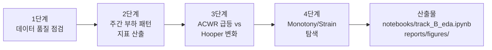

> **문서 ID**: TRK-B-EDA · **버전**: v2 · **최종수정**: 2026-05-30 · **상위문서**: [RESEARCH_PROTOCOL.md](../../RESEARCH_PROTOCOL.md)

# 트랙 B EDA 계획

> 목적: sRPE/ACWR/Monotony 부하 지표와 Hooper Index 웰니스 간 시차 관계 탐색

지표 수식 정의는 [METRICS_FORMULAS.md](../../../standards/METRICS_FORMULAS.md)를 교차참조한다.

## 데이터셋
- 실제 채택: SoccerMon (Midoglu et al., 2024; DOI: 10.5281/zenodo.10033832) — 프로 축구 44명, 24,596 athlete-days, 2020-01-09~2021-12-31
- 1순위 후보: Carey et al. (Zenodo, CC BY 4.0, AFL ~45명, 1시즌)
- 웰니스 매핑: fatigue→fatigue, sleep quality→sleep, muscle soreness→DOMS, stress→stress (mood 제외); stress는 1–10→1–5 정규화(/2.0) 적용
- 파이프라인 검증: 합성 데모 데이터(12명, 120일) 사용

## 실측 요약 수치

| 항목 | 값 |
|------|-----|
| 최종 선수 수 | 44명 (50명 → 부하·웰니스 ≥60일 필터) |
| 총 athlete-days | 24,596 |
| Hooper Index 유효 관측 | 16,592 (결측률 **~32.5%**) |
| Hooper Index (M±SD) | 10.70 ± 1.77 (범위 4.5–17.5) |
| daily_load (M±SD) | 284.9 ± 323.3 (min 0 ~ max 3,420) |
| ACWR (M±SD, 모형) | 1.170 ± 0.640 |
| Monotony (M±SD, 모형) | 1.324 ± 0.543 |
| Strain (M±SD, 모형) | 3,598.8 ± 2,428.7 |

출처: [reports/track_B_model_comparison.md](../../../../reports/track_B_model_comparison.md)

---

## EDA 흐름도

---

## EDA 4단계

### 1단계: 데이터 품질 점검
- 선수별 결측 비율 히트맵 → Hooper 결측 ~32.5% (선수별·월별 패턴 확인; `reports/figures/track_B_missing_heatmap.png`)
- 일별 부하(sRPE / daily_load) 분포 — 선수별 boxplot (중앙값 180 AU, max 3,420 AU)
- Hooper 4항목 분포 (fatigue 평균 3.03, stress_norm 1.60, soreness 2.80, sleep_quality 3.27)
- 코드 경로: `src/data/preprocess.py`

### 2단계: 주간 부하 패턴 및 지표 산출
- 선수별 ACWR(rolling/EWMA), Monotony, Strain 산출
  - 코드 경로: `src/metrics/acwr.py`, `src/metrics/monotony_strain.py`
  - 수식 교차참조: [METRICS_FORMULAS.md §4 ACWR](../../../standards/METRICS_FORMULAS.md), [§5 Monotony](../../../standards/METRICS_FORMULAS.md), [§6 Strain](../../../standards/METRICS_FORMULAS.md)
- 요일별 평균 부하 막대 그래프 (월~일 패턴; `reports/figures/track_B_weekly_load_pattern.png`)
- 대표 선수 시계열: daily_load, ATL, CTL, ACWR, Monotony, Strain (`reports/figures/track_B_timeseries_sample.png`)

### 3단계: ACWR 급등 vs Hooper 변화
- ACWR(t) vs Hooper(t+1) 산점도 (lag=1일; `reports/figures/track_B_acwr_hooper_scatter.png`)
- Monotony(t) vs Hooper(t+1) 산점도
- Pearson 상관계수 표 (lag 0~7일) — 실측: lag 1 r=−0.004, lag 7 r=+0.027 (집단 수준 상관 매우 약함)
- 집중 훈련 구간 전후 Hooper 변화 이벤트 플롯

### 4단계: Monotony/Strain 탐색
- Strain(t) vs Hooper(t+1) 산점도
- 고 Monotony (>2.0) 구간 하이라이트 — 실측: 1,388관측 (전체의 약 9%), Hooper 평균 10.67 (Monotony≤2.0: 10.70, 차이 p=0.543, Cohen's d=−0.017; 임계값 효과 미지지)
- Monotony 임계값 전후 Hooper 평균 비교 (`reports/figures/track_B_monotony_threshold.png`)
- 코드 경로: `src/metrics/monotony_strain.py`

---

## 산출물
- `notebooks/track_B_eda.ipynb` (13셀, 합성 데모 데이터 포함)
- `notebooks/track_B_real.ipynb` (44셀, SoccerMon 실제 데이터 실행 완료)
- `reports/figures/track_B_*.png` (8개 파일: missing_heatmap, weekly_load_pattern, acwr_hooper_scatter, monotony_threshold, load_distribution, timeseries_sample, model_comparison, lag_profile)

---

## 변경 이력

| 버전 | 일자 | 변경 내용 |
|------|------|-----------|
| v1 | 2026-02-10 | 초기 작성 |
| v2 | 2026-05-30 | mermaid EDA 흐름도 추가, 실측 수치 반영 (44명·32.5% 결측·lag 7 r=+0.027·Monotony 임계값 효과 미지지), 코드 경로 교차참조, 산출물 목록 갱신, 메타블록 추가 |
