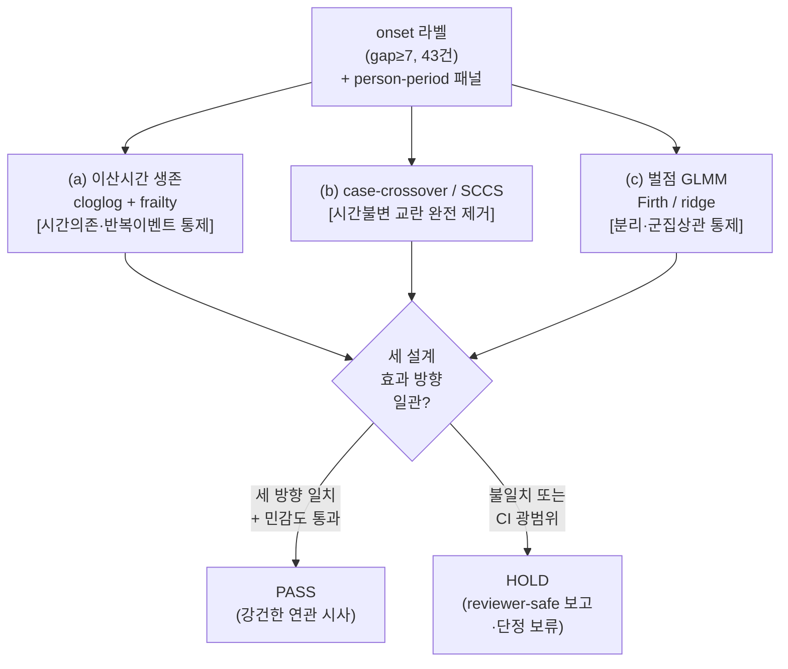
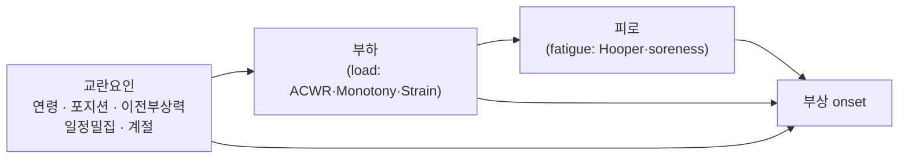
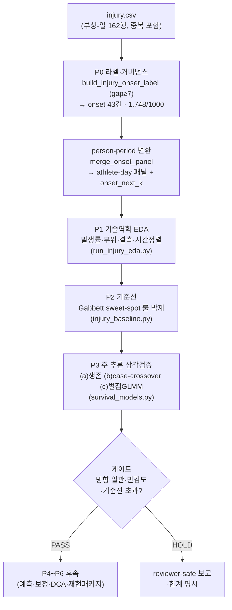

> 문서 ID · 버전 v1.0 · 최종수정 2026-05-30 · 상위문서 [RESEARCH_PROTOCOL §H](../../RESEARCH_PROTOCOL.md) · 담당영역 Stage 8 부상예측(P0~P3)

# Stage 8 부상예측 — 개념·방법론 가이드

> 본 문서는 Stage 8 부상예측에서 사용하는 **방법론 개념의 사전(dictionary)**이다.
> 코드와 결과 수치 자체는 `src/`·`notebooks/`·결과 리포트에 있으며, 여기서는 **각 개념의 정의·목적·이 데이터에서의 설계 근거·결과 해석법**을 한국어로 정리한다.
> 지표 수식(ACWR·Monotony·Strain·Hooper 등)의 **원전은 [../METRICS_FORMULAS.md](../../../standards/METRICS_FORMULAS.md)**이며, 본 문서는 *부상예측에 특이한 개념*(생존분석·case-crossover·불균형 평가 등)만 서술한다.
> 톤은 reviewer-safe(시사한다/관찰된다/일관된 경향)를 따르며, 임상 배포·진단 주장은 하지 않는다.

각 방법 개념은 다음 **4요소**로 서술한다.

| 요소 | 질문 |
|------|------|
| **정의** | 이 개념은 무엇인가 |
| **목적** | 왜 쓰는가 |
| **이 데이터에서 왜 이 설계인가** | SoccerMon·onset 43건 제약 하에서의 정당화 |
| **결과 해석법** | 무엇을 보면 되는가 |

---

## 1. 개요·범위

### 1.1 이번 라운드의 범위 (P0~P3 실행, P4~P6 정의만 제시)

[RESEARCH_PROTOCOL §H](../../RESEARCH_PROTOCOL.md)의 게이트 로드맵 P0~P6 중, **이번 라운드는 P0~P3을 실행**한다.

| 게이트 | 내용 | 이번 라운드 |
|--------|------|:-----------:|
| **P0** | 거버넌스·라벨(onset·위험집합·EPV) | ✅ 실행 |
| **P1** | 기술역학 EDA(발생률·부위·결측·시간정렬) | ✅ 실행 |
| **P2** | 기준선(Gabbett sweet-spot 룰 박제) | ✅ 실행 |
| **P3** | 주 추론 삼각검증(생존·case-crossover·벌점 GLMM) | ✅ 실행 |
| P4 | 예측+XAI·확률보정·decision-curve | ⏸ 후속(정의만 §3.4) |
| P5 | 강건성(MNAR·윈도우 민감도·Leave-Team-Out) | ⏸ 후속(정의만 §6) |
| P6 | 재현 패키지·데모·1-pager | ⏸ 후속 |

### 1.2 "방법론 시연이 1차 가치"

> **정직성 원칙**([RESEARCH_PROTOCOL §0](../../RESEARCH_PROTOCOL.md)): 본 데이터의 독립 부상 onset은 **43건**에 불과하다.
> 따라서 본 라운드의 1차 가치는 *배포형 부상 예측기*가 아니라, **데이터 희소성·극단적 불균형 하에서의 엄밀한 방법론 시연**이다.
> 절대 성능 수치(PR-AUC 등)는 작을 수 있으며, 그 자체가 임상적 무력함이 아니라 **검정력 한계의 반영**임을 reviewer-safe 톤으로 명시한다([RESEARCH_PROTOCOL §I](../../RESEARCH_PROTOCOL.md)).

---

## 2. 라벨·노출 개념

### 2.1 onset (부상 발현 사건, gap≥7)

- **정의**: 동일 선수에서 직전 부상-일과의 간격(gap)이 **7일 이상**이면 새로운 독립 부상 사건(onset)으로 센다. 7일 미만 간격으로 이어지는 연속 부상-일은 **하나의 부상 에피소드**로 묶고, 그 시작일만 onset으로 센다(첫 부상-일은 항상 onset). 결정 근거는 [../DECISIONS.md ADR-014](../../DECISIONS.md)에 동결되어 있다.
- **목적**: 원시 `injury.csv`는 *상태 로깅*(같은 부상이 여러 날 중복 기록, 162 부상-일)이므로, 사건 단위로 환산하지 않으면 발생률·검정력 추정이 흔들린다. onset은 "예측 대상이 되는 독립 이벤트"를 정의한다.
- **이 데이터에서 왜 이 설계인가**: gap≥7 규칙 적용 시 **onset 43건·발생률 1.748/1000 athlete-days**가 산출되며, 이는 동일 SoccerMon을 분석한 외부 연구(arXiv 2601.19479)의 43건과 일치한다(외부 검증). 부상 보유 선수는 **15/44명**으로 이벤트가 소수에 집중된다.
- **결과 해석법**: 라벨 정의는 결과에 민감하다 — **gap=3이면 onset 75건**으로 늘어난다. 따라서 결과는 항상 gap=3/7 민감도 분석과 함께 해석하며, 단일 gap 값에 결론을 의존하지 않는다.

### 2.2 위험집합 (risk set)

- **정의**: 특정 시점에 "아직 부상이 발생하지 않았고, 발생할 수 있는 상태"에 있는 athlete-day들의 집합. 생존분석에서 각 시점의 위험률은 *그 시점 위험집합 내에서* 평가된다.
- **목적**: 이미 부상 중이거나 관측이 끝난(중도절단) athlete-day를 위험 평가에서 올바르게 배제하기 위함. 위험집합을 정확히 다루지 않으면 발생률·위험률이 왜곡된다.
- **이 데이터에서 왜 이 설계인가**: SoccerMon은 선수별 관측 기간이 다르고(평균 559일), 시즌 경계·결측이 존재한다. 위험집합 개념으로 "관측되지 않은 기간"을 위험에서 제외해 발생률 분모(24,596 athlete-days)를 정합적으로 유지한다.
- **결과 해석법**: 발생률(1.748/1000)은 *위험집합에 노출된 athlete-day당* 사건 수임을 기억한다. 위험집합 정의가 바뀌면 발생률 분모가 바뀐다.

### 2.3 person-period (이산시간) 변환

- **정의**: 각 선수의 관측 기간을 **일(day) 단위 행**으로 펼쳐, 각 athlete-day가 "그 날 사건이 일어났는가(0/1)"를 갖는 long-format 패널로 변환하는 것. 연속시간 생존을 이산시간 회귀로 다루는 표준 변환이다.
- **목적**: 일별 부하·웰니스 공변량이 시간에 따라 변하므로(time-varying), 행 단위로 공변량을 정렬하면 일반 이항회귀 도구로 위험률을 추정할 수 있다.
- **이 데이터에서 왜 이 설계인가**: SoccerMon은 본래 일별 패널(24,596 athlete-days)이므로 person-period 구조가 자연스럽다. 별도 생존 라이브러리 없이 cloglog 링크 이항회귀로 위험률을 추정할 수 있어, 검정력 제약 하에서 모형을 단순·투명하게 유지한다.
- **결과 해석법**: 행 수는 athlete-days, 양성 행은 사건일이다. 한 onset 주변 여러 athlete-day가 양성/위험으로 묶이므로, **실질 정보량은 athlete-day 수가 아니라 독립 onset 43건**임을 항상 염두에 둔다.

### 2.4 선행 위험창 라벨 onset_next_k (k=1/3/7)

- **정의**: athlete-day `t`에 대해 `onset_next_k = 1`이면 **다음 [t+1, t+k] 구간에 onset이 발생**함을 의미한다(선행 예측 라벨). 코드: `merge_onset_panel`(`src/data/injury_label.py`).
- **목적**: "오늘의 부하·웰니스 상태로 *향후 k일 내* 부상을 선행 탐지"하는 예측 문제를 정의한다. 사후 적합이 아니라 *미래* 사건을 본다.
- **이 데이터에서 왜 이 설계인가**: k를 1·3·7로 두어 *유도기간(induction period)*에 대한 가정을 다변화한다. k가 커질수록 양성 사건이 누적되어 양성률이 오른다(아래 표).
- **결과 해석법**: k 선택은 정밀도와 lead-time(경고~부상 간격)의 트레이드오프다. k=7은 양성률이 높아 통계적으로 다루기 쉽지만, "7일 내 어딘가"라는 거친 경고다.

| 선행 위험창 k | 양성률 | 불균형비 |
|:------------:|:------:|:--------:|
| k=1일 | **0.150%** | 1:664 |
| k=3일 | **0.447%** | 1:223 |
| k=7일 | **1.033%** | 1:96 |

> (위 표는 [RESEARCH_PROTOCOL §C.2](../../RESEARCH_PROTOCOL.md)의 athlete-day 라벨 분포와 동일 정의이며, 본 문서는 *독립 onset 기준 위험창 양성률*을 제시한다.)

### 2.5 EPV (events-per-variable)와 변수 예산

- **정의**: EPV = 이벤트 수 / 동시 투입 예측변수 수. 회귀모형이 안정적으로 적합되려면 EPV가 충분히 커야 한다는 경험칙(통상 ≥10).
- **목적**: 과적합·분리(separation)·불안정 추정을 피하기 위해 *동시에 추정할 수 있는 변수 개수의 상한*을 미리 정한다.
- **이 데이터에서 왜 이 설계인가**: 독립 onset **43건** → EPV 10 규칙상 **동시 투입 예측변수 ≤ 4개**. 이것이 본 라운드 설계를 지배하는 제약이며, **풀 ML(GBM 등)을 단독 주모형으로 쓰는 것을 금지**하는 근거다(ML은 탐색·민감도 보조로만).
- **결과 해석법**: 모든 주모형은 변수 4개 이내로 보고된다. "왜 모든 변수를 한꺼번에 넣지 않았는가?"의 답은 EPV 예산이다.

---

## 3. 불균형·평가 지표

### 3.1 클래스 불균형 (class imbalance)

- **정의**: 양성(부상)이 음성에 비해 극단적으로 드문 상태. 본 데이터는 k=1에서 **1:664**, k=7에서도 **1:96**.
- **목적**: 평가·학습 전략을 불균형에 맞게 설계하기 위해 먼저 그 규모를 정량화한다.
- **이 데이터에서 왜 이 설계인가**: 이 분포는 **FDS 사기 탐지(통상 0.1~1%대)와 동일한 난이도**이며([RESEARCH_PROTOCOL §G](../../RESEARCH_PROTOCOL.md)), 정확도(accuracy)·ROC-AUC가 부적절함을 직접 정당화한다.
- **결과 해석법**: "정확도 99%"는 전부 음성으로 찍어도 달성되므로 무의미하다. 불균형 하에서는 정밀도·재현율 계열 지표를 본다.

### 3.2 PR-AUC vs ROC-AUC (왜 PR-AUC인가)

- **정의**: **PR-AUC(평균정밀도, average precision)**는 정밀도-재현율 곡선 아래 면적. ROC-AUC는 위양성률-재현율 곡선 아래 면적. 코드: `pr_auc`(`src/stats/injury_eval.py`).
- **목적**: 희소 양성에서 모형의 "양성 식별력"을 과대평가 없이 측정한다.
- **이 데이터에서 왜 이 설계인가**: ROC-AUC는 음성이 압도적으로 많을 때 위양성률 분모가 거대해 **소수의 양성 식별 실패가 잘 드러나지 않아 과대평가**된다. PR-AUC는 정밀도(양성 예측의 신뢰도)를 직접 반영하므로 1:96~1:664 불균형에서 더 정직하다([RESEARCH_PROTOCOL §C.2](../../RESEARCH_PROTOCOL.md)).
- **결과 해석법**: PR-AUC를 1차 지표로 보고, ROC-AUC는 (보고하더라도) 보조로만 본다.

### 3.3 기저율(baseline PR-AUC)·recall@precision·lift

- **기저율(baseline PR-AUC)**
  - **정의**: 무작위 분류기의 PR-AUC = 양성률 그 자체. 코드: `baseline_pr_auc`.
  - **목적**: PR-AUC의 절대값은 양성률에 따라 달라지므로, 무작위 대비 *상대* 식별력을 보기 위한 하한선을 제공한다.
  - **결과 해석법**: 모형 PR-AUC가 기저율보다 의미 있게 커야 식별력이 있다. RQ1의 PASS 기준은 **PR-AUC > 기저율×2**([RESEARCH_PROTOCOL §D](../../RESEARCH_PROTOCOL.md)).
- **lift**
  - **정의**: lift = PR-AUC / 기저율. 무작위 대비 몇 배의 식별력인가. 코드: `evaluate_baseline`(`src/stats/injury_baseline.py`).
  - **결과 해석법**: lift > 2가 RQ1 PASS의 직관적 표현이다.
- **recall@precision**
  - **정의**: 목표 정밀도(예: 0.5) 이상을 만족하는 운영점에서 달성 가능한 최대 재현율. 코드: `recall_at_precision`.
  - **목적**: 실제 운영에서는 "경고가 맞을 확률(정밀도)을 일정 수준 보장한 채, 얼마나 많은 부상을 잡는가(재현율)"가 중요하다. FDS의 비용민감 운영과 동형이다.
  - **결과 해석법**: 목표 정밀도를 만족하는 지점이 없으면 0이 나올 수 있으며, 이는 희소·검정력 한계 하에서 정상적인 결과다.

### 3.4 보정(calibration)·decision-curve — P4 후속 (정의만 제시)

> 아래 두 개념은 **P4(예측+효용) 후속**이며, 이번 라운드에서는 정의만 제시한다.

- **calibration (확률 보정)**
  - **정의**: 모형이 출력한 위험확률이 *실제 관측 빈도*와 일치하는 정도. **Brier score**(확률예측의 평균제곱오차)와 **calibration curve**(예측확률 구간별 실제 양성비율)로 평가하며, 어긋나면 isotonic 재보정을 적용한다.
  - **목적**: 위험 임계값으로 휴식을 권고하려면 확률이 *의미 있는 수치*여야 한다. 순위만 맞고 절대확률이 틀리면 운영 임계 설정이 왜곡된다.
- **decision-curve (net benefit)**
  - **정의**: 다양한 임계확률에서 "경고를 따랐을 때의 순이익(net benefit = 진양성 이득 − 위양성 비용)"을 곡선으로 그린 것.
  - **목적**: 휴식 권고는 *예측이 아니라 결정*이다(훈련 손실 비용 vs 부상 회피 편익의 비대칭). 정확도가 아니라 순이익으로 임계값을 정한다([RESEARCH_PROTOCOL §A′.6, §F](../../RESEARCH_PROTOCOL.md)).
  - **결과 해석법(P4)**: "Gabbett 룰만 따랐을 때" vs "모형을 따랐을 때"의 net benefit을 비교해, 모형이 실제 운영 이득을 주는지 본다.

---

## 4. 주 추론 삼각검증 (P3)

> **단일 모형 의존 금지 이유**: onset 43건·EPV≤4의 검정력 제약 하에서 어떤 단일 설계도 결정적 증거가 되지 못한다. 서로 *다른 가정·다른 편향*을 통제하는 세 설계가 **같은 방향**을 가리킬 때, 결론의 강건성이 확보된다(설계 간 삼각검증). RQ1의 PASS 기준에 "설계 3종 방향 일관"이 포함된다([RESEARCH_PROTOCOL §E.3, §H-P3](../../RESEARCH_PROTOCOL.md)).
>
> 코드: `src/stats/survival_models.py`(이산시간 생존·case-crossover·벌점 GLMM, 동시 작성 중), 실행 노트북 `notebooks/run_injury_inference.py`.

### 4.1 (a) 이산시간 생존 — cloglog + frailty

- **정의**: person-period 패널(§2.3)에서 각 athlete-day의 부상 위험률을 **cloglog(complementary log-log) 링크** 이항회귀로 모형화한다. **frailty**는 선수별 랜덤효과(개인 기저 위험 이질성)를 위험률에 곱하는 항이다.
- **목적**: 시간의존 위험·중도절단·반복이벤트를 위험집합 정합적으로 다루며, 개인 간 기저 위험 차이(frailty)를 통제한다.
- **강점·통제 편향**: cloglog는 이산시간에서 비례위험 해석이 가능하다(연속시간 Cox와 정합). frailty는 *측정되지 않은 개인 불변 취약성*(부상 소인 등)을 흡수해 군집 상관을 통제한다.
- **이 데이터에서 왜 이 설계인가**: SoccerMon은 본래 일별 패널이라 person-period 변환이 자연스럽고, ICC≈0.45([STATS_PLAN.md](STATS_PLAN.md))로 개인 이질성이 크므로 frailty가 필수다.
- **결과 해석법**: 부하 공변량 계수의 부호·95%CI를 본다. 위험비(exp(β))가 1보다 크면 부하 상승이 위험 증가와 연관됨을 시사한다. CI가 넓으면(검정력 한계) 단정하지 않는다.

### 4.2 (b) case-crossover / SCCS

- **정의**: **case-crossover**는 사건 직전 *위험기간(hazard period)*의 노출을, 같은 사람의 *대조기간(control period)* 노출과 비교한다(개인이 자기 자신의 대조). **SCCS(self-controlled case series)**도 케이스 내부에서 노출-시간을 비교하는 자기대조 설계다.
- **목적**: 시간불변 교란(연령·포지션·이전부상력·체질 등)을 *설계 자체로* 완전히 제거한다.
- **강점·통제 편향**: 케이스만 사용하므로 희소이벤트에서 효율적이다. 개인이 자기 대조이므로 측정·미측정 시간불변 교란이 차분으로 소거된다.
- **이 데이터에서 왜 이 설계인가**: onset 43건이라는 희소성에서 *케이스만 쓰는* 자기대조 설계는 음성 대량을 다루지 않아 검정력 효율이 높다. 시간불변 교란 보정 변수를 추가로 추정할 필요가 없어 EPV 예산을 아낀다([RESEARCH_PROTOCOL §E.3](../../RESEARCH_PROTOCOL.md)).
- **결과 해석법**: 위험기간 노출이 대조기간보다 높은지(OR>1)를 본다. 단, 시간추세(계절·시즌)는 자동 소거되지 않으므로 SCCS의 시간보정이 필요할 수 있다.

### 4.3 (c) 벌점 GLMM (Firth / ridge)

- **정의**: 일반화선형혼합모형(GLMM, 선수 랜덤효과 포함)에 **벌점(penalty)**을 가한 회귀. **Firth penalty**는 희소·분리(separation) 상황에서 추정 편향을 줄이고, **ridge(L2)**는 계수를 수축해 다중공선성·과적합을 완화한다.
- **목적**: 희소 양성에서 흔한 *완전·준완전 분리*(특정 공변량 값에서 양성이 0/전부)로 인한 추정 발산을 방지하면서, 기존 혼합효과 코드와 연속선상에서 해석 가능한 계수를 얻는다.
- **강점·통제 편향**: 군집 상관(랜덤효과)과 분리(벌점)를 동시에 다룬다. 해석이 용이하고 기존 Track B 혼합효과 자산([STATS_PLAN.md](STATS_PLAN.md))과 연결된다.
- **이 데이터에서 왜 이 설계인가**: onset 43건에서 비벌점 로지스틱은 분리로 발산하기 쉽다. Firth/ridge는 이 영역에서 표준적인 안정화 기법이다.
- **결과 해석법**: 벌점화된 계수는 *수축된* 값임을 감안해 부호·상대 크기 중심으로 해석한다. 절대 효과크기는 다른 두 설계와의 *방향 일관성* 맥락에서 본다.

### 4.4 삼각검증 흐름



---

## 5. 인과·교란

### 5.1 load → fatigue → injury DAG

- **정의**: 부하(load)가 피로(fatigue)를 거쳐 부상(injury)에 이르는 인과 경로를 방향그래프(DAG)로 명시한 것.
- **목적**: 어떤 변수를 *조정해야 하고/하지 말아야 하는지*를 그래프 규칙으로 결정한다([RESEARCH_PROTOCOL §E.2](../../RESEARCH_PROTOCOL.md)).



### 5.2 매개변수 과조정 회피

- **정의**: 피로(fatigue)는 부하와 부상 사이의 **매개변수(mediator)**다. 매개변수를 회귀에 함께 통제하면 *과조정 편향(over-adjustment bias)*이 생겨 총효과가 왜곡된다.
- **목적·결과 해석법**: ACWR→부상의 **총효과**를 보고 싶을 때는 피로를 *조정하지 않는다*. 피로의 매개 비중을 보고 싶을 때만 별도 매개분석 모형으로 분리한다. 따라서 "부하 모형"과 "웰니스 증분 모형(RQ2)"은 같은 회귀에 모든 변수를 욱여넣지 않고 목적별로 분리해 추정한다.

### 5.3 시간불변 교란

- **정의**: 연령·포지션·이전부상력처럼 (관측 기간 내) 거의 변하지 않는 교란.
- **결과 해석법**: 이 교란들은 §4.2 case-crossover/SCCS에서 *설계적으로* 소거되므로, 생존·GLMM에서의 추정과 자기대조 추정이 **일치하면** 시간불변 교란에 의한 허위연관 가능성이 낮다고 해석한다.

---

## 6. 검증·일반화

> P3에서 적용하는 누수 차단 검증과, P5 후속의 외적 타당도·보고표준을 정리한다. 코드: `time_split`·`loso_subject_splits`(`src/stats/injury_eval.py`).

- **시간분리 (2020→2021)**
  - **정의**: 2020년 데이터로 학습, 2021년 데이터로 검정.
  - **목적**: 시즌 전환에 따른 분포이동(concept drift)에 대한 강건성을 본다(FDS의 시간 검증과 동형).
  - **결과 해석법**: 학습기 성능이 검정기에서 유지되면 시간 일반화가 시사된다.
- **중첩 LOSO (선수분리)**
  - **정의**: 한 선수를 통째로 검정셋으로 빼고 나머지로 학습(Leave-One-Subject-Out).
  - **목적**: 같은 선수의 정보가 학습·검정에 동시에 들어가는 *개인 정보 누수*를 차단한다.
  - **결과 해석법**: 전체 데이터 성능보다 LOSO 성능이 낮으면(예: [STATS_PLAN.md](STATS_PLAN.md)의 LOSO MAE 1.448 vs 0.986) "새 선수 일반화의 한계"를 반영한 것으로 본다.
- **Leave-Team-Out (P5 후속)**
  - **정의**: TeamA로 학습 → TeamB로 검정(또는 역방향).
  - **목적·결과 해석법**: 팀 간 도메인 이동에서의 외적 타당도를 본다. 성능 저하 폭이 일반화 한계의 상한을 시사한다.
- **보고 표준**
  - **TRIPOD**: 예측모형 보고 표준(Transparent Reporting of a multivariable prediction model). 예측 모형의 개발·검증·보고 항목 체크리스트.
  - **STROBE**: 관찰연구 보고 표준. 코호트 흐름도·결측·교란 보고 항목 체크리스트.
  - **목적**: 본 연구를 *재현·심사 가능*하게 만들고, P1의 STROBE 흐름도·P4의 TRIPOD 표가 게이트 산출물이다([RESEARCH_PROTOCOL §F, §H](../../RESEARCH_PROTOCOL.md)).

---

## 7. P2 기준선 — Gabbett sweet-spot 룰을 벤치마크로 박제하는 의미

- **정의**: Gabbett(2016)의 ACWR "sweet spot"(대략 0.8~1.5 저위험, 양극단 고위험) 직관을 단일 위험점수[0~1]로 환산한 **비학습 규칙 기반 기준선**. 코드: `gabbett_risk_score`·`gabbett_risk_zone`·`evaluate_baseline`(`src/stats/injury_baseline.py`).
- **목적**: 데이터 학습 모형(생존·GLMM·향후 ML)이 **반드시 초과해야 할 최소 기준**을 사전에 못박는다. "복잡한 모형이 단순 룰보다 나은가?"라는 질문에 정직하게 답하기 위함.
- **이 데이터에서 왜 이 설계인가**: 현장에서 Gabbett 룰은 사실상의 표준 운영 룰이다. 이를 박제해두면, 본 연구 모형의 증분가치를 *현장 기준* 위에서 평가할 수 있다. ACWR은 전처리에서 상한 4.0으로 캡핑되어 있어, danger 점수는 [1.5, 4.0]에서 변동하고 그 이상은 최대 위험으로 포화된다([RESEARCH_PROTOCOL §B.1](../../RESEARCH_PROTOCOL.md)).
- **결과 해석법**: 기준선 PR-AUC·lift가 보고된다. **후속 모든 모형은 이 기준을 초과해야 의미가 있다**([RESEARCH_PROTOCOL §H-P2](../../RESEARCH_PROTOCOL.md)). 단, 검정력 한계로 기준선·모형 모두 절대값이 작을 수 있다.

---

## 8. 결과 해석 가이드·한계

### 8.1 무엇을 "PASS"로 보는가

| RQ | PASS 기준(사전 정의) |
|----|----------------------|
| **RQ1** (부하→onset 선행) | PR-AUC > 기저율×2 **AND** 시간분리 검증 유지 **AND** 설계 3종 방향 일관 |
| **RQ2** (웰니스 증분) | ΔAIC>10 **AND** NRI/IDI>0 (중첩 벌점 모형) |
| **RQ3** (개인 보정) | 개인 z-score/랜덤효과 모형이 PR-AUC·calibration 우위 |

(출처: [RESEARCH_PROTOCOL §D](../../RESEARCH_PROTOCOL.md). RQ4 결측 편향은 P5/H4 후속.)

### 8.2 결과를 reviewer-safe하게 서술하는 법

- **표현**: "시사한다 / 관찰된다 / 일관된 경향" 사용. "입증했다 / 예측한다 / 위험을 낮춘다"처럼 단정·인과 단언 금지(CLAUDE.md 품질 기준).
- **검정력 맥락 명시**: 절대 성능이 낮을 때 "모형이 무력하다"가 아니라 **"onset 43건·EPV≤4의 검정력 한계 하에서의 결과"**로 프레이밍한다.
- **삼각검증 우선**: 단일 모형의 유의성보다 **세 설계의 방향 일관성·민감도 통과**를 결론의 근거로 삼는다.
- **민감도 동반**: gap 3/7, 윈도우 k=1/3/7 결과를 함께 제시하고, 결론이 특정 선택에 과민하면 그 사실을 보고한다.

### 8.3 임상 배포 주장 금지 (한계)

[RESEARCH_PROTOCOL §I](../../RESEARCH_PROTOCOL.md)의 한계를 그대로 승계한다.

1. **표본·검정력**: 독립 onset 43건, 부상 보유 15/44명 → 결론은 *방법론 시연*이며 임상 배포·진단 주장 불가.
2. **단일 데이터·일반화**: 단일 종목(여자 축구) 2팀 → 성별·종목·수준 일반화 제한. **HRV 없음**(부하+웰니스만).
3. **라벨 노이즈**: 자가보고 부상, onset gap 임계(3 vs 7)에 민감 → 민감도 분석 필수.
4. **결측(MNAR)**: 웰니스 32% 결측이 부상 시 미보고면 웰니스 효과가 편향될 수 있음(P5/RQ4로 정량화하되 완전 보정 불가).
5. **지표 아티팩트**: ACWR 4.0 캡핑 등 전처리 의존 → 전처리 규칙은 ADR로 고정.

---

## 9. 코드·재현

### 9.1 진행 도식 (P0~P3 + person-period 변환)



### 9.2 함수 매핑 표

| 개념 | 함수 / 객체 | 파일 |
|------|-------------|------|
| 원시 부상 파싱 | `parse_injury_records` | `src/data/injury_label.py` |
| onset 도출(gap≥7) | `build_injury_onset_label` | `src/data/injury_label.py` |
| 발생률 산출 | `compute_incidence` | `src/data/injury_label.py` |
| person-period·위험창 결합 | `merge_onset_panel` | `src/data/injury_label.py` |
| gap 민감도(3 vs 7) | `gap_sensitivity` | `src/stats/injury_eval.py` |
| PR-AUC(평균정밀도) | `pr_auc` | `src/stats/injury_eval.py` |
| 기저율(무작위 PR-AUC) | `baseline_pr_auc` | `src/stats/injury_eval.py` |
| recall@precision | `recall_at_precision` | `src/stats/injury_eval.py` |
| 시간분리(2020→2021) | `time_split` | `src/stats/injury_eval.py` |
| 중첩 LOSO(선수분리) | `loso_subject_splits` | `src/stats/injury_eval.py` |
| Gabbett 위험점수/구간 | `gabbett_risk_score` · `gabbett_risk_zone` | `src/stats/injury_baseline.py` |
| 기준선 평가표(PR-AUC·lift) | `evaluate_baseline` | `src/stats/injury_baseline.py` |
| 이산시간 생존·case-crossover·벌점GLMM | `survival_models.py`(작성 중) | `src/stats/survival_models.py` |
| P1 EDA 실행 | — | `notebooks/run_injury_eda.py` |
| P3 추론 실행 | — | `notebooks/run_injury_inference.py` |

### 9.3 재현 명령

```bash
# 가상환경 활성화 후 (Windows)
venv\Scripts\activate.bat

# P0 라벨·평가 단위테스트 (onset=43 재현 게이트 포함)
venv/Scripts/python.exe -m pytest tests/test_injury_*.py -v

# P1 기술역학 EDA 실행
venv/Scripts/python.exe notebooks/run_injury_eda.py

# P3 주 추론(삼각검증) 실행
venv/Scripts/python.exe notebooks/run_injury_inference.py
```

> seed 고정·버전 명시는 [RESEARCH_PROTOCOL](../../RESEARCH_PROTOCOL.md) 재현 환경(numpy seed=42 등)을 따른다. onset 수(=43)·발생률(=1.748/1000) 재현이 P0 합격 게이트다.

---

## 10. 교차참조

| 문서 | 관계 |
|------|------|
| [../RESEARCH_PROTOCOL.md](../../RESEARCH_PROTOCOL.md) | 상위 사전등록(§D RQ, §E 통계·인과, §F 검증, §H 게이트, §I 한계) |
| [../DECISIONS.md](../../DECISIONS.md) | ADR-014 onset 라벨 정의 동결 |
| [../METRICS_FORMULAS.md](../../../standards/METRICS_FORMULAS.md) | 지표 수식 원전(ACWR·Monotony·Strain·Hooper) — 본 문서는 재서술하지 않음 |
| [../INJURY_PREDICTION_REFERENCES.md](../../INJURY_PREDICTION_REFERENCES.md) | 부상예측 공개 데이터셋·핵심 문헌 |
| [METRICS.md](METRICS.md) · [STATS_PLAN.md](STATS_PLAN.md) | Track B 지표·통계 자산(혼합효과·ICC·LOSO) |

---

*담당영역: Stage 8 부상예측(P0~P3). 데이터셋 근거: Midoglu et al. (2024). SoccerMon Dataset. Scientific Data.*
*본 문서는 개념·방법론 가이드이며, 실측 결과 수치는 후속 결과 리포트(P1~P3 산출물)에 기록한다.*
