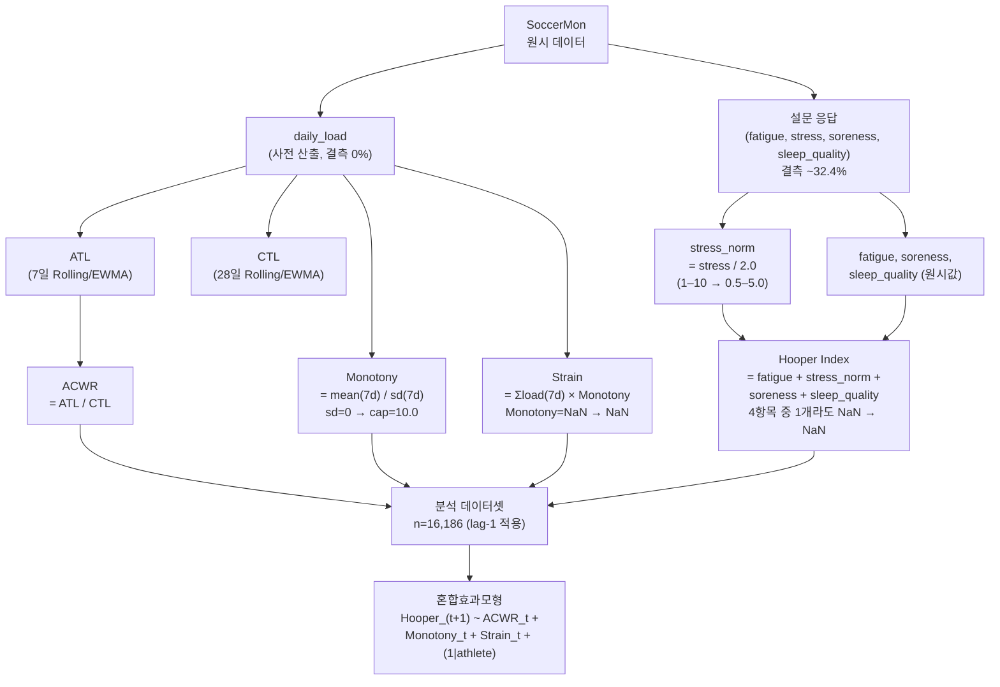

> **문서 ID**: TRK-B-METRICS · **버전**: v1.0 · **최종수정**: 2026-05-30 · **상위문서**: [RESEARCH_PROTOCOL.md](../../RESEARCH_PROTOCOL.md) · **담당영역**: Track B (부하+설문, SoccerMon)

# Track B 지표 명세서

본 문서는 Track B 분석에서 사용하는 모든 지표의 정의, 산출 함수, 결측 규칙, 주의사항을 기술한다.
수식 원문 및 파라미터 기본값은 [../METRICS_FORMULAS.md](../../../standards/METRICS_FORMULAS.md)를 교차참조하며, 본 문서에는 Track B 특이사항만 기술한다.

---

## 1. 지표 목록 요약

| 지표 | 약어 | 유형 | 산출 함수 | 수식 교차참조 |
|------|------|------|-----------|---------------|
| Session RPE | sRPE | 내적 부하 | `srpe()` | [§1 sRPE](../../../standards/METRICS_FORMULAS.md#1-srpe-session-rpe) |
| 피로도 | fatigue | 설문 구성 | — (원시값) | — |
| 스트레스 | stress | 설문 구성 | — (정규화 필요) | — |
| 근육통 | soreness / DOMS | 설문 구성 | — (원시값) | — |
| 수면 질 | sleep_quality | 설문 구성 | — (원시값) | — |
| Hooper Index | HI | 웰니스 종합 | `hooper_index()` | [§7 Hooper Index](../../../standards/METRICS_FORMULAS.md#7-hooper-index) |
| 일별 훈련 부하 | daily_load | 부하 원시값 | — (SoccerMon 제공) | [§1 sRPE](../../../standards/METRICS_FORMULAS.md#1-srpe-session-rpe) |
| 급성 훈련 부하 | ATL | 단기 부하 | 내부 산출 | [§2 ATL](../../../standards/METRICS_FORMULAS.md#2-atl-acute-training-load) |
| 만성 훈련 부하 | CTL | 장기 부하 | 내부 산출 | [§3 CTL](../../../standards/METRICS_FORMULAS.md#3-ctl-chronic-training-load) |
| 급성:만성 부하 비율 | ACWR | 부하 비율 | 내부 산출 | [§4 ACWR](../../../standards/METRICS_FORMULAS.md#4-acwr-acutechronic-workload-ratio) |
| 훈련 단조성 | Monotony | 부하 패턴 | `monotony()` | [§5 Monotony](../../../standards/METRICS_FORMULAS.md#5-monotony) |
| 훈련 부담 | Strain | 부하 복합 | `strain()` | [§6 Strain](../../../standards/METRICS_FORMULAS.md#6-strain) |

---

## 2. sRPE (Session RPE)

### 정의 요약

선수가 체감하는 훈련 강도(RPE)에 훈련 시간(분)을 곱한 내적 부하 지표.
수식 원문: [../METRICS_FORMULAS.md §1](../../../standards/METRICS_FORMULAS.md#1-srpe-session-rpe)

```
sRPE = RPE × Duration(min)
```

### 산출 함수

```python
# src/metrics/monotony_strain.py
def srpe(rpe: pd.Series, duration: pd.Series) -> pd.Series:
    return rpe * duration
```

pandas 곱셈 특성상, `rpe` 또는 `duration` 중 하나라도 `NaN`이면 결과도 자동으로 `NaN`이 된다.

### Track B 특이사항

SoccerMon 데이터셋에서는 `daily_load` 컬럼이 사전 산출된 형태로 제공되므로, `srpe()` 함수는 원시 RPE·duration 데이터로부터 직접 산출 시에만 사용한다.
SoccerMon의 `daily_load` 결측률은 **0%**로, 휴식일은 `daily_load = 0`으로 기록되어 있다(단순 NA가 아님).

---

## 3. Hooper Index 구성 4항목

### 3.1 항목 정의

| 항목 | 변수명 | 원본 스케일 | 설명 |
|------|--------|-------------|------|
| 피로도 | `fatigue` | 1–5 | 1=매우 낮음, 5=매우 높음 |
| 스트레스 | `stress` | 1–10 (SoccerMon) | 1–5 계열과 스케일 불일치 주의 |
| 근육통 | `soreness` | 1–5 | DOMS에 해당 |
| 수면 질 | `sleep_quality` | 1–5 | 높은 값 = 나쁜 수면 (역방향 주의) |

> **수면 스케일 방향 주의**: 원 Hooper & Mackinnon(1995) 정의에서 높은 sleep 점수는 나쁜 수면을 의미한다.
> 역코딩 여부를 사전에 명확히 정의하고 `config.json`에 기록해야 한다.

### 3.2 stress 정규화 — Track B 특이사항

SoccerMon의 `stress` 항목은 **1–10 척도**로 수집되어, 나머지 3개 항목(1–5)과 스케일이 다르다.
합산 전 다음 정규화를 적용한다.

```python
# stress_norm = stress / 2.0  →  범위: 0.5 ~ 5.0
df["stress_norm"] = df["stress"] / 2.0
```

이 선형 정규화는 단순하지만, 비선형 매핑이 더 적절할 수 있다는 점을 분석 한계 섹션에 명시한다
(단순 나누기 방식의 한계: `reports/track_B_model_comparison.md` §8.1 참조).

### 3.3 Hooper Index 합산 수식

```
Hooper Index = fatigue + stress_norm + soreness + sleep_quality
```

- SoccerMon 적용 범위: 대략 **4.5 ~ 17.5** (stress 정규화 후)
- 실측 기술통계: 평균 **10.70 ± 1.77** (n=16,592)

### 3.4 산출 함수

```python
# src/metrics/monotony_strain.py
def hooper_index(
    fatigue: pd.Series,
    stress: pd.Series,
    doms: pd.Series,
    sleep: pd.Series,
) -> pd.Series:
    df = pd.DataFrame({
        "fatigue": fatigue,
        "stress": stress,
        "doms": doms,
        "sleep": sleep,
    })
    return df.sum(axis=1, min_count=4)
```

`min_count=4` 파라미터로 인해 4개 항목 중 하나라도 `NaN`이면 합산 결과가 `NaN`으로 처리된다.
부분 합산은 허용하지 않는다.

---

## 4. Hooper Index 결측 규칙 — Track B 특이사항

### 4.1 결측 규모

SoccerMon 데이터에서 웰니스 설문 응답은 선수 자기보고 방식이므로 상당한 결측이 존재한다.

| 구성요소 | 유효 n | 결측률 |
|----------|:------:|:------:|
| fatigue | 16,618 | 32.4% |
| stress (원본) | 16,623 | 32.4% |
| soreness | 16,625 | 32.4% |
| sleep_quality | 16,620 | 32.4% |
| **Hooper Index (합산)** | **16,592** | **32.5%** |

> 웰니스 4개 항목은 **동일 시점에 동시 응답**하는 구조이므로, 결측 패턴이 4개 항목에 걸쳐 거의 일치한다.
> 따라서 각 항목의 결측률(32.4%)과 Hooper Index 합산 결측률(32.5%)은 사실상 동일하다.

### 4.2 결측 처리 규칙

```
규칙 1: 4개 항목(fatigue, stress, soreness, sleep_quality) 중 1개라도 NaN이면
         Hooper Index = NaN.  부분 합산 금지.

규칙 2: 결측을 0 또는 평균으로 대체하지 않는다. NaN 상태를 유지한다.

규칙 3: 혼합효과모형 분석 시, 결측 행은 listwise deletion으로 제외한다.
         (최종 분석 n = 16,186, lag-1 시차 적용 후)
```

### 4.3 결측 시각화

결측 패턴은 선수별·월별 히트맵으로 확인할 수 있다.

```
reports/figures/track_B_missing_heatmap.png
```

히트맵에서 결측이 특정 월이나 특정 선수에 집중되는 구조적 패턴이 있는지 반드시 확인해야 한다.

---

## 5. daily_load (일별 훈련 부하)

### 정의

SoccerMon이 사전 산출하여 제공하는 일별 내적 훈련 부하. sRPE에 해당하는 개념.

| 파라미터 | 실측값 |
|----------|--------|
| 평균 ± SD | 284.9 ± 323.3 AU |
| 범위 | 0 ~ 3,420 AU |
| 중위수 | 180 AU |
| 결측률 | 0% |

> 중위수(180 AU)와 평균(284.9 AU)의 괴리는 분포의 오른쪽 치우침을 시사한다.
> 분포 형태는 `reports/figures/track_B_load_distribution.png`에서 확인한다.

---

## 6. ATL / CTL

수식 원문: [../METRICS_FORMULAS.md §2-§3](../../../standards/METRICS_FORMULAS.md#2-atl-acute-training-load)

### Track B 적용 파라미터

| 지표 | 방식 | 윈도우 | α (EWMA) | warm-up |
|------|------|--------|-----------|---------|
| ATL | Rolling + EWMA | 7일 | 0.25 | 7일 |
| CTL | Rolling + EWMA | 28일 | 2/29 ≈ 0.069 | 28일 |

### Track B 특이사항

SoccerMon은 자체 산출된 `acwr` 컬럼을 제공하므로, 현 분석에서는 이를 그대로 활용한다.
향후 과제로 원시 `daily_load`에서 직접 Rolling/EWMA 방식을 재산출하여 SoccerMon 제공값과 비교하는 민감도 분석이 필요하다(`reports/track_B_model_comparison.md` §8.2 참조).

실측 ATL 기술통계: 평균 **281.7 ± 181.3** AU (n=24,596)

---

## 7. ACWR (Acute:Chronic Workload Ratio)

수식 원문: [../METRICS_FORMULAS.md §4](../../../standards/METRICS_FORMULAS.md#4-acwr-acutechronic-workload-ratio)

### Track B 실측 기술통계

| 파라미터 | 값 |
|----------|-----|
| 평균 ± SD | 0.98 ± 0.76 |
| 중위수 | 0.97 |
| 사분위 범위 | 0.64 – 1.19 |
| 최솟값 | 0.00 |
| 최댓값 | 4.00 |
| 결측률 | 0% |

### Track B 분석에서의 역할

혼합효과모형에서 ACWR은 핵심 독립변수로 사용된다.

```
Hooper_{t+1} ~ ACWR_t + (1|athlete)   # M2
Hooper_{t+1} ~ ACWR_t + Monotony_t + (1|athlete)   # M3
Hooper_{t+1} ~ ACWR_t + Monotony_t + Strain_t + (1|athlete)   # M4
```

**ACWR 계수 방향 주의**: M2~M4 모든 혼합효과모형에서 ACWR 계수가 **음의 방향**으로 추정되었다
(β = −0.078 ~ −0.090, p < 0.001). 이는 직관적 예상(ACWR↑ → 피로↑ → Hooper↑)과 반대 방향으로,
효과 크기가 매우 작고 역방향인 결과의 해석에 주의가 필요하다
(`reports/track_B_model_comparison.md` §5.4 참조).

---

## 8. Monotony

수식 원문: [../METRICS_FORMULAS.md §5](../../../standards/METRICS_FORMULAS.md#5-monotony)

### 산출 함수

```python
# src/metrics/monotony_strain.py
def monotony(loads: pd.Series, window: int = 7, cap: float = 10.0) -> pd.Series:
    min_valid = window - 1  # 최소 6개 유효값 필요
    roll_mean = loads.rolling(window=window, min_periods=min_valid).mean()
    roll_std  = loads.rolling(window=window, min_periods=min_valid).std(ddof=1)
    result = roll_mean / roll_std
    result = result.where(roll_std != 0, cap)   # sd=0 → cap=10.0
    ...
    return result
```

### Track B 실측 기술통계

| 파라미터 | 값 |
|----------|-----|
| 평균 ± SD | 1.05 ± 0.69 |
| 중위수 | 1.09 |
| 최댓값 | 8.75 |
| 결측률 | 0% |

### Track B 특이사항 — Monotony 임계값의 제한

Foster(1998)의 Monotony > 2.0 임계값에 의한 집단 비교 결과, SoccerMon 데이터에서는
통계적으로도 실질적으로도 유의한 차이가 관찰되지 않았다.

| 집단 | n | Hooper 평균 | SD |
|------|:---:|:-----------:|:---:|
| Monotony ≤ 2.0 | 14,798 | 10.70 | 1.77 |
| Monotony > 2.0 | 1,388 | 10.67 | 1.81 |

Welch t = 0.608, p = 0.543, Cohen's d = −0.017

이분법적 임계값 사용은 본 데이터에서 지지되지 않았으므로, 연속형 변수로 모형에 투입하는 것이
더 적절하다. 자세한 내용은 `reports/figures/track_B_monotony_threshold.png` 및
`reports/track_B_model_comparison.md` §5.5를 참조한다.

---

## 9. Strain

수식 원문: [../METRICS_FORMULAS.md §6](../../../standards/METRICS_FORMULAS.md#6-strain)

### 산출 함수

```python
# src/metrics/monotony_strain.py
def strain(loads: pd.Series, window: int = 7, cap: float = 10.0) -> pd.Series:
    min_valid = window - 1
    weekly_load = loads.rolling(window=window, min_periods=min_valid).sum()
    mono = monotony(loads, window=window, cap=cap)
    return weekly_load * mono
```

### Track B 실측 기술통계

| 파라미터 | 값 |
|----------|-----|
| 평균 ± SD | 2,787 ± 2,552 AU² |
| 중위수 | 2,401 AU² |
| 최댓값 | 34,475 AU² |
| 결측률 | 0% |

### Track B 특이사항 — Monotony·Strain 동시 투입 시 억제변수 효과

M4 모형(ACWR + Monotony + Strain)에서 Monotony 계수가 M3(−0.027, ns)과 달리
**+0.142(p = 0.002)로 부호 반전** 및 유의화되었다. 이는 억제변수(suppressor variable) 효과로
해석된다. Strain = 주간 총 부하 × Monotony라는 수학적 관계로 인해, Strain을 통제하면
Monotony의 순수 효과가 드러날 수 있다. 따라서 Monotony와 Strain을 동시에 투입할 때는
다중공선성 및 억제 효과를 반드시 점검해야 한다.

---

## 10. 지표 간 산출 흐름



---

## 11. 결측 규칙 종합

| 지표 | 결측 조건 | 처리 |
|------|----------|------|
| sRPE | RPE 또는 Duration 중 1개 NaN | NaN (0 대체 금지) |
| daily_load | 해당 없음 (SoccerMon 사전 산출) | 0 = 휴식일 |
| ATL | 연속 결측 3일 이상 (EWMA) | NaN |
| CTL | 연속 결측 7일 이상 (EWMA) | NaN |
| ACWR | CTL = 0 | NaN (division by zero 방지) |
| Monotony | 7일 윈도우 내 결측 2일 이상 | NaN |
| Monotony | sd = 0 | cap = 10.0 |
| Strain | Monotony = NaN | NaN |
| **Hooper Index** | **4항목 중 1개라도 NaN** | **NaN (부분 합산 금지)** |

> Track B에서 가장 중요한 결측 규칙은 Hooper Index의 **4항목 완전 유효 요건**이다.
> SoccerMon에서 약 **32.5%** 결측이 발생하며, 이는 분석 표본 크기와 통계적 검정력에 직접 영향을 준다.

---

## 12. 웰니스 스케일 정규화 주의사항

SoccerMon은 Hooper 원 정의(1–7 스케일)와 다른 **1–5 스케일** 및 **1–10 스케일**을 혼용한다.
다른 데이터셋과 비교하거나 외부 참고 기준을 적용할 때는 스케일 차이를 반드시 명시해야 한다.

| 항목 | SoccerMon 스케일 | 원 Hooper 스케일 | 정규화 방법 |
|------|:---------------:|:---------------:|------------|
| fatigue | 1–5 | 1–7 | 분석 내 그대로 사용 (외부 비교 시 주석) |
| stress | **1–10** | 1–7 | `/2.0` 으로 선형 정규화 → 0.5–5.0 |
| soreness | 1–5 | 1–7 | 분석 내 그대로 사용 |
| sleep_quality | 1–5 | 1–7 | 분석 내 그대로 사용 |

스케일 정규화 결정의 근거는 `docs/rnd/DECISIONS.md` ADR 항목에 기록되어 있다.

---

*참조 코드: `src/metrics/monotony_strain.py`*
*참조 보고서: `reports/track_B_model_comparison.md`*
*수식 원문: [../METRICS_FORMULAS.md](../../../standards/METRICS_FORMULAS.md)*
*데이터셋 근거: Midoglu et al. (2024). SoccerMon Dataset. Scientific Data. DOI: 10.5281/zenodo.10033832*
