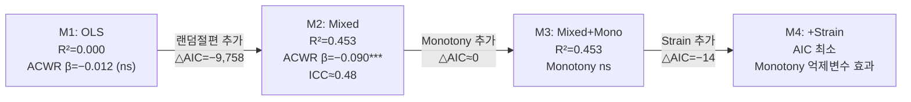

> **문서 ID**: TRK-B-STATS · **버전**: v2 · **최종수정**: 2026-05-30 · **상위문서**: [RESEARCH_PROTOCOL.md](../../RESEARCH_PROTOCOL.md)

# 트랙 B 통계 계획

> 목적: 부하 구조(ACWR, Monotony)가 다음날 웰니스(Hooper Index)를 설명하는지 검증

지표 수식 정의는 [METRICS_FORMULAS.md](../../../standards/METRICS_FORMULAS.md)를 교차참조한다.

---

## 핵심 모형

```
Hooper_{t+1} ~ ACWR_t + Monotony_t + (1|athlete)
```

수식 교차참조: [METRICS_FORMULAS.md §4 ACWR](../../../standards/METRICS_FORMULAS.md), [§5 Monotony](../../../standards/METRICS_FORMULAS.md), [§7 Hooper Index](../../../standards/METRICS_FORMULAS.md)

---

## 모형 비교 전략 (4개 모형)

| 모형 | 수식 | 목적 |
|------|------|------|
| M1: OLS 베이스라인 | hooper_next ~ acwr_rolling | 단순 회귀 기준선 |
| M2: Mixed (ACWR만) | hooper_next ~ acwr_rolling + (1\|athlete) | 개인 랜덤효과 추가 |
| M3: Mixed (ACWR + Monotony) | hooper_next ~ acwr_rolling + monotony + (1\|athlete) | Monotony 추가 효과 |
| M4: Mixed (ACWR + Monotony + Strain) | hooper_next ~ acwr_rolling + monotony + strain + (1\|athlete) | Strain 추가 및 억제변수 효과 탐색 |

---

## 실측 모형 비교 결과

> 데이터: SoccerMon 44명, 16,186 관측 (lag-1 시차 적용)
> 출처: [reports/track_B_model_comparison.md](../../../../reports/track_B_model_comparison.md)

| 지표 | M1: OLS | M2: Mixed (ACWR) | M3: Mixed (ACWR+Mono) | M4: Mixed (ACWR+Mono+Strain) |
|------|:-------:|:----------------:|:---------------------:|:----------------------------:|
| **AIC** | 64,508.9 | 54,750.9 | 54,751.1 | **54,736.7** |
| **BIC** | 64,524.3 | 54,773.9 | 54,781.9 | **54,775.1** |
| **MAE** | 1.348 | 0.986 | 0.986 | **0.985** |
| **RMSE** | 1.775 | 1.313 | 1.313 | **1.312** |
| **R²** | **0.000** | **0.453** | 0.453 | **0.454** |
| **Cohen's f²** | 0.000 | 0.828 | 0.828 | **0.830** |

### 주요 고정효과 계수

| 모형 | 변수 | 계수 | p-value | 해석 |
|------|------|:----:|:-------:|------|
| M1 OLS | ACWR | −0.012 | 0.593 | 집단 수준 비유의 (Simpson's Paradox) |
| M2 Mixed | ACWR | **−0.090** | **< 0.001** | 개인 통제 후 유의 |
| M3 Mixed | ACWR | **−0.089** | **< 0.001** | Monotony 추가 후 안정 유지 |
| M3 Mixed | Monotony | −0.027 | 0.191 | **비유의** |
| M4 Mixed | ACWR | **−0.078** | **< 0.001** | Strain 통제 후 효과 감소 |
| M4 Mixed | Monotony | **+0.142** | **0.002** | 억제변수 효과로 부호 반전·유의화 |
| M4 Mixed | Strain | **−0.00007** | **< 0.001** | Strain 독립 효과 유의 |

### 랜덤효과 및 ICC

| 모형 | 랜덤절편 분산 | 잔차 분산 | ICC |
|------|:------------:|:--------:|:---:|
| M2 | 1.578 | 1.728 | **≈ 0.478** |
| M3 | 1.580 | 1.728 | **≈ 0.478** |
| M4 | 1.573 | 1.728 | **≈ 0.476** |

> ICC ≈ 0.45~0.48: Hooper Index 전체 변동의 약 45~48%가 선수 간 차이에 기인 → 혼합효과모형 필수

---

## 모형 선택 근거 (Simpson's Paradox 효과)



핵심 해석:
- **OLS → 혼합효과**: AIC △= −9,758, R² 0→0.453. Simpson's Paradox 전형 사례 — 선수 간 기저 Hooper 이질성이 집단 분석에서 ACWR 효과를 마스킹
- **Monotony 단독 추가**: 제한적 효과 (M3 vs M2 거의 동일)
- **Strain 추가**: Monotony 억제변수(suppressor variable) 효과 발현 — Monotony 부호 반전(−0.027→+0.142)

---

## LOSO 교차검증 결과

> M3 (ACWR + Monotony) 기준, 44 fold

| 지표 | 값 |
|------|:---:|
| 평균 MAE | **1.448** (SD = 0.566) |
| 평균 RMSE | **1.764** (SD = 0.609) |
| MAE 범위 | 0.585 – 2.906 |
| RMSE 범위 | 0.756 – 3.444 |
| 성공 fold | 44 / 44 (100%) |

LOSO MAE(1.448)가 전체 데이터 MAE(0.986)보다 47% 높음 → 랜덤 절편(개인별 기저 Hooper)이 핵심 예측 요소이며, 새 선수 일반화의 한계를 반영.

코드 경로: `src/stats/mixed_effects.py`

---

## 평가 지표
- AIC, BIC — 모형 복잡도 대비 적합도
- MAE, RMSE — 예측 정확도
- Cohen's f² — 효과크기
- ICC — 선수 간 변동 비율
- 고정효과 계수 방향 및 p-value

## 기대 패턴 vs 실측 패턴

| 항목 | 초기 기대 | 실측 결과 |
|------|-----------|-----------|
| ACWR 계수 방향 | 양의 방향 (부하↑ → 웰니스 악화) | **음의 방향** (β≈−0.089); 효과 크기 매우 작음 |
| Monotony 계수 방향 | 양의 방향 | M3 비유의 (−0.027); M4에서 억제변수 효과로 +0.142 |
| Mixed > OLS | 예상 | 확인 (R² 0.000→0.453, AIC △=−9,758) |
| M3/M4 > M2 | 예상 | M3 개선 미미, M4 △AIC=−14 |

---

## 다중 시차 상관 (집단 수준)

| 시차 (일) | Pearson r | p-value |
|:---------:|:---------:|:-------:|
| 0 | +0.005 | 0.551 |
| 1 | −0.004 | 0.593 |
| 4 | +0.016 | *0.045* |
| 7 | **+0.027** | **< 0.001** |

최적 집단 수준 시차: **7일** (|r| = 0.027). 단, 모든 시차에서 |r| < 0.03으로 집단 수준 상관 매우 약함.

---

## 산출물
- `notebooks/track_B_stats.ipynb` (15셀, 합성 데모)
- `notebooks/track_B_real.ipynb` (44셀, SoccerMon 실제 데이터 실행 완료)
- `reports/track_B_model_comparison.md`
- `reports/figures/track_B_model_comparison.png`, `track_B_lag_profile.png`

---

## 변경 이력

| 버전 | 일자 | 변경 내용 |
|------|------|-----------|
| v1 | 2026-02-10 | 초기 작성 |
| v2 | 2026-05-30 | mermaid 모형비교 흐름도 추가, 실측 결과 반영 (OLS R²≈0→혼합 R²=0.453·ICC≈0.45~0.48·ACWR β≈−0.089·LOSO MAE=1.448·다중시차표), 기대 vs 실측 비교표 추가, 코드 경로 교차참조, 용어 통일, 메타블록 추가 |
