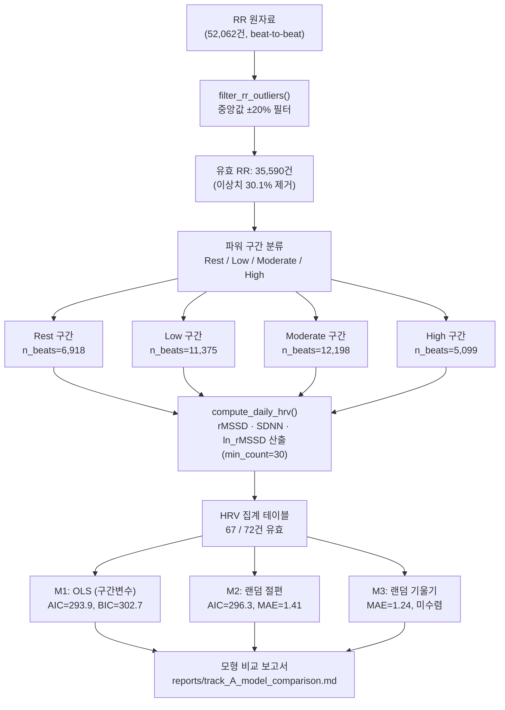

> **문서 ID**: TRK-A-PROTOCOL · **버전**: v1.0 · **최종수정**: 2026-05-30 · **상위문서**: [RESEARCH_PROTOCOL.md](../RESEARCH_PROTOCOL.md) · **담당영역**: Track A (HRV 중심, PhysioNet ACTES)

# Track A 연구 프로토콜 (HRV 중심)

---

## 1. 목적

운동 강도(파워, W)가 심박변이도(HRV; 주로 rMSSD)에 미치는 **용량-반응(dose-response) 관계**를 정량적으로 평가한다.
구체적인 연구 질문은 다음 세 가지이다.

1. 파워 구간(Rest → Low → Moderate → High)에 따라 rMSSD가 체계적으로 변화하는가?
2. 피험자별 랜덤효과를 포함하면 모형 적합도가 향상되는가?
3. 랜덤 기울기(피험자별 파워–HRV 민감도 차이)를 추가하면 추가 설명력이 있는가?

> **분석 범위 고지**: ACTES 데이터셋은 단일 세션 점증 부하 검사(graded exercise test) 구조이므로, 다중 일간 ACWR→HRV 시차 분석은 적용 불가하다. 대신 파워 구간별 HRV 용량-반응 관계를 분석하는 방식으로 설계를 조정하였다. 이러한 설계 조정의 근거는 `docs/DECISIONS.md` ADR에 기록되어 있다.

---

## 2. 데이터셋 개요

### 2.1 PhysioNet ACTES 개요

| 항목 | 내용 |
|------|------|
| **정식 명칭** | Autonomic Control of the cardiovascular system during Exercise and recovery in response to Training and Exercising in Standardized conditions |
| **출처** | https://physionet.org/content/actes/1.0.0/ |
| **인용** | Muniz-Pardos et al. (2023). PhysioNet ACTES Cycloergometer Exercise Dataset. Open Data Commons Attribution License v1.0 |
| **피험자 수** | n=18 (펜싱 10명, 카약 6명, 철인3종 2명) |
| **총 RR 기록** | 52,062건 |
| **측정 유형** | 자전거 에르고미터 점증 부하 검사(CPET) — 단일 세션 |
| **핵심 변수** | beat-to-beat RR 간격(ms), 파워(W), VO2(mL/min/kg), 환기역치(P_vt1, P_vt2) |
| **라이선스** | PhysioNet Credentialed Health Data License 1.5.0 |

### 2.2 피험자 특성

- 연령: 12~18세 (청소년 경기 선수 구성)
- 종목별 구성: 이질적(펜싱 55.6%, 카약 33.3%, 철인3종 11.1%)
- 훈련 수준: 경쟁적 선수(competitive athletes) 집단
- 개인별 환기역치(P_vt1, P_vt2) 보고값 사용 (검사 내 재현성은 확인 불가)

### 2.3 세션 구조

점증 부하 프로토콜: 안정 상태(Rest, 0W) → 단계적 파워 증가 → 탈진까지 지속.
각 단계에서 beat-to-beat RR 간격과 파워(W)가 동시 기록된다.

---

## 3. 분석 설계

### 3.1 파워 구간 정의

개인별 환기역치(P_vt1, P_vt2)를 기준으로 RR 관측을 네 구간으로 분류한다.

| 구간 | 정의 | 생리학적 의미 |
|------|------|--------------|
| **Rest** | power = 0 W | 안정 상태 |
| **Low** | 0 < power ≤ P_vt1 | 유산소 기초 강도 |
| **Moderate** | P_vt1 < power ≤ P_vt2 | 무산소 역치 전 구간 |
| **High** | power > P_vt2 | 고강도 무산소 구간 |

### 3.2 유효 관측 기준

| 기준 | 값 | 근거 |
|------|-----|------|
| 최소 유효 NN 간격 수 | **150개** | `src/metrics/hrv_features.py` `min_count` 파라미터 |
| 구간별 최소 beat 수 | **30개** (min_count=30으로 완화) | 구간 집계 시 적용 |
| 총 유효 HRV 산출 건수 | **67 / 72** (피험자 × 구간) | 5건 NA 처리 |

### 3.3 결과변수 정의

| 지표 | 정의 | 산출 함수 |
|------|------|-----------|
| **rMSSD** | Root Mean Square of Successive Differences (ms) | `src/metrics/hrv_features.py::rmssd()` |
| **SDNN** | Standard Deviation of NN intervals (ms) | `src/metrics/hrv_features.py::sdnn()` |
| **ln_rMSSD** | 자연 로그 변환 rMSSD — 분포 정규화 목적 | `src/metrics/hrv_features.py::ln_rmssd()` |

주 결과변수는 **rMSSD** 및 **ln_rMSSD**이다. 수식 원문은 [../METRICS_FORMULAS.md #8 HRV 지표](../METRICS_FORMULAS.md#8-hrv-지표-rmssd-sdnn) 참조.

---

## 4. 품질 기준 및 전처리

### 4.1 RR 이상치 필터링

**기준**: 피험자별 RR 중앙값 ± 20% 범위를 벗어나는 값을 NaN으로 대체.

```python
# src/data/preprocess.py::filter_rr_outliers()
def filter_rr_outliers(rr_series, threshold=0.20):
    median_rr = rr_series.median()
    lower_bound = median_rr * (1.0 - threshold)
    upper_bound = median_rr * (1.0 + threshold)
    filtered = rr_series.copy()
    filtered[(filtered < lower_bound) | (filtered > upper_bound)] = np.nan
    return filtered
```

| 항목 | 수치 |
|------|------|
| 필터링 전 유효 RR | 50,914건 |
| 필터링 후 유효 RR | **35,590건** |
| 제거된 이상치 | 15,324건 (**30.1%**) |

> 이상치 비율(30.1%)이 높게 나타난 원인: 점증 부하 검사 중 고강도 구간에서 심박수 급증·호흡 아티팩트에 의한 비정상(non-NN) 간격이 다수 포함된 것으로 해석된다. 운동 중 HRV 측정의 비정상성(non-stationarity)에 따른 구조적 한계이다.

근거: Malik et al. (1996); `src/data/preprocess.py::filter_rr_outliers()`

### 4.2 HRV 산출 파이프라인

```python
# src/data/preprocess.py::compute_daily_hrv()
def compute_daily_hrv(df, subject_col='subject_id', rr_col='rr_interval_ms', min_nn=150):
    # 피험자·세션별로 rmssd(), sdnn(), ln_rmssd() 적용
    ...
```

### 4.3 재현성 확보

| 항목 | 설정 |
|------|------|
| 난수 시드 | `numpy.random.seed(42)` |
| 환경 | Python 3, statsmodels mixedlm |
| 처리 데이터 경로 | `data/processed/track_A_hrv_by_zone.csv` (72행, 10열) |
| 실행 노트북 | `notebooks/track_A_real.ipynb` (37셀, 실행 완료) |

---

## 5. 데이터 흐름 다이어그램



---

## 6. 통계 모형 구조

기본 모형 공식:

```
rMSSD ~ power_mean + (1 + power_mean | subject)   # M3 (랜덤 기울기)
rMSSD ~ power_mean + (1 | subject)                # M2 (랜덤 절편, 채택)
rMSSD ~ C(power_zone, Treatment(reference='Rest')) # M1 (OLS 베이스라인)
```

30초 윈도우 확장 분석:

```
ln_rMSSD ~ power_mean + (1 | subject)   # 486개 윈도우
```

상세 모형 비교 결과는 [STATS_PLAN.md](./STATS_PLAN.md) 및 `reports/track_A_model_comparison.md` 참조.

---

## 7. 윤리 및 라이선스

- ACTES 데이터셋 접근: PhysioNet 계정 등록 + 데이터 이용 동의서 서명 필요
- 본 저장소에는 원본 데이터를 포함하지 않음 (`data/raw/` — git 미포함)
- 재배포 시 Open Data Commons Attribution License v1.0 조건 준수 필요

---

## 참고문헌

- Muniz-Pardos, B., et al. (2023). ACTES Cycloergometer Exercise Dataset. *PhysioNet*.
- Buchheit, M. (2014). Monitoring training status with HR measures. *IJSPP*, 9(5), 883-895.
- Plews, D. J., et al. (2013). Training adaptation and HRV in elite endurance athletes. *IJSPP*, 8(6), 688-694.
- Task Force of the European Society of Cardiology. (1996). HRV Standards. *Circulation*, 93(5), 1043-1065.
- Malik, M., et al. (1996). Heart rate variability. *European Heart Journal*, 17, 354-381.
