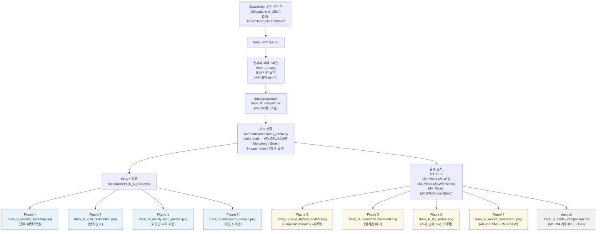

> **문서 ID**: TRK-B-OUTPUTS · **버전**: v1.0 · **최종수정**: 2026-05-30 · **상위문서**: [RESEARCH_PROTOCOL.md](../RESEARCH_PROTOCOL.md) · **담당영역**: Track B (부하+설문, SoccerMon)

# Track B 기대 산출물 명세서

본 문서는 Track B 분석 파이프라인이 생성하는 모든 산출물(figures, tables, reports)의 목록,
내용 설명, 재현 방법, 품질 기준을 정의한다.
실측치는 `reports/track_B_model_comparison.md`에서 직접 확인한 값을 인용한다.

---

## 1. 산출물 개요

Track B 분석은 `notebooks/track_B_real.ipynb`를 통해 재현되며, 다음 유형의 산출물을 생성한다.

| 유형 | 수량 | 저장 경로 |
|------|:----:|-----------|
| 시각화 (PNG) | 8종 | `reports/figures/` |
| 모형 비교 보고서 | 1종 | `reports/` |
| 처리 데이터 | 1종 | `data/processed/` |

---

## 2. 시각화 산출물 (Figures)

### 2.1 전체 목록

| 순번 | 파일명 | 파일 크기 | 내용 요약 |
|:----:|--------|:---------:|-----------|
| 1 | `track_B_weekly_load_pattern.png` | 28.0 KB | 요일별 평균 훈련 부하 분포 |
| 2 | `track_B_acwr_hooper_scatter.png` | 221.9 KB | ACWR(t) vs Hooper Index(t+1) 산점도 |
| 3 | `track_B_monotony_threshold.png` | 33.5 KB | Monotony 2.0 임계값 기준 Hooper 비교 |
| 4 | `track_B_missing_heatmap.png` | 126.0 KB | 선수별·월별 결측 패턴 히트맵 |
| 5 | `track_B_load_distribution.png` | 137.5 KB | 부하·웰니스 변수 분포 (히스토그램) |
| 6 | `track_B_timeseries_sample.png` | 608.1 KB | 샘플 선수 시계열 (부하 + Hooper + ACWR) |
| 7 | `track_B_model_comparison.png` | 98.8 KB | M1~M4 모형 지표 비교 막대 그래프 |
| 8 | `track_B_lag_profile.png` | 41.2 KB | 시차별(0~7일) ACWR–Hooper 상관 프로파일 |

저장 경로: `reports/figures/`

---

### 2.2 개별 시각화 상세 설명

#### Figure 1: `track_B_weekly_load_pattern.png`

**목적**: 주간 내 요일별 훈련 부하 분포 패턴을 파악한다.

**내용**:
- X축: 요일(월~일)
- Y축: 평균 daily_load (AU)
- 경기일(주말)과 훈련일(주중)의 부하 차이를 시각화
- SoccerMon n=44명 선수, 총 24,596 관측 기반

**해석 포인트**:
- 경기일 전후 부하 변화 패턴이 관찰되는지 확인
- 팀A와 팀B 간 주간 패턴 차이 여부 탐색

---

#### Figure 2: `track_B_acwr_hooper_scatter.png`

**목적**: ACWR(t)와 다음날 Hooper Index(t+1)의 집단 수준 관계를 시각화한다.

**내용**:
- X축: ACWR(t), Y축: Hooper Index(t+1)
- 221.9 KB의 큰 파일 크기 — 개별 데이터 포인트 또는 선수별 색상 구분 포함
- n=16,186 (lag-1 시차 적용, 이상치 제거 후)

**해석 포인트**:
- OLS 기준선: ACWR 계수 −0.012, p = 0.593 (비유의) — 집단 수준에서 선형 관계가 약함
- 혼합효과 기준: ACWR 계수 −0.090, p < 0.001 — 개인 내 변동 통제 후 유의한 음의 관계
- Simpson's Paradox 구조: 집단 회귀선과 개인 내 회귀선의 방향 차이 시각적 확인 가능

---

#### Figure 3: `track_B_monotony_threshold.png`

**목적**: Foster(1998)의 Monotony > 2.0 임계값에 의한 집단 비교를 시각화한다.

**내용**:
- Monotony ≤ 2.0 vs Monotony > 2.0 집단의 Hooper Index 분포 비교
- 박스플롯 또는 바이올린 플롯 형태

**실측 비교 결과**:

| 집단 | n | Hooper 평균 | SD |
|------|:---:|:-----------:|:---:|
| Monotony ≤ 2.0 | 14,798 | 10.70 | 1.77 |
| Monotony > 2.0 | 1,388 | 10.67 | 1.81 |

Welch t = 0.608, p = 0.543, Cohen's d = −0.017 — 통계적으로 유의하지 않음.

**해석 포인트**: 이분법적 임계값의 유용성이 본 데이터에서 지지되지 않음. 연속형 변수 투입이 권장됨.

---

#### Figure 4: `track_B_missing_heatmap.png`

**목적**: 선수별·월별 웰니스 설문 결측 패턴의 구조적 특성을 파악한다.

**내용**:
- X축: 월(2020-01 ~ 2021-12), Y축: 선수 ID (44명)
- 셀 색상: 결측 비율 또는 유효 응답 여부
- 전체 결측률 약 **32.5%** (16,592 / 24,596 유효)

**해석 포인트**:
- 결측이 특정 월에 집중되는지 (시즌 중단, 부상 기간 등) 확인
- 결측이 특정 선수에 집중되는지 (비순응 선수) 확인
- 무작위 결측(MCAR) vs 체계적 결측(MAR/MNAR) 구분을 위한 시각적 단서

---

#### Figure 5: `track_B_load_distribution.png`

**목적**: 주요 부하 및 웰니스 변수의 분포 형태를 파악한다.

**내용**:
- 히스토그램 형태, 6개 이상 변수 서브플롯 구성
- daily_load (평균 284.9, SD 323.3, 우측 치우침), ACWR (평균 0.98, SD 0.76),
  ATL (평균 281.7, SD 181.3), Monotony (평균 1.05, SD 0.69),
  Strain (평균 2,787, SD 2,552), Hooper Index (평균 10.70, SD 1.77) 포함

**해석 포인트**:
- daily_load의 이중 피크(0 = 휴식일) 구조 확인
- ACWR의 고위험 구간(> 1.50) 빈도 확인
- Hooper Index의 정규성 확인 (혼합효과모형 가정 검토)

---

#### Figure 6: `track_B_timeseries_sample.png`

**목적**: 개별 선수 수준에서 부하와 웰니스의 시계열 공변동을 시각화한다.

**내용**:
- 608.1 KB — 가장 용량이 큰 시각화, 다수 선수 또는 고해상도 시계열 포함
- 샘플 선수(TeamA / TeamB 각 1~2명)의 시계열 표시:
  - daily_load (막대 또는 선)
  - ACWR (선, 위험 구간 색상 표시)
  - Hooper Index (선)
- 날짜 범위: 2020-01-09 ~ 2021-12-31

**해석 포인트**:
- ACWR 급등 구간과 Hooper 변화의 시각적 시차 관계 탐색
- 개인 내 Hooper 기저 수준(랜덤 절편)의 개인 간 차이 확인
- 결측 구간(웰니스 미응답)의 시계열 상 위치 확인

---

#### Figure 7: `track_B_model_comparison.png`

**목적**: M1~M4 모형의 적합도 지표를 한눈에 비교한다.

**내용**:
- 6개 지표(AIC, BIC, MAE, RMSE, R², Cohen's f²)를 모형별로 비교하는 막대 그래프
- 실측 수치 (reports/track_B_model_comparison.md §4 기준):

| 지표 | M1 (OLS) | M2 (Mixed) | M3 (Mixed+Mono) | M4 (Mixed+Mono+Strain) |
|------|:--------:|:----------:|:---------------:|:----------------------:|
| AIC | 64,508.9 | 54,750.9 | 54,751.1 | **54,736.7** |
| BIC | 64,524.3 | 54,773.9 | 54,781.9 | **54,775.1** |
| MAE | 1.348 | 0.986 | 0.986 | **0.985** |
| RMSE | 1.775 | 1.313 | 1.313 | **1.312** |
| R² | 0.000 | 0.453 | 0.453 | **0.454** |
| Cohen's f² | 0.000 | 0.828 | 0.828 | **0.830** |

**해석 포인트**:
- M1→M2 전환: AIC Δ = −9,758, R² 0→0.453 — 랜덤 절편의 극적 효과
- M2→M3: 개선 미미 (Monotony 단독 추가 효과 제한적)
- M3→M4: AIC Δ = −14 — Strain 추가의 의미 있는 (소폭) 개선

---

#### Figure 8: `track_B_lag_profile.png`

**목적**: ACWR(t)과 Hooper(t+k) 간 상관의 시차 의존성을 시각화한다.

**내용**:
- X축: 시차 k = 0, 1, 2, ..., 7일
- Y축: Pearson r
- 95% 신뢰구간 또는 유의수준(p = 0.05) 기준선 표시

**실측 시차별 상관 (n=15,687~16,299)**:

| 시차 | Pearson r | p-value |
|:----:|:---------:|:-------:|
| 0 | +0.005 | 0.551 |
| 1 | −0.004 | 0.593 |
| 2 | +0.008 | 0.293 |
| 3 | +0.014 | 0.071 |
| 4 | +0.016 | 0.045 |
| 5 | +0.020 | 0.012 |
| 6 | +0.024 | 0.003 |
| **7** | **+0.027** | **< 0.001** |

**해석 포인트**:
- 최적 시차 = **7일** (|r| = 0.027) — 1주 뒤 Hooper와의 상관이 가장 강함
- 모든 시차에서 |r| < 0.03 — 집단 수준 상관은 매우 약함
- 상관 계수 절대값의 작음은 개인 간 이질성(ICC ≈ 0.48)이 집단 수준 신호를 압도함을 시사

---

## 3. 표 및 보고서 산출물

### 3.1 모형 비교 보고서

| 파일 | 경로 | 내용 |
|------|------|------|
| `track_B_model_comparison.md` | `reports/` | M1~M4 전체 분석 결과, 고정효과 계수, 랜덤효과, LOSO 교차검증, 한계 및 향후 과제 |

**보고서 주요 발견 (실측치)**:

- **Simpson's Paradox**: OLS에서 ACWR β = −0.012 (p = 0.593, 비유의) → 혼합효과 전환 후 β = −0.090 (p < 0.001, 고도 유의). 선수 간 기저 Hooper 이질성이 집단 수준 분석에서 ACWR 효과를 마스킹하고 있었음.
- **ICC ≈ 0.48**: Hooper Index 전체 변동의 약 48%가 선수 간 차이에 기인. 랜덤 절편 분산 1.578 vs 잔차 분산 1.728.
- **Monotony 억제변수 효과**: M3에서 −0.027 (ns) → M4에서 +0.142 (p = 0.002) 부호 반전. Strain을 통제하면 Monotony의 순수 효과 방향이 반전됨.
- **LOSO 교차검증**: M3 기준 평균 MAE = 1.448 (SD = 0.566), 전체 데이터 MAE 0.986 대비 47% 증가. 새 선수 예측의 한계를 반영함.

### 3.2 처리 데이터

| 파일 | 경로 | 내용 |
|------|------|------|
| `track_B_merged.csv` | `data/processed/` | 24,596행, 14열, 44명 선수, 2020-01-09 ~ 2021-12-31 |

**데이터 전처리 요약**:

| 단계 | 결과 |
|------|------|
| 원본 로딩 (Wide → Long) | 36,550행, 11열 |
| 활성 시즌 필터 | 25,529행 |
| 선수 필터 (부하 ≥ 60일 & 웰니스 ≥ 60일) | 50명 → **44명** |
| 최종 데이터셋 | **24,596행**, 14열 |

---

## 4. 산출물 생성 흐름



---

## 5. 재현 방법

### 5.1 전체 파이프라인 실행

```bash
# 가상환경 활성화 (Windows)
cd soccer_rnd
venv\Scripts\activate.bat

# 전체 Track B 파이프라인 실행
python notebooks/run_track_B.py
```

`run_track_B.py` 실행 시 생성되는 산출물:

- `reports/figures/track_B_*.png` (8개)
- `reports/track_B_model_comparison.md`
- `data/processed/track_B_merged.csv`

### 5.2 노트북 직접 실행

```bash
jupyter nbconvert --to notebook --execute notebooks/track_B_real.ipynb \
  --output notebooks/track_B_real_executed.ipynb
```

노트북은 44셀, numpy seed=42로 재현 가능하다.

### 5.3 재현성 조건

| 항목 | 값 |
|------|-----|
| Python 버전 | 3.x |
| numpy seed | 42 |
| statsmodels | mixedlm (REML) |
| sklearn | 교차검증 (LOSO) |
| 데이터 DOI | 10.5281/zenodo.10033832 |

---

## 6. 산출물 품질 기준

| 기준 | 내용 |
|------|------|
| 재현성 | 동일 seed(42), 동일 데이터로 동일 수치 보장 |
| 추적성 | 모든 figure·표는 노트북 셀 번호로 역추적 가능 |
| 한글 폰트 | 모든 PNG에서 한글 깨짐 없이 렌더링 (UTF-8 보장) |
| reviewer-safe 톤 | 보고서 전반에 "시사한다/관찰된다" 표현 사용, 인과 단정 금지 |
| 수치 일관성 | METRICS.md, STATS_PLAN.md, reports/의 수치가 서로 일치 |

---

## 7. 참조 문서

| 문서 | 경로 | 역할 |
|------|------|------|
| 지표 명세서 | `docs/track_B/METRICS.md` | 지표 정의·함수·결측 규칙 |
| 통계 계획 | `docs/track_B/STATS_PLAN.md` | M1~M4 모형 설계·평가 기준 |
| 데이터셋 명세 | `docs/track_B/DATASETS.md` | SoccerMon 취득·전처리 절차 |
| 모형 비교 보고서 | `reports/track_B_model_comparison.md` | 실제 분석 결과 및 수치 |
| 수식 원문 | `docs/METRICS_FORMULAS.md` | sRPE~Hooper Index 모든 공식 |

---

*재현 노트북: `notebooks/track_B_real.ipynb` (44셀, statsmodels mixedlm, seed=42)*
*데이터 출처: Midoglu et al. (2024). SoccerMon Dataset. Scientific Data. DOI: 10.5281/zenodo.10033832*
*처리 데이터: `data/processed/track_B_merged.csv` (24,596행, 44선수)*
*지표 모듈: `src/metrics/monotony_strain.py`, `src/metrics/acwr.py`*
