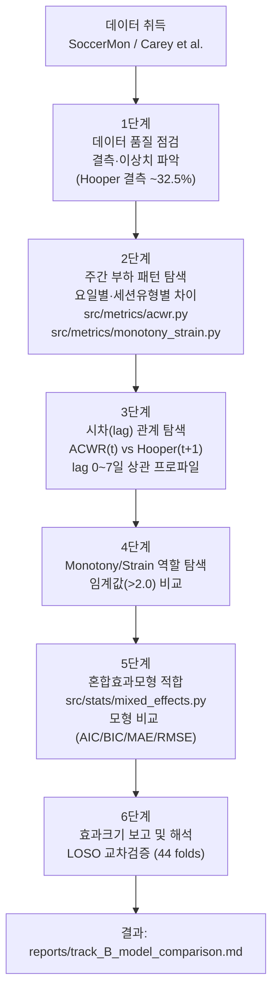

> **문서 ID**: TRK-B-PROTOCOL · **버전**: v2 · **최종수정**: 2026-05-30 · **상위문서**: [RESEARCH_PROTOCOL.md](../RESEARCH_PROTOCOL.md)

# 트랙 B 프로토콜 (부하 + 설문)

## 목적
부하 구조(ACWR, Monotony, Strain)가 선수 웰니스(Hooper Index)에 미치는 시차 효과를 정량적으로 설명한다.

지표 수식 정의는 [METRICS_FORMULAS.md](../METRICS_FORMULAS.md)를 교차참조한다.

---

## 데이터셋
- **실제 채택**: SoccerMon (Midoglu et al., 2024; DOI: 10.5281/zenodo.10033832) — 프로 축구 44명, 24,596 athlete-days
- **1순위 후보**: Carey et al. (Zenodo, CC BY 4.0) — AFL 프로 선수 ~45명, 1시즌
- 컬럼 매핑: fatigue→fatigue, sleep quality→sleep, muscle soreness→DOMS, stress→stress
- stress 정규화: SoccerMon stress(1–10) → stress/2.0으로 1–5 척도 통일
- mood 항목은 Hooper Index 산출에서 제외 (별도 보조 분석 가능)

### 실측 표본 수치 (SoccerMon 기준)

| 단계 | 관측 수 | 비고 |
|------|---------|------|
| 원본 (Wide→Long) | 36,550행 | `src/data/preprocess.py` |
| 활성 시즌 필터 | 25,529행 | |
| 선수 필터 후 | 24,596행, 44명 | 부하·웰니스 ≥60일 |
| lag-1 시차 + 이상치 제거 | **16,186 관측** | 모형 입력 데이터 |
| Hooper Index 결측률 | **~32.5%** | 웰니스 자기보고 특성 |

---

## 핵심 지표
- **독립변수**: sRPE, ACWR (rolling/EWMA), Monotony, Strain
  - 수식: [METRICS_FORMULAS.md §1 sRPE](../METRICS_FORMULAS.md), [§4 ACWR](../METRICS_FORMULAS.md), [§5 Monotony](../METRICS_FORMULAS.md), [§6 Strain](../METRICS_FORMULAS.md)
- **종속변수**: Hooper Index (다음날, t+1)
  - 수식: [METRICS_FORMULAS.md §7 Hooper Index](../METRICS_FORMULAS.md)
- **통제**: 개인 랜덤효과 (1|athlete)

---

## 분석 흐름

---

## 결과변수 정의
- Hooper Index = fatigue + stress_norm + soreness + sleep_quality (스케일 통일 후; SoccerMon 기준 총점 범위 4.5–17.5)
- 높은 값 = 나쁜 웰니스 상태
- 실측 Hooper Index: M=10.70, SD=1.77 (16,592 유효 관측)

---

## 주요 실측 결과 요약

| 비교 | 결과 |
|------|------|
| OLS R² (M1) | ≈ 0.000 (ACWR 집단 수준 설명력 없음) |
| 혼합효과 R² (M2~M4) | **≈ 0.453** (선수 간 이질성 포착) |
| ICC (Hooper) | **≈ 0.45~0.48** (전체 변동의 45~48%가 선수 간 차이) |
| ACWR 계수 (M3) | **β ≈ −0.089** (p < 0.001, 혼합효과모형) |
| Monotony 계수 (M3) | −0.027 (p = 0.191, 비유의) |
| LOSO MAE | 1.448 (SD=0.566; 선수 범위 0.585~2.906) |
| Monotony >2.0 임계값 효과 | p = 0.543, Cohen's d = −0.017 (미지지) |

출처: [reports/track_B_model_comparison.md](../../reports/track_B_model_comparison.md)

---

## 품질 기준
- 재현성: `np.random.seed(42)`, 파라미터 문서화 (`config.json`)
- reviewer-safe 톤: "시사한다/관찰된다/일관된 경향"
- ACWR 단독 사용 한계 명시 (Impellizzeri et al., 2020)
- 결측 처리: NA 유지 원칙, 처리 규칙은 `docs/DECISIONS.md` ADR로 기록

---

## 관련 코드 경로
- `src/data/preprocess.py` — 데이터 로딩·필터링·Wide→Long 변환
- `src/metrics/acwr.py` — ATL/CTL/ACWR (Rolling/EWMA)
- `src/metrics/monotony_strain.py` — Monotony, Strain
- `src/stats/mixed_effects.py` — 혼합효과모형 (statsmodels mixedlm)
- `notebooks/track_B_real.ipynb` — 재현 노트북 (44셀, SoccerMon 실행 완료)
- `data/processed/track_B_merged.csv` — 전처리 완료 데이터 (24,596행)

---

## 변경 이력

| 버전 | 일자 | 변경 내용 |
|------|------|-----------|
| v1 | 2026-02-10 | 초기 작성 |
| v2 | 2026-05-30 | mermaid 분석흐름도 추가, 실측 수치 반영 (44명·결측 32.5%·OLS R²≈0→혼합 R²=0.453·ICC≈0.45~0.48·ACWR β≈−0.089), 코드 경로 교차참조, 용어 통일, 메타블록 추가 |
