# 축구팀 훈련·컨디션 관리 시스템 — 데이터명세서 v3.0

> 이 문서는 **기획자, 디자이너, 개발자, QA, 데이터 분석가** 모두가 읽을 수 있도록 작성되었습니다.
> 기술 용어에는 항상 쉬운 설명을 병기합니다.

---

## 문서 정보

| 항목 | 내용 |
|------|------|
| 버전 | 3.0 |
| 작성일 | 2026-02-11 |
| 원본 기술 문서 | [DRD_v3.0.md](DRD_v3.0.md) |
| 대상 시스템 | soccer (서비스 앱) + soccer_rnd (데이터 분석) |
| 데이터베이스 | PostgreSQL 15+ / Supabase |

---

## 목차

1. [한눈에 보는 전체 구조](#1-한눈에-보는-전체-구조)
2. [데이터가 흘러가는 길](#2-데이터가-흘러가는-길)
3. [테이블 사전 — 기본 정보](#3-테이블-사전--기본-정보)
4. [테이블 사전 — 훈련과 컨디션](#4-테이블-사전--훈련과-컨디션)
5. [테이블 사전 — 심박 측정(HRV)](#5-테이블-사전--심박-측정hrv)
6. [테이블 사전 — 부하 지표](#6-테이블-사전--부하-지표)
7. [분석용 데이터 뷰](#7-분석용-데이터-뷰)
8. [선택지 목록 (코드값)](#8-선택지-목록-코드값)
9. [누가 어떤 데이터를 볼 수 있나 (접근 권한)](#9-누가-어떤-데이터를-볼-수-있나)
10. [데이터 삭제 시 연쇄 영향](#10-데이터-삭제-시-연쇄-영향)
11. [핵심 용어 사전](#11-핵심-용어-사전)
12. [자주 묻는 질문 (FAQ)](#12-자주-묻는-질문)

---

## 1. 한눈에 보는 전체 구조

### 1.1 우리 시스템에는 어떤 데이터가 있나요?

이 시스템은 축구팀의 **훈련**, **컨디션(몸 상태)**, **심박 데이터**를 체계적으로 기록하고, 이를 분석하여 **부상 위험을 예측**하는 것이 목표입니다.

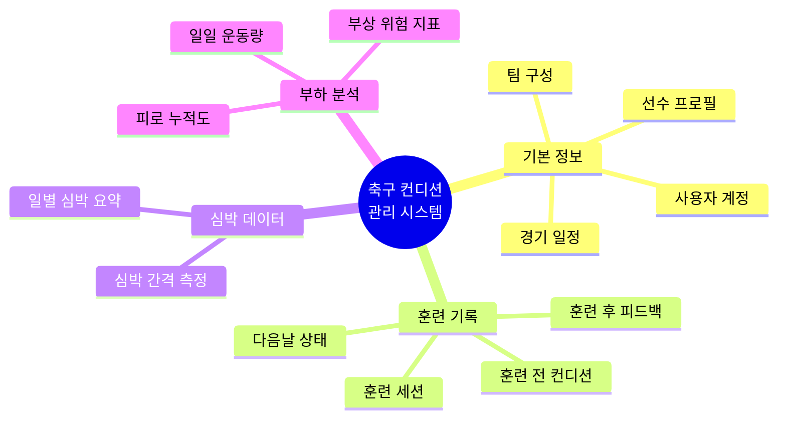

### 1.2 테이블 전체 관계도

> 아래 그림에서 **네모 상자**가 하나의 테이블(데이터 저장소)이고, **선**이 테이블 간의 연결을 나타냅니다.

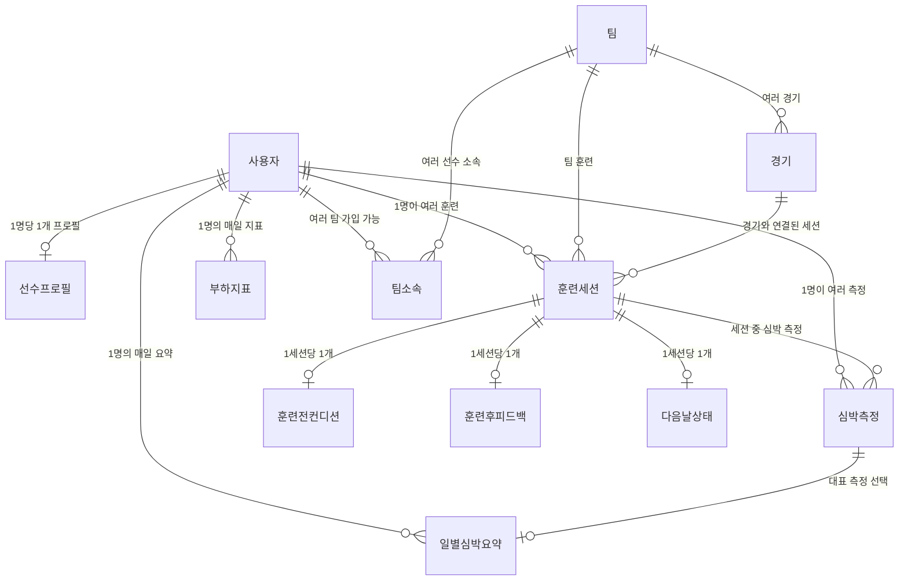

---

## 2. 데이터가 흘러가는 길

### 2.1 입력부터 분석까지

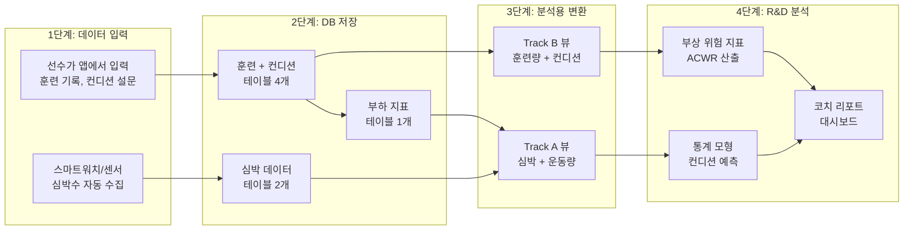

### 2.2 선수 하루의 데이터 흐름

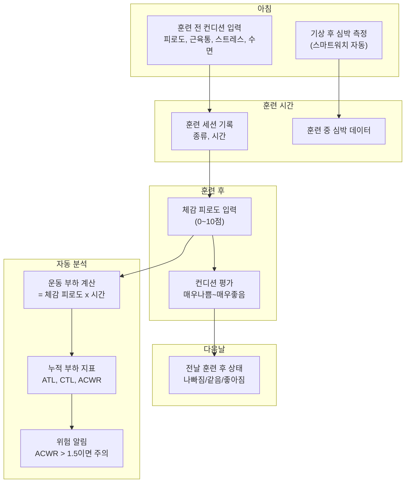

---

## 3. 테이블 사전 — 기본 정보

### 3.1 사용자 (users)

> 앱에 가입한 모든 사람 — 선수, 코치, 매니저 포함

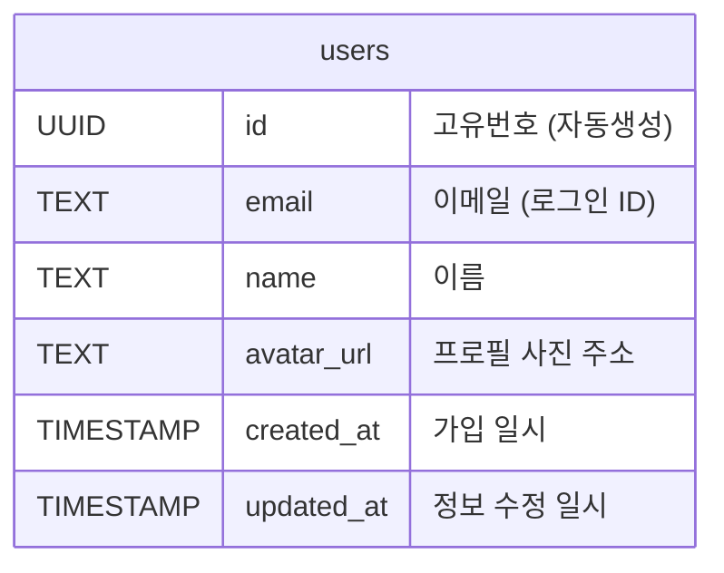

| 컬럼명 | 한글명 | 설명 | 예시 |
|--------|--------|------|------|
| id | 고유번호 | 시스템이 자동으로 부여하는 고유 식별자 | `a1b2c3d4-...` |
| email | 이메일 | 로그인에 사용하는 이메일 주소 (중복 불가) | `kim@soccer.com` |
| name | 이름 | 표시 이름 | `김민수` |
| avatar_url | 프로필 사진 | 프로필 이미지 파일 경로 | `https://...jpg` |
| created_at | 가입일시 | 계정이 만들어진 시각 | `2026-01-15 09:30:00` |
| updated_at | 수정일시 | 마지막으로 정보가 바뀐 시각 | `2026-02-01 14:20:00` |

---

### 3.2 선수 프로필 (user_profiles)

> 선수의 추가 정보 — 포지션, 연락처 등

| 컬럼명 | 한글명 | 설명 | 예시 |
|--------|--------|------|------|
| id | 고유번호 | 자동 생성 | — |
| user_id | 사용자 번호 | 어떤 사용자의 프로필인지 (1명당 1개) | — |
| phone | 전화번호 | 연락처 | `010-1234-5678` |
| position | 포지션 | 축구 포지션 (14종 중 선택) | `CB` (센터백) |

**포지션 선택지 (14종)**:

| 코드 | 포지션 | 코드 | 포지션 |
|:----:|--------|:----:|--------|
| GK | 골키퍼 | CM | 중앙 미드필더 |
| CB | 센터백 | AM | 공격형 미드필더 |
| LB | 좌측 풀백 | DM | 수비형 미드필더 |
| RB | 우측 풀백 | LW | 좌측 윙 |
| LWB | 좌측 윙백 | RW | 우측 윙 |
| RWB | 우측 윙백 | CF | 중앙 공격수 |
| SS | 세컨드 스트라이커 | ST | 스트라이커 |

---

### 3.3 팀 (teams) / 팀 소속 (team_members)

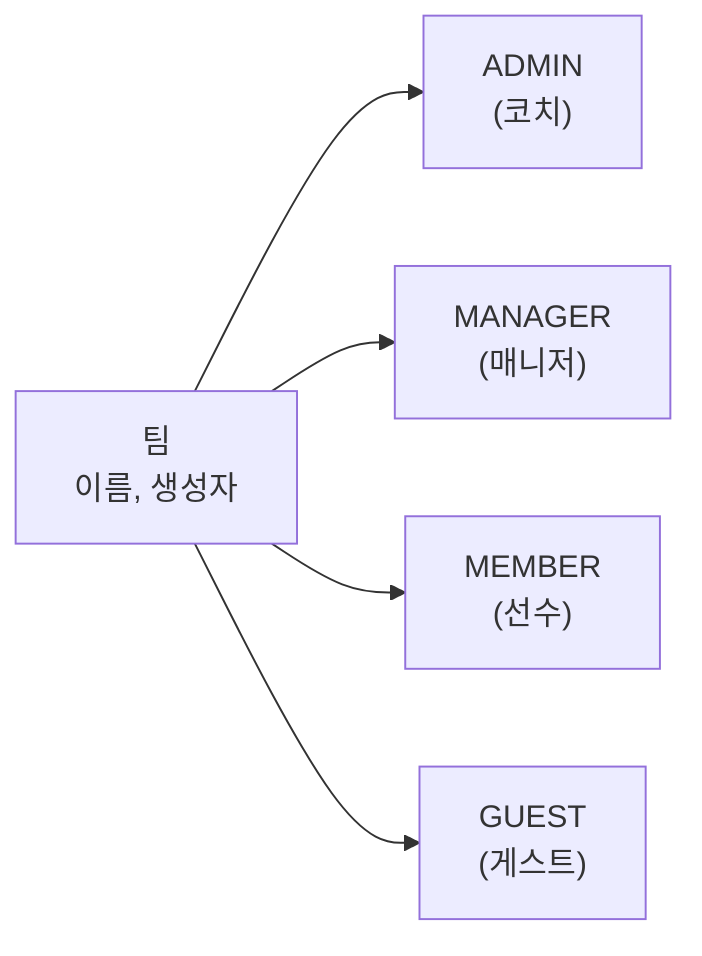

**팀 역할별 권한**:

| 역할 | 할 수 있는 것 | 전형적인 사람 |
|:----:|--------------|:------------:|
| ADMIN | 팀의 모든 데이터 조회/수정/삭제 | 코치, 감독 |
| MANAGER | 팀 데이터 조회, 경기/출석 관리 | 팀 매니저 |
| MEMBER | 본인 데이터만 조회/입력 | 선수 |
| GUEST | 제한적 조회 | 외부 관계자 |

---

### 3.4 경기 (matches) / 출석 (attendances)

| 테이블 | 설명 | 주요 정보 |
|--------|------|-----------|
| matches | 경기 일정 | 팀, 날짜, 장소, 상태(모집중/확정/완료/취소) |
| attendances | 경기 참석 여부 | 선수별 참석/불참/미정/보류 |

---

## 4. 테이블 사전 — 훈련과 컨디션

> 이 부분이 시스템의 **핵심**입니다. 선수의 훈련과 몸 상태를 추적합니다.

### 4.1 훈련 세션 (training_sessions) — 모든 것의 중심

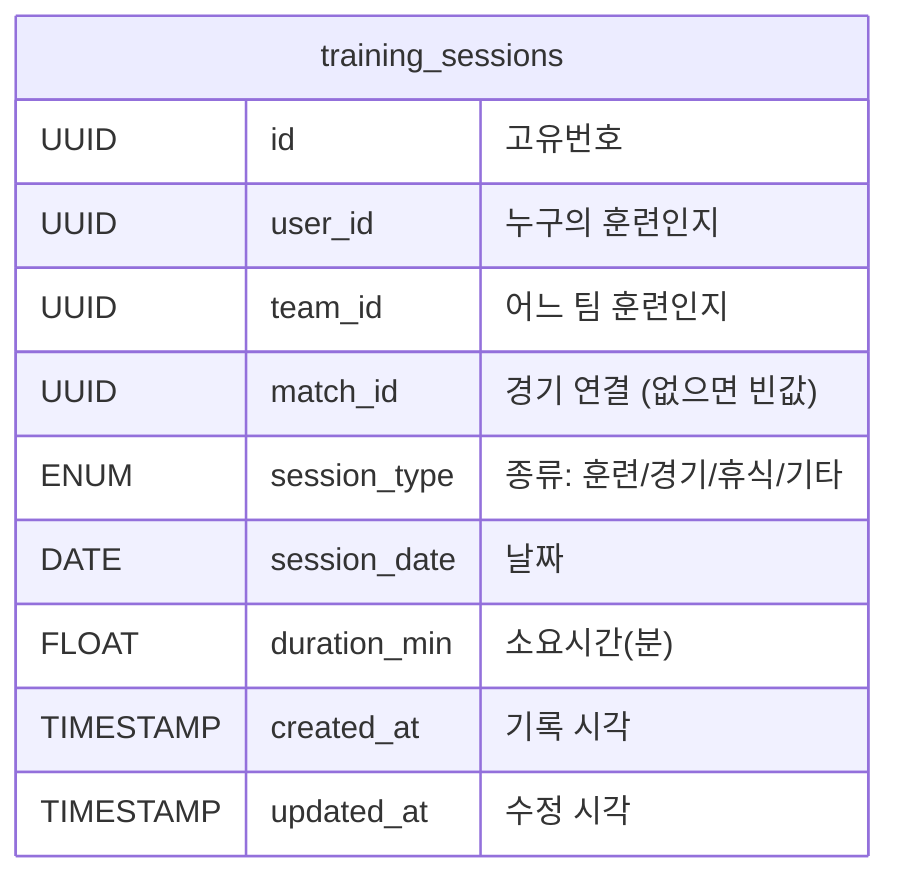

| 컬럼명 | 한글명 | 설명 | 예시 |
|--------|--------|------|------|
| session_type | 세션 종류 | 이 세션이 어떤 유형인지 | `TRAINING` |
| session_date | 날짜 | 훈련/경기/휴식일 | `2026-02-10` |
| duration_min | 소요시간(분) | 훈련/경기에 걸린 시간 | `90` (90분) |
| match_id | 경기 연결 | 경기 세션이면 어떤 경기인지 | — |

**세션 종류 4가지**:

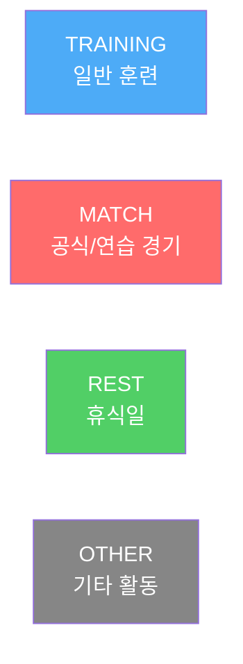

| 종류 | 의미 | 시간 기록 | 경기 연결 |
|:----:|------|:---------:|:---------:|
| TRAINING | 일반 체력/전술 훈련 | 필수 (분) | 없음 |
| MATCH | 공식 경기 또는 연습 경기 | 필수 (분) | 필수 |
| REST | 의도적 휴식일 | 없음 | 없음 |
| OTHER | 재활, 개인 운동 등 | 선택 | 없음 |

---

### 4.2 훈련 전 컨디션 (pre_session_wellness)

> 훈련 시작 **전에** 선수가 오늘 컨디션을 1~7점으로 평가

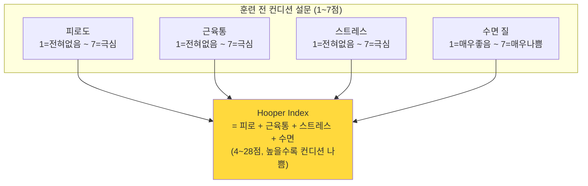

| 컬럼명 | 한글명 | 범위 | 설명 |
|--------|--------|:----:|------|
| fatigue | 피로도 | 1~7 | 숫자가 클수록 피로가 심함 |
| soreness | 근육통 | 1~7 | 숫자가 클수록 근육통이 심함 |
| stress | 스트레스 | 1~7 | 숫자가 클수록 스트레스가 심함 |
| sleep | 수면 질 | 1~7 | 숫자가 클수록 수면이 나쁨 |
| hooper_index | 후퍼 지수 | 4~28 | 4개 합산 (자동 계산). 높을수록 컨디션 나쁨 |
| memo | 메모 | 200자 | 추가로 남기고 싶은 말 |

---

### 4.3 훈련 후 피드백 (post_session_feedback)

> 훈련 **끝난 직후** 오늘 운동이 얼마나 힘들었는지 평가

| 컬럼명 | 한글명 | 범위 | 설명 |
|--------|--------|:----:|------|
| session_rpe | 체감 피로도 (RPE) | 0~10 | Borg CR-10 척도. 0=전혀 안 힘듦, 10=최대한 힘듦 |
| condition | 컨디션 평가 | 5단계 | 훈련 후 몸 상태 |
| memo | 메모 | 200자 | 추가 기록 |

**체감 피로도(RPE) 척도**:

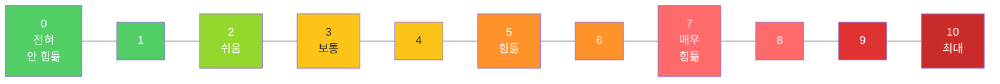

**컨디션 5단계**:

| 코드 | 의미 | 설명 |
|:----:|:----:|------|
| VERY_BAD | 매우 나쁨 | 통증이나 심한 피로 |
| BAD | 나쁨 | 컨디션 저하 느낌 |
| NEUTRAL | 보통 | 평소와 비슷 |
| GOOD | 좋음 | 컨디션 양호 |
| VERY_GOOD | 매우 좋음 | 최상의 상태 |

---

### 4.4 다음날 상태 (next_day_reviews)

> 훈련 **다음날** 회복 상태를 간단히 평가

| 코드 | 의미 | 설명 |
|:----:|:----:|------|
| WORSE | 나빠짐 | 전날보다 상태가 안 좋음 |
| SAME | 같음 | 특별한 변화 없음 |
| BETTER | 좋아짐 | 회복이 잘 됨 |

---

### 4.5 훈련 데이터 4개 테이블의 관계

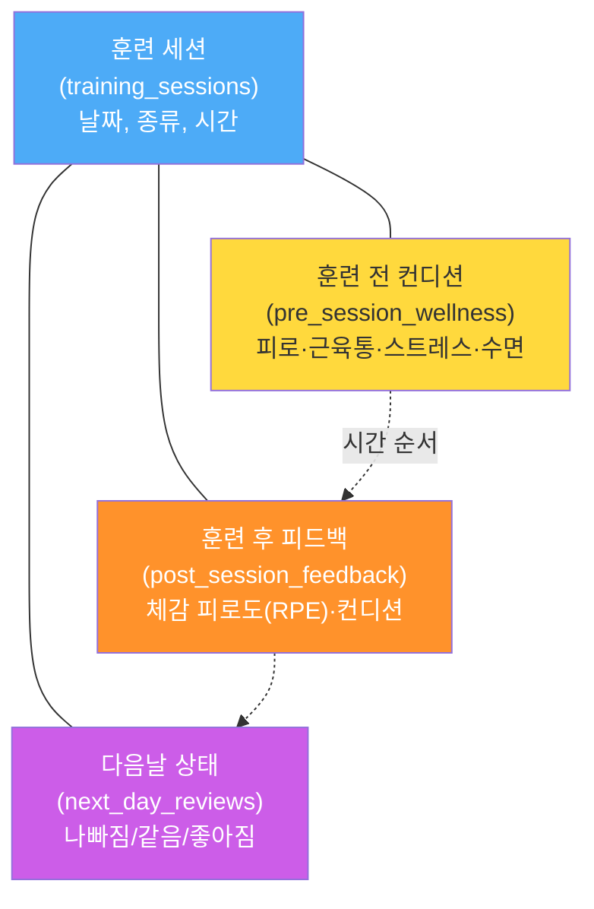

> 하나의 훈련 세션에 대해 **전/후/다음날** 3단계로 컨디션을 추적합니다.
> 각 단계는 최대 1개씩만 기록됩니다.

---

## 5. 테이블 사전 — 심박 측정(HRV)

### 5.1 심박 간격 측정 (hrv_measurements)

> 심장 박동 사이의 **시간 간격**(RR 간격)을 밀리초 단위로 기록합니다.
> 스마트워치나 가슴 센서에서 자동으로 수집됩니다.

| 컬럼명 | 한글명 | 설명 | 예시 |
|--------|--------|------|------|
| source | 측정 장비 | 어떤 장비로 측정했는지 | `CHEST_STRAP` |
| context | 측정 상황 | 어떤 상황에서 측정했는지 | `MORNING_REST` |
| rr_intervals_ms | RR 간격 배열 | 심박 간 시간 간격 목록 (밀리초) | `[812, 795, 831, ...]` |
| rr_count | 박동 수 | 기록된 심박 수 (자동 계산) | `350` |
| quality_flag | 품질 표시 | 데이터 품질 상태 | `good` |

**측정 장비 종류**:

| 코드 | 장비 |
|:----:|------|
| CHEST_STRAP | 가슴 밴드 센서 (가장 정확) |
| SMARTWATCH | 스마트워치 |
| FINGER_SENSOR | 손가락 센서 |
| APP_MANUAL | 앱에서 수동 입력 |
| EXTERNAL_IMPORT | 외부 파일 가져오기 |

**측정 상황**:

| 코드 | 상황 | 설명 |
|:----:|------|------|
| MORNING_REST | 아침 안정시 | 기상 후 안정된 상태에서 측정 (가장 중요) |
| PRE_SESSION | 훈련 직전 | 훈련 시작 전 |
| POST_SESSION | 훈련 직후 | 훈련 종료 후 |
| DURING_SESSION | 훈련 중 | 훈련 도중 |
| NIGHT_SLEEP | 수면 중 | 밤새 측정 (데이터 양 많음) |
| OTHER | 기타 | 위에 해당하지 않는 경우 |

---

### 5.2 일별 심박 요약 (daily_hrv_metrics)

> 하루에 여러 번 측정할 수 있으므로, **하루를 대표하는 1개 요약값**을 저장합니다.
> 아침 안정시(MORNING_REST) 측정을 우선 사용합니다.

| 컬럼명 | 한글명 | 단위 | 의미 |
|--------|--------|:----:|------|
| rmssd | 심박 변이도 (rMSSD) | ms | 높을수록 회복 상태 좋음 |
| sdnn | 심박 변이도 (SDNN) | ms | 자율신경 전체 활성도 |
| ln_rmssd | rMSSD 로그값 | — | 분석용 변환값 |
| ln_rmssd_7d | 7일 평균 로그값 | — | 추세 파악용 평활값 |
| mean_hr | 평균 심박수 | bpm | 분당 심장 박동 수 |
| nn_count | 유효 박동 수 | 개 | 150개 이상이면 신뢰 가능 |
| valid | 유효 여부 | 예/아니오 | 분석에 사용할 수 있는 데이터인지 |

> **쉽게 이해하기**: rMSSD 값이 **높으면** 심장이 유연하게 반응하고 있다는 뜻으로, **회복이 잘 되고 있다**는 신호입니다. 값이 **급격히 떨어지면** 몸이 피로하다는 경고입니다.

---

## 6. 테이블 사전 — 부하 지표

### 6.1 일일 부하 지표 (computed_load_metrics)

> 매일 자동으로 계산되는 **운동 부하와 피로 누적 지표**입니다.
> 선수가 직접 입력하는 것이 아니라, 시스템이 계산합니다.

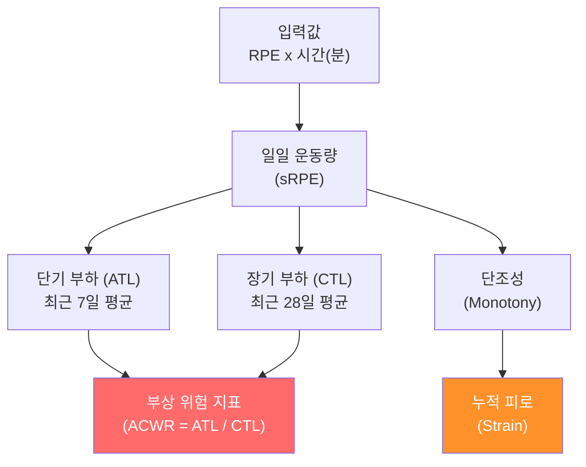

### 6.2 핵심 지표 해설

| 지표 | 한글명 | 계산 방법 | 의미 | 위험 기준 |
|------|--------|-----------|------|:---------:|
| **sRPE** | 운동 부하 | RPE x 시간(분) | 한 세션의 총 운동량 | — |
| **ATL** | 단기 부하 | 최근 **7일** 평균 sRPE | 최근 얼마나 많이 훈련했는지 | — |
| **CTL** | 장기 부하 | 최근 **28일** 평균 sRPE | 평소 얼마나 많이 훈련하는지 | — |
| **ACWR** | 급만성 비율 | ATL / CTL | 평소 대비 최근 훈련량 비율 | **1.5 이상 주의** |
| **Monotony** | 훈련 단조성 | 7일 평균 / 7일 표준편차 | 매일 비슷한 강도로 훈련하는지 | **2.0 이상 주의** |
| **Strain** | 누적 피로 | 주간 총 부하 x Monotony | 단조로운 고부하 = 피로 누적 | — |

### 6.3 ACWR 위험 구간 그림

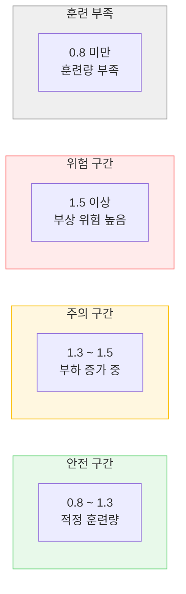

> **ACWR이 1.5를 넘으면**: 평소보다 훈련량이 급격히 늘었다는 뜻. 부상 위험이 높아집니다.
> **ACWR이 0.8 미만이면**: 훈련량이 너무 적어 체력이 떨어질 수 있습니다.

### 6.4 전체 컬럼 목록

| 컬럼명 | 한글명 | 단위 | 음수 가능? |
|--------|--------|:----:|:----------:|
| daily_load | 일일 운동량 | — | 불가 (0 이상) |
| atl_rolling | 단기 부하 (이동평균) | — | 불가 |
| ctl_rolling | 장기 부하 (이동평균) | — | 불가 |
| acwr_rolling | 급만성 비율 (이동평균) | 비율 | 불가 |
| atl_ewma | 단기 부하 (가중평균) | — | 불가 |
| ctl_ewma | 장기 부하 (가중평균) | — | 불가 |
| acwr_ewma | 급만성 비율 (가중평균) | 비율 | 불가 |
| monotony | 훈련 단조성 | — | 불가 |
| strain | 누적 피로 | — | 불가 |
| dcwr_rolling | 부하 차이 (ATL-CTL) | — | **가능** |
| tsb_rolling | 훈련 균형 (CTL-ATL) | — | **가능** |
| pipeline_version | 계산 버전 | — | — |
| params | 계산 설정값 | JSON | — |

> **이동평균 vs 가중평균**: 두 가지 계산 방식으로 같은 지표를 산출합니다. 이동평균(rolling)은 단순 평균, 가중평균(EWMA)은 최근 데이터에 더 높은 비중을 줍니다.

---

## 7. 분석용 데이터 뷰

> **뷰(View)**란: 여러 테이블의 데이터를 한 번에 볼 수 있도록 미리 만들어 놓은 **읽기 전용 창**입니다.
> 원본 데이터를 바꾸지 않고, 분석에 필요한 형태로 보여줍니다.

### 7.1 Track B 뷰 — 훈련량 + 컨디션 (v_rnd_track_b)

> **목적**: 선수의 훈련 부하와 컨디션 설문을 한 행으로 결합하여 "운동량이 컨디션에 미치는 영향"을 분석

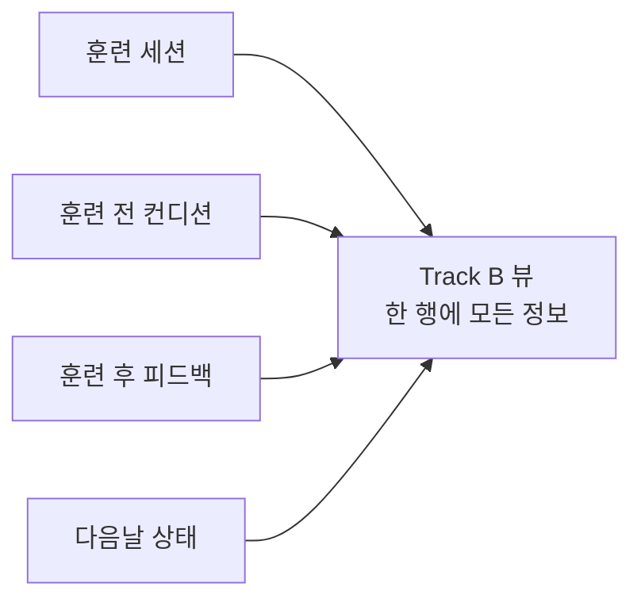

| 뷰 컬럼 | 원본 | 의미 |
|----------|------|------|
| athlete_id | 사용자 번호 | 선수 식별자 |
| date | 세션 날짜 | 훈련일 |
| rpe | 체감 피로도 | 0~10 |
| duration_min | 소요시간 | 분 |
| **srpe** | **RPE x 시간** | **일일 운동 부하** |
| fatigue | 피로도 | 1~7 |
| stress | 스트레스 | 1~7 |
| doms | 근육통 | 1~7 (DB에서는 soreness) |
| sleep | 수면 질 | 1~7 |
| hooper_index | 후퍼 지수 | 4~28 (4개 합산) |
| session_type | 세션 종류 | TRAINING/MATCH/REST/OTHER |
| match_day | 경기일 여부 | 예/아니오 |
| next_day_score | 다음날 점수 | 나빠짐=3, 같음=2, 좋아짐=1 |

> **중요**: 휴식일(REST)도 포함됩니다. 휴식일의 운동 부하(sRPE)는 **0**으로 기록됩니다.
> 이것이 빠지면 주간 평균 부하가 40% 이상 과대평가될 수 있습니다.

---

### 7.2 Track A 뷰 — 심박 + 부하 (v_rnd_track_a)

> **목적**: 심박 변이도(HRV)와 운동 부하를 결합하여 "운동이 자율신경에 미치는 영향"을 분석

| 뷰 컬럼 | 원본 | 의미 |
|----------|------|------|
| subject_id | 사용자 번호 | 선수 식별자 |
| date | 측정일 | 날짜 |
| rmssd | 심박 변이도 | ms (높을수록 회복 좋음) |
| sdnn | 심박 변이도 | ms |
| ln_rmssd | 로그 변환값 | 분석용 |
| ln_rmssd_7d | 7일 평균 | 추세 |
| mean_hr | 평균 심박수 | bpm |
| nn_count | 유효 박동 수 | 개 |
| acwr_rolling | 급만성 비율 | 비율 |
| acwr_ewma | 급만성 비율 (가중) | 비율 |
| monotony | 훈련 단조성 | — |
| **strain** | **누적 피로** | — |
| **dcwr_rolling** | **부하 차이** | ATL-CTL |
| **tsb_rolling** | **훈련 균형** | CTL-ATL |
| srpe | 일일 운동량 | — |

---

## 8. 선택지 목록 (코드값)

> 데이터에 사용되는 모든 **고정 선택지** 목록입니다.

### 8.1 전체 코드값 관계도

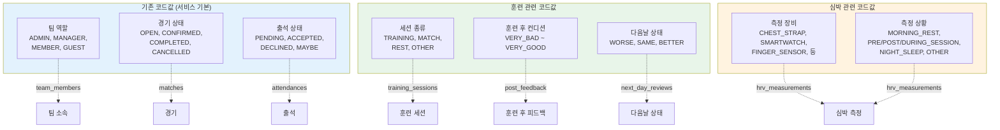

---

## 9. 누가 어떤 데이터를 볼 수 있나

> 데이터 **보안**을 위해, 역할에 따라 볼 수 있는 데이터가 다릅니다.

### 9.1 권한 구조도

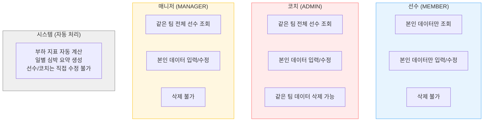

### 9.2 권한 상세표

| 데이터 | 선수(본인) | 선수(타인) | 코치 | 매니저 | 시스템 |
|--------|:----------:|:----------:|:----:|:------:|:------:|
| 훈련 세션 | 조회/입력/수정 | — | 팀 조회 | 팀 조회 | — |
| 훈련 전 컨디션 | 조회/입력/수정 | — | 팀 조회 | 팀 조회 | — |
| 훈련 후 피드백 | 조회/입력/수정 | — | 팀 조회 | 팀 조회 | — |
| 다음날 상태 | 조회/입력/수정 | — | 팀 조회 | 팀 조회 | — |
| 심박 데이터 | 조회/입력/수정 | — | 팀 조회 | 팀 조회 | — |
| 일별 심박 요약 | 조회만 | — | 팀 조회 | 팀 조회 | 입력/수정 |
| **부하 지표** | **조회만** | — | **팀 조회** | **팀 조회** | **입력/수정** |
| 삭제 권한 | — | — | 코치만 가능 | — | — |

> **부하 지표와 일별 심박 요약**은 시스템이 자동으로 계산하는 데이터입니다.
> 선수나 코치가 직접 수정할 수 없으며, 이는 **데이터 신뢰성**을 보장하기 위함입니다.

---

## 10. 데이터 삭제 시 연쇄 영향

> 데이터를 삭제하면 연결된 하위 데이터도 **자동으로 함께 삭제**됩니다.
> 이를 통해 "주인 없는 데이터"가 남지 않습니다.

### 10.1 사용자 삭제 시 영향

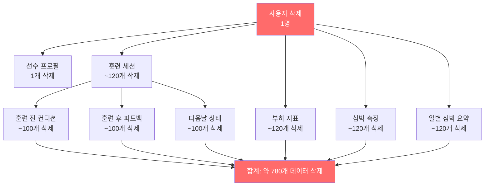

> **주의**: 사용자 1명을 삭제하면 약 **780개의 관련 데이터가 모두 삭제**됩니다.
> 실수로 삭제하면 복구할 수 없으므로, **관리자만 삭제할 수 있도록** 제한되어 있습니다.

### 10.2 훈련 세션 삭제 시 영향

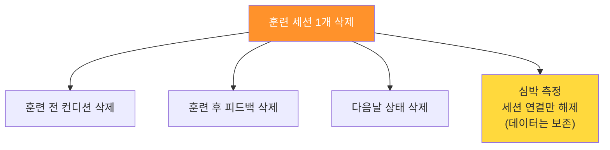

> 심박 데이터는 세션과 무관하게 독립적으로 의미가 있으므로(예: 아침 안정시 측정), 세션을 삭제해도 **심박 데이터 자체는 보존**됩니다.

---

## 11. 핵심 용어 사전

| 용어 | 영어 원문 | 쉬운 설명 |
|------|-----------|-----------|
| **RPE** | Rating of Perceived Exertion | "얼마나 힘들었나요?" 0~10점 |
| **sRPE** | session RPE | RPE x 운동시간. **운동 부하**의 기본 단위 |
| **ATL** | Acute Training Load | 최근 **7일** 평균 운동량. "요즘 얼마나 뛰었나" |
| **CTL** | Chronic Training Load | 최근 **28일** 평균 운동량. "평소에 얼마나 뛰나" |
| **ACWR** | Acute:Chronic Workload Ratio | ATL / CTL. **1.5 이상이면 부상 위험** |
| **Monotony** | — | 훈련 패턴이 얼마나 단조로운지. 매일 같은 강도면 높음 |
| **Strain** | — | 주간 총 부하 x Monotony. 단조로운 고부하 = 피로 누적 |
| **HRV** | Heart Rate Variability | 심박 변이도. 심장 박동 간격의 변화 정도 |
| **rMSSD** | Root Mean Square of Successive Differences | HRV 지표. **높을수록 회복 좋음** |
| **SDNN** | Standard Deviation of NN intervals | HRV 지표. 자율신경 활성도 |
| **Hooper Index** | — | 피로+근육통+스트레스+수면 합산. **높을수록 컨디션 나쁨** |
| **DCWR** | Differential ACWR | ATL - CTL. 부하 차이를 직접 보여줌 |
| **TSB** | Training Stress Balance | CTL - ATL. 양수=회복 상태, 음수=피로 상태 |
| **RLS** | Row Level Security | 행 단위 접근 제어. 각자 볼 수 있는 데이터만 보이게 함 |
| **CASCADE** | — | 연쇄 삭제. 부모 데이터 삭제 시 자식도 함께 삭제 |
| **ETL 뷰** | Extract-Transform-Load View | 여러 테이블을 합쳐 분석용으로 만든 읽기 전용 창 |
| **EWMA** | Exponentially Weighted Moving Average | 최근 데이터에 더 높은 비중을 주는 평균 계산 방식 |
| **Rolling** | — | 단순 이동 평균. 7일이면 7일 데이터를 동일 비중으로 평균 |

---

## 12. 자주 묻는 질문

### 일반

**Q: 선수가 하루에 훈련을 2번 하면 어떻게 기록하나요?**
> 각 훈련을 별도의 세션으로 기록합니다. 오전 체력 훈련과 오후 전술 훈련을 각각 1개씩 생성합니다. 부하 지표(sRPE)는 두 세션의 합으로 자동 계산됩니다.

**Q: 휴식일에도 기록해야 하나요?**
> 네. REST 세션을 생성합니다. 운동 부하는 자동으로 0이 됩니다. 이것이 빠지면 주간 평균 부하가 과대평가됩니다.

**Q: 선수가 RPE를 잘못 입력하면 수정할 수 있나요?**
> 네. 본인이 입력한 데이터는 본인이 수정할 수 있습니다. 단, 부하 지표는 시스템이 재계산합니다.

### 분석

**Q: ACWR이 1.5가 넘으면 훈련을 멈춰야 하나요?**
> ACWR은 **경고 신호**이지 절대적인 중단 기준이 아닙니다. 코치가 다른 지표(HRV, Hooper Index)와 함께 종합 판단합니다.

**Q: HRV(rMSSD)가 떨어지면 무엇을 의미하나요?**
> 몸이 피로하거나 스트레스를 받고 있다는 신호입니다. 하루 정도는 정상 변동이지만, 3일 이상 지속적으로 떨어지면 주의가 필요합니다.

**Q: Hooper Index가 높으면 훈련 강도를 줄여야 하나요?**
> 16점 이상이면 주의, 20점 이상이면 경량 훈련이나 휴식을 고려합니다. 이는 일반적 기준이며, 선수별로 다를 수 있습니다.

### 보안

**Q: 다른 팀 선수의 데이터를 볼 수 있나요?**
> 아니요. 같은 팀에 소속된 코치/매니저만 해당 팀 선수의 데이터를 볼 수 있습니다. 일반 선수는 자기 데이터만 볼 수 있습니다.

**Q: 선수가 자기 부하 지표를 임의로 바꿀 수 있나요?**
> 아니요. 부하 지표(ACWR, ATL 등)와 일별 심박 요약은 **시스템 전용**으로, 사용자가 직접 수정할 수 없습니다. 이는 데이터 신뢰성을 위한 것입니다.

---

## 부록: 테이블 전체 목록 요약

| # | 테이블 (영문명) | 한글명 | 데이터 수 (예상) | 누가 만드나 |
|:-:|----------------|--------|:----------------:|:-----------:|
| 1 | users | 사용자 | 15명 | 회원가입 |
| 2 | teams | 팀 | 1개 | 코치 |
| 3 | team_members | 팀 소속 | 15명 | 코치 |
| 4 | matches | 경기 | 2개 | 코치/매니저 |
| 5 | attendances | 출석 | 10개 | 코치/매니저 |
| 6 | record_rooms | 기록실 | — | 매니저 |
| 7 | match_records | 경기 기록 | — | 매니저 |
| 8 | user_profiles | 선수 프로필 | 15명 | 선수 |
| 9 | **training_sessions** | **훈련 세션** | **~1,800개** | **선수** |
| 10 | **pre_session_wellness** | **훈련 전 컨디션** | **~1,300개** | **선수** |
| 11 | **post_session_feedback** | **훈련 후 피드백** | **~1,300개** | **선수** |
| 12 | **next_day_reviews** | **다음날 상태** | **~1,300개** | **선수** |
| 13 | **hrv_measurements** | **심박 간격 측정** | **~1,800개** | **웨어러블 기기** |
| 14 | **daily_hrv_metrics** | **일별 심박 요약** | **~1,800개** | **시스템 자동** |
| 15 | **computed_load_metrics** | **일일 부하 지표** | **~1,800개** | **시스템 자동** |

> 굵은 글씨(#8~#15)가 이번에 새로 추가된 훈련·컨디션·HRV 관련 테이블입니다.

---

*이 문서는 [DRD_v3.0.md](DRD_v3.0.md)의 기술 내용을 모든 직군이 이해할 수 있도록 재구성한 것입니다. 기술적 세부사항(DDL, 인덱스, 마이그레이션 등)은 원본 문서를 참조하십시오.*
