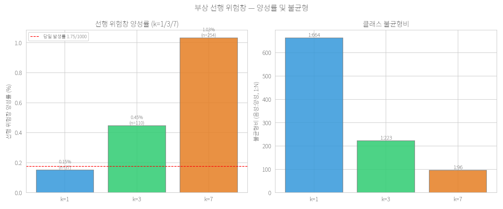
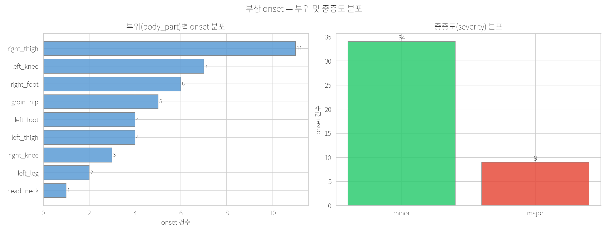
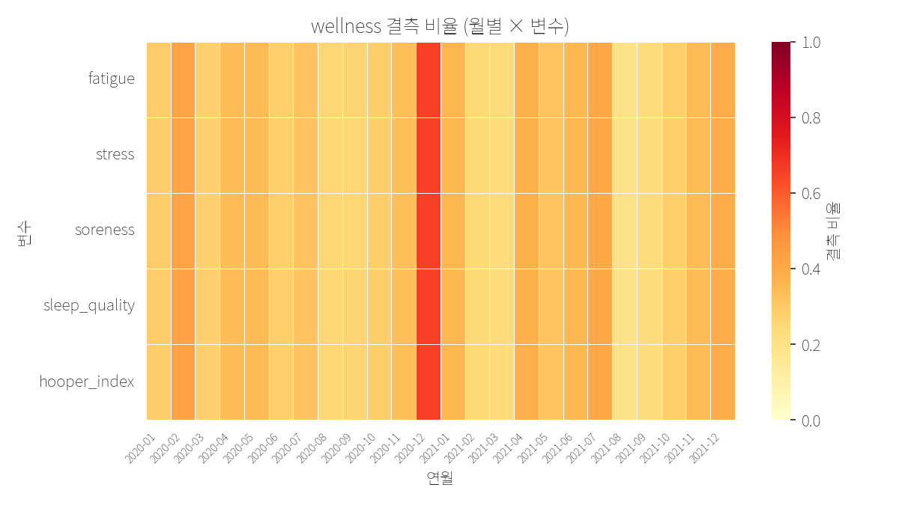
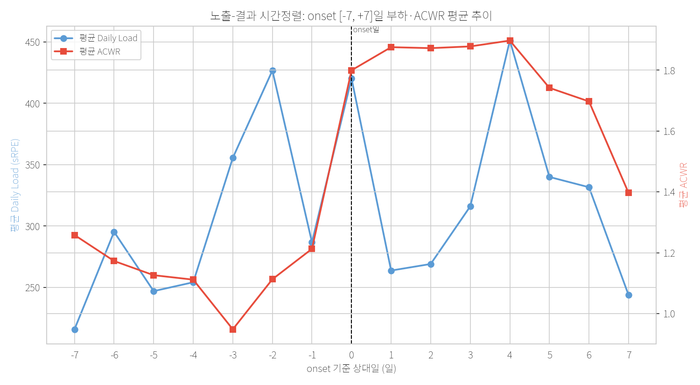
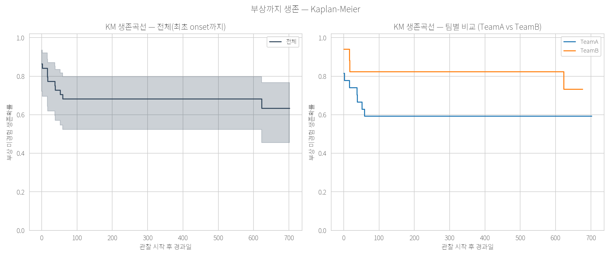

# 부상 예측 결과 리포트 — Stage 8 (게이트 P0~P3)

> 문서 ID: REPORT-INJURY-2026-001 · 버전 v1.0 · 최종수정 2026-05-30
> 상위문서: [RESEARCH_PROTOCOL.md](../docs/rnd/RESEARCH_PROTOCOL.md) §H · 개념·방법론: [INJURY_PREDICTION.md](../docs/rnd/tracks/track_B/INJURY_PREDICTION.md)
> 데이터: SoccerMon(여자축구 2팀, 부하+설문, HRV 없음) · 라벨 동결: [ADR-014](../docs/rnd/DECISIONS.md)

## 0. 요약 (Executive Summary)

본 리포트는 Stage 8 부상 예측 파이프라인의 **게이트 P0~P3**(라벨 → 기술역학 EDA → 기준선 → 주 추론 삼각검증) 실행 결과를 정리한다.
검정력 제약(독립 onset **43건**, EPV≤4)상 본 단계의 1차 가치는 **방법론 시연**이며, 임상 배포 가능한 예측기를 주장하지 않는다(RESEARCH_PROTOCOL §I).

- **P0**: gap≥7 규칙으로 onset **43건·발생률 1.748/1000 athlete-days** 재현(외부 연구 arXiv 2601.19479의 43건과 일치). seed 고정·단위테스트 7건 통과.
- **P1**: 선행 위험창 양성률 k=1/3/7 = **0.150% / 0.447% / 1.033%**(불균형 1:664 / 1:223 / 1:96). 부위·중증도·결측·KM 곡선 기술.
- **P2**: Gabbett sweet-spot 룰 기준선 PR-AUC가 무작위 대비 **lift 1.07~1.09배**로 미약한 식별력 — 후속 모형이 초과해야 할 하한선으로 박제.
- **P3**: ACWR 효과가 3개 설계에서 **방향 일관(3/3 위험↑)**하게 관찰됨. 이산시간 생존·벌점 로지스틱은 통계적으로 유의, case-crossover는 폭넓은 CI로 비유의. 시간외삽(2020→2021) 변별력은 낮음.

> **reviewer-safe 해석**: ACWR 상승과 부상 onset 위험 증가의 연관 신호가 설계 전반에서 방향상 일관되게 *관찰*되나, case-crossover의 넓은 CI와 낮은 시간외삽 PR-AUC를 고려하면 인과·운영적 예측력으로 *단정할 수 없다*.

---

## 1. P0 — 라벨·발생률 (거버넌스)

onset 정의(ADR-014): 동일 선수에서 직전 부상-일과 간격 **gap≥7일**이면 새 독립 사건. 동일일 중복은 dedup(중증도 major 우선).

| 항목 | 값 |
|---|---|
| 원시 부상-일 | 162행(동일일 중복 포함) → dedup 156행 |
| 독립 onset | **43건** |
| 부상 보유 선수 | **15 / 44명** |
| 노출 | 24,596 athlete-days |
| 발생률 | **1.748 / 1000 athlete-days** |
| gap 민감도 | gap=3 → 75건(3.049/1000) vs gap=7 → 43건(1.748/1000) |
| 외부 검증 | arXiv 2601.19479 동일 데이터 분석 43건과 일치 |

검증경로: `src/data/injury_label.py`, `tests/test_injury_label.py`(7건 통과).
EPV 제약: 43건 → EPV 10 규칙상 **동시 예측변수 ≤ 4개**(풀 ML 단독 주모형 금지).

---

## 2. P1 — 기술역학 EDA

실행: `notebooks/run_injury_eda.py` → `reports/figures/injury_eda_*.png`(5종).

### 2.1 선행 위험창 양성률·불균형 (분모 24,596)

| horizon k | 양성 수 | 양성률 | 불균형비(음성:양성) |
|---|---|---|---|
| k=1 | 37 | 0.150% | 1:664 |
| k=3 | 110 | 0.447% | 1:223 |
| k=7 | 254 | 1.033% | 1:96 |

→ 양성률 ~1% 안팎의 **극단 불균형** → ROC-AUC가 아닌 **PR-AUC** 사용 근거.



### 2.2 부위·중증도

- 부위 top-5: right_thigh 11, left_knee 7, right_foot 6, groin_hip 5, left_thigh·left_foot 4(공동).
- 중증도: minor **34** / major **9**(복수 부위 시 major 격상).



### 2.3 결측 패턴

- wellness 5종(fatigue/stress/soreness/sleep_quality/hooper_index) 결측률 ≈ **32.4~32.5%**로 거의 동일 → 동일 설문 미보고일에 동반 결측되는 패턴이 관찰됨(MNAR 의심 → P5 후속 정량화 대상).



### 2.4 노출-결과 시간정렬 (onset [-7,+7]일)

| 구간 | daily_load 평균 | ACWR 평균 |
|---|---|---|
| 부상 전(-7~-1) | 297.3 | 1.135 |
| 부상일(0) | 420.2 | 1.800 |
| 부상 후(+1~+7) | 316.5 | 1.766 |

→ 부상 시점 전후로 ACWR가 상승한 수준에서 유지되는 경향이 *관찰*되나 인과로 단정 불가.



### 2.5 KM 생존 (선수별 최초 onset, 미발생자 censoring)

- 44명 중 이벤트 15 / 검열 29. 이벤트<50%로 중위 생존시간 추정 불가.
- 관찰 종료시점(t=702일) 생존확률 ≈ **0.633**.
- 팀별: TeamA(n=27) 0.593 vs TeamB(n=17) 0.732 → **TeamA 부상 위험이 상대적으로 높게 관찰**(Leave-Team-Out 외적타당도는 P5 후속).



### 2.6 활성일 정의

daily_load==0인 10,620 athlete-days는 비훈련일(휴식)로 간주하되, 발생률 분모(노출)에는 포함하는 보수적 정의 사용.

### 2.7 STROBE 흐름

원시 162행 → dedup 156행 → onset 43건(15명) → 패널 24,596 athlete-days 결합.

---

## 3. P2 — Gabbett 기준선 (벤치마크 박제)

ACWR sweet-spot(0.8~1.3 저위험, 양극단 위험) 룰을 데이터 기반 모형이 초과해야 할 **하한선**으로 박제.
구현: `src/stats/injury_baseline.py`(`gabbett_risk_score`/`gabbett_risk_zone`/`evaluate_baseline`), 테스트 14건 통과.

| horizon k | 양성률(기저 PR-AUC) | Gabbett PR-AUC | recall@precision0.5 | lift |
|---|---|---|---|---|
| k=1 | 0.00150 | 0.00161 | 0.0000 | 1.073 |
| k=3 | 0.00447 | 0.00482 | 0.0000 | 1.079 |
| k=7 | 0.01033 | 0.01126 | 0.0000 | 1.091 |

→ 무작위 대비 lift 1.07~1.09배로 일관되나 미약. recall@precision0.5=0 → 실용적 식별력은 희박. **후속 모형 비교 기준선**으로만 기능.

---

## 4. P3 — 주 추론 (설계 삼각검증)

단일 모형 의존을 피하기 위해 **3개 설계**로 ACWR 효과를 교차검증. 피로(웰니스)는 매개변수이므로 ACWR 총효과 추정 시 공변량 투입 회피(과조정 방지). 구현: `src/stats/survival_models.py`, 실행 `notebooks/run_injury_inference.py`, 테스트 11건 통과.

| 설계 | 효과 | 추정치 | 95% CI | p | n / 이벤트 |
|---|---|---|---|---|---|
| 이산시간 생존(cloglog, 선수 군집 robust SE) | HR | **3.263** | 2.215 ~ 4.808 | <0.0001 | 15,908 / 15 |
| case-crossover(조건부 로지스틱, 자기대조) | OR | 1.159 | 0.830 ~ 1.619 | 0.387 | 134 / 35 |
| 벌점 로지스틱(L2 ridge, onset_next_7, z-ACWR) | coef(log-odds) | 0.175 | 0.069 ~ 0.280(근사) | 0.0012(근사) | 24,596 / 254 |

- **방향 일관성: 3/3 위험↑**(HR>1, OR>1, coef>0). 단 case-crossover는 95% CI가 1을 포함(비유의).
- **gap 3 vs 7 민감도**: onset 75 vs 43. 이산시간 HR=3.263 불변(선수별 *최초* onset만 위험집합에 사용 → 재발 병합 기준 변경에 둔감), OR 1.002→1.159, coef 0.304→0.175. 세 설계 모두 양 gap에서 위험↑ 방향 유지.
- **시간분리(2020 학습 → 2021 검정)**: 벌점 로지스틱 PR-AUC = **0.0041**(검정셋 기저 0.0046, lift 0.91×). 2021 양성률(0.455%)이 2020(1.775%)보다 크게 낮아 ACWR 단독 모형의 시간외삽 변별력은 기저선 동등/하회 수준으로 관찰됨.
- 수렴: 세 설계 정상 수렴. case-crossover는 통제기간(lag 14/21/28일) 확보 가능한 35개 case로 표본이 작아 CI가 넓음. 벌점 추정의 CI/p는 근사치.

---

## 5. 결과의 의미·한계

- **의미**: ACWR 상승과 부상 onset 위험의 양(+) 연관이 서로 다른 가정·편향통제를 갖는 3개 설계에서 방향상 일관되게 관찰됨 → 단일 모형 아티팩트가 아닐 가능성을 *시사*. 이산시간 생존·벌점 로지스틱에서 통계적 유의.
- **한계**:
  1. 검정력 — 독립 onset 43건·EPV≤4 → 결론은 *방법론 시연*, 임상 배포 주장 불가.
  2. 시간외삽 — 2021 양성률 급감으로 PR-AUC가 기저선 동등/하회 → 분포이동(concept drift)에 취약.
  3. case-crossover — 통제기간 확보 case 35개로 CI가 넓고 비유의.
  4. 라벨 민감도 — gap 3/7에서 onset 수가 75↔43으로 변동(§4). gap 민감도 보고 필수.
  5. 결측 — wellness 32% MNAR 의심 → P5 후속 정량화 전까지 웰니스 효과 결론 보류.
- **후속(P4~P6, 본 라운드 범위 밖)**: calibration·decision-curve(net benefit)·SHAP(P4), MNAR Monte Carlo·Leave-Team-Out(P5), 재현 패키지·Streamlit 데모·TRIPOD 체크리스트(P6). 개념 정의는 [INJURY_PREDICTION.md](../docs/rnd/tracks/track_B/INJURY_PREDICTION.md)에 기술됨.

---

## 6. 재현

```bash
# 가상환경 활성화 후 (Windows: venv\Scripts\activate.bat)
python -m pytest tests/test_injury_label.py tests/test_injury_baseline.py tests/test_survival_models.py -v
python notebooks/run_injury_eda.py          # P1 EDA 그림 5종 생성
python notebooks/run_injury_inference.py    # P2 기준선 + P3 삼각검증 수치
```

| 게이트 | 코드 | 테스트 | 산출 |
|---|---|---|---|
| P0 | `src/data/injury_label.py`, `src/stats/injury_eval.py` | `tests/test_injury_label.py`(7) | onset=43 재현, ADR-014 |
| P1 | `notebooks/run_injury_eda.py` | — | `reports/figures/injury_eda_*.png`(5) |
| P2 | `src/stats/injury_baseline.py` | `tests/test_injury_baseline.py`(14) | 기준선 PR-AUC |
| P3 | `src/stats/survival_models.py`, `notebooks/run_injury_inference.py` | `tests/test_survival_models.py`(11) | 삼각검증 효과추정·CI |

### 그림 목록
- `reports/figures/injury_eda_incidence_window.png` — 양성률·불균형 막대
- `reports/figures/injury_eda_bodypart_severity.png` — 부위·중증도 분포
- `reports/figures/injury_eda_event_aligned.png` — onset 전후 부하·ACWR 추이
- `reports/figures/injury_eda_missing_heatmap.png` — 월별×변수 결측
- `reports/figures/injury_eda_km_survival.png` — KM 생존곡선(전체·팀별)
